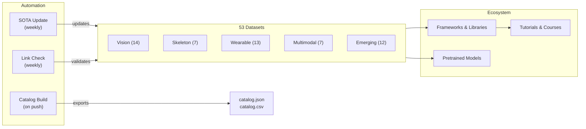

# Awesome Human Activity Recognition [](https://awesome.re)

<p align="center">
  <a href="https://github.com/Leo-Cyberautonomy/awesome-human-activity-recognition">
    
  </a>
</p>

> A curated, researcher-driven guide to **Human Activity Recognition** — 53 datasets, key frameworks, pretrained models, tutorials, and benchmark tools across vision, wearable, skeleton, and multimodal modalities.

[](https://creativecommons.org/licenses/by/4.0/)
[](https://github.com/Leo-Cyberautonomy/awesome-human-activity-recognition/pulls)
[](https://github.com/Leo-Cyberautonomy/awesome-human-activity-recognition/commits/main)
[](data/sota-snapshot.json)
[](https://leo-cyberautonomy.github.io/awesome-human-activity-recognition/)

<p align="center">
  <a href="https://leo-cyberautonomy.github.io/awesome-human-activity-recognition/">
    
  </a>
  &nbsp;&nbsp;
  <a href="https://github.com/Leo-Cyberautonomy/awesome-human-activity-recognition/stargazers">
    
  </a>
</p>

**[中文](i18n/README.zh.md)** | [Deutsch](i18n/README.de.md) | [Español](i18n/README.es.md) | [Français](i18n/README.fr.md) | [日本語](i18n/README.ja.md) | [한국어](i18n/README.ko.md) | [Português](i18n/README.pt.md) | [Русский](i18n/README.ru.md)

## Contents

- [Repository Architecture](#repository-architecture)
- [Which Dataset Should I Use](#which-dataset-should-i-use)
- [Datasets](#datasets)
- [Frameworks and Libraries](#frameworks-and-libraries)
- [Pretrained Models](#pretrained-models)
- [Tutorials and Courses](#tutorials-and-courses)
- [Key Papers](#key-papers)
- [Competitions and Challenges](#competitions-and-challenges)
- [Tools and Utilities](#tools-and-utilities)
- [Related Awesome Lists](#related-awesome-lists)

## Repository Architecture



## Which Dataset Should I Use

> Pick your modality and task, then follow the recommendation to the right section.

**I have video and want to classify actions** — Start with Kinetics-700 for pretraining, evaluate on UCF-101 or HMDB-51 for comparison with prior work. See [Vision](#vision-rgb--depth).

**I need temporal action detection in untrimmed video** — ActivityNet for proposals, AVA for spatio-temporal, MultiTHUMOS for dense multi-label. Also listed under Vision above.

**I work with skeleton or motion capture data** — NTU RGB+D 120 is the de facto standard. For text-motion alignment, use Babel or HumanML3D. See [Skeleton](#skeleton-and-mocap) and [Emerging](#emerging-and-frontier).

**I have IMU or wearable sensor data** — UCI-HAR for baselines, PAMAP2 for multi-sensor, CAPTURE-24 for real-world scale (151 subjects, 3883 hours). See [Wearable](#wearable-sensors).

**I need egocentric or multimodal data** — Ego4D for scale (3.3k hours), EPIC-Kitchens-100 for kitchen actions, Ego-Exo4D for cross-view (NEW, CVPR 2024). See [Multimodal](#multimodal-and-egocentric).

**I want text-to-motion generation** — HumanML3D for single-person, InterHuman for two-person, Motion-X++ for whole-body with face and hands. Also listed under Emerging above.

## Datasets

### Vision (RGB / Depth)

- [Kinetics-700](https://deepmind.com/research/open-source/kinetics) - Large-scale pretraining benchmark with 650k YouTube clips across 700 action classes.
- [UCF-101](https://www.crcv.ucf.edu/data/UCF101.php) - Classic action recognition benchmark with 13.3k clips across 101 classes.
- [HMDB-51](https://serre-lab.clps.brown.edu/resource/hmdb-a-large-human-motion-database/) - Diverse action recognition dataset with 6.8k clips from movies and web videos across 51 classes.
- [ActivityNet](http://activity-net.org/) - Temporal action detection benchmark with 20k untrimmed YouTube videos across 200 classes.
- [AVA](https://research.google.com/ava/) - Spatio-temporal action detection with 430 movie clips and 80 atomic action labels with bounding boxes.
- [NTU RGB+D 120](http://rose1.ntu.edu.sg/datasets/actionrecognition.asp) - Multi-view 3D action recognition with 114k sequences across 120 classes using RGB, depth, and skeleton.
- [Something-Something V2](https://developer.qualcomm.com/software/ai-datasets/something-something) - Fine-grained object interaction dataset with 220k clips across 174 labels requiring temporal reasoning.
- [FineGym](https://sdolivia.github.io/FineGym/) - Fine-grained gymnastics action recognition with 32k hierarchically labeled segments.
- [Moments in Time](http://moments.csail.mit.edu/) - Extremely diverse event and action recognition dataset with 1M labeled 3-second video clips across 339 classes.
- [Diving48](http://www.svcl.ucsd.edu/projects/resound/dataset.html) - Fine-grained diving action recognition with 18k clips across 48 classes requiring temporal reasoning.
- [Toyota Smarthome](https://project.inria.fr/toyotasmarthome/) - Daily living activity recognition with 16k multi-view clips across 31 classes using RGB, depth, and skeleton.
- [MultiSports](https://deeperaction.github.io/multisports/) - Spatio-temporal action detection across 4 sports with 3.2k clips and 66 fine-grained action classes.
- [MultiTHUMOS](https://ai.stanford.edu/~syyeung/everymoment.html) - Dense multi-label temporal action detection with 65 classes and 38k annotations.
- [FineSports](https://github.com/PKU-ICST-MIPL/FineSports_CVPR2024) - Multi-person fine-grained sports understanding with 10k NBA videos and 52 action types from CVPR 2024.

### Skeleton and Mocap

- [NTU RGB+D 60](https://rose1.ntu.edu.sg/dataset/actionRecognition/) - Foundation dataset for skeleton-based action recognition with 57k sequences across 60 classes.
- [AMASS](https://amass.is.tue.mpg.de/) - Unified SMPL motion capture parameters from 40+ datasets covering 16k minutes and 344 subjects.
- [Human3.6M](http://vision.imar.ro/human3.6m/description.php) - De facto standard for 3D pose estimation with 3.6M frames from 11 professional actors.
- [Babel](https://babel.is.tue.mpg.de/) - Motion-language alignment dataset with 43 hours and 3.7k sequences annotated with SMPL and text labels.
- [TotalCapture](http://totalcapture.net/) - Multi-modal 3D pose estimation benchmark combining mocap, multi-view RGB, and IMU from 5 subjects.
- [PKU-MMD](https://www.icst.pku.edu.cn/struct/Projects/PKUMMD.html) - Multi-modality action detection benchmark with 20k instances across 51 classes.
- [Skeletics-152](https://github.com/skelemoa/quater-gcn) - Large-scale skeleton action recognition from estimated poses with 150k clips across 152 classes.

### Wearable Sensors

- [UCI-HAR](https://archive.ics.uci.edu/ml/datasets/human+activity+recognition+using+smartphones) - Classic smartphone IMU benchmark with 30 subjects and 6 activities, near-saturated.
- [PAMAP2](https://archive.ics.uci.edu/ml/datasets/pamap2+physical+activity+monitoring) - Wearable HAR standard with multi-IMU and heart rate from 9 subjects across 18 activities.
- [WISDM](https://www.cis.fordham.edu/wisdm/dataset.php) - Phone and smartwatch sensor data mining with 51 subjects and over 1 million samples.
- [OPPORTUNITY](https://archive.ics.uci.edu/ml/datasets/OPPORTUNITY+Activity+Recognition) - Rich context-aware activity recognition with 72 wearable and ambient sensors from 4 subjects.
- [HAPT](https://archive.ics.uci.edu/ml/datasets/Human+Activity+Recognition+Using+Smartphones) - Smartphone IMU dataset with postural transition detection from 30 subjects across 12 activities.
- [RealWorld HAR](https://sensor.informatik.uni-mannheim.de/#dataset_realworld) - In-the-wild activity recognition with multiple device placements from 60 subjects across 15 activities.
- [mHealth](https://archive.ics.uci.edu/ml/datasets/MHEALTH+Dataset) - Body-worn sensors with ECG for mobile health monitoring from 10 subjects across 12 activities.
- [UniMiB-SHAR](http://www.sal.disco.unimib.it/technologies/unimib-shar/) - Smartphone accelerometer dataset for daily activities and fall detection from 30 subjects across 17 activities.
- [Daphnet](https://archive.ics.uci.edu/ml/datasets/Daphnet+Freezing+of+Gait) - Freezing of gait detection for Parkinson's patients using 3 wearable accelerometers from 10 subjects.
- [Sussex-Huawei Locomotion](http://www.shl-dataset.org/) - Large-scale locomotion mode recognition with 2800+ hours from 3 users with phone and watch sensors.
- [HARTH](https://archive.ics.uci.edu/dataset/779/harth) - Professional video-annotated free-living accelerometer HAR from 22 subjects in real-world conditions.
- [CAPTURE-24](https://github.com/OxWearables/capture24) - Largest free-living wrist accelerometer dataset with 151 subjects and 3883 hours from Nature Scientific Data 2024.
- [WEAR](https://github.com/mariusbock/wear) - Outdoor sports dataset with smartwatch IMU and egocentric video from 22 subjects across 18 activities, published at IMWUT 2024.

### Multimodal and Egocentric

- [EPIC-Kitchens-100](https://epic-kitchens.github.io/2021) - Long-term egocentric kitchen actions with audio spanning 700 hours across 90 kitchens.
- [Ego4D](https://ego4d-data.org/docs/data/) - Largest egocentric dataset with multi-task benchmarks spanning 3.3k hours across 74 scenes.
- [Charades](https://allenai.org/plato/charades/) - Indoor multi-label action recognition with scripted descriptions spanning 9.8k videos across 157 labels.
- [NTU Mutual Actions](https://arxiv.org/abs/1905.04757) - Two-person interactions from NTU RGB+D with skeleton data across 26 interaction classes.
- [ActivityNet Captions](https://cs.stanford.edu/people/ranber/densevid/) - Dense video captioning and temporal grounding with 20k videos and 100k captions.
- [How2Sign](https://how2sign.github.io/) - Multimodal American Sign Language dataset with RGB, depth, and pose spanning 80 hours.
- [EgoExo-Fitness](https://github.com/iSEE-Laboratory/EgoExo-Fitness) - Ego and exo fitness action quality assessment with 31 hours and 6k+ actions from ECCV 2024.

### Emerging and Frontier

- [BEHAVE](https://virtualhumans.mpi-inf.mpg.de/behave/) - RGB-D human-object interaction with 3D pose spanning 321 sequences from 20 subjects.
- [Motion-X](https://caizhongang.github.io/projects/Motion-X/) - Full-body and hand joint motion from multisensor mocap with 2M frames from 10 subjects.
- [Ego-Exo4D](https://ego-exo4d-data.org/) - Cross-view action understanding with synchronized ego and exo video spanning 1.4k sequences.
- [HumanML3D](https://github.com/EricGuo5513/HumanML3D) - Text-to-motion generation dataset with SMPL annotations spanning 14k+ motion sequences.
- [InterHuman](https://github.com/tr3e/InterHuman) - Two-person interaction motion with SMPL-X and text descriptions spanning 6k+ sequences.
- [HOI4D](https://hoi4d.github.io/) - Egocentric hand-object interaction with RGB-D and hand pose spanning 4k+ video clips.
- [FineBio](https://github.com/aistairc/FineBio) - Fine-grained biology lab action understanding with multi-step procedure annotations.
- [HAA500](https://www.cse.ust.hk/haa/) - Diverse fine-grained atomic action recognition with 10k clips across 500 classes.
- [Motion-X++](https://motion-x-dataset.github.io/) - Whole-body motion generation with text and audio spanning 120k+ sequences.
- [FLAG3D](https://andytang15.github.io/FLAG3D/) - 3D fitness activity understanding with multi-view RGB, skeleton, and text spanning 180k sequences from CVPR 2024.
- [InterX](https://liangxuy.github.io/inter-x/) - Comprehensive human-human interaction dataset with SMPL-X spanning 11k+ sequences from CVPR 2024.
- [WiMANS](https://arxiv.org/abs/2402.09430) - First WiFi-based multi-user activity sensing benchmark at a top venue from ECCV 2024.

## Frameworks and Libraries

### Video Action Recognition

- [MMAction2](https://github.com/open-mmlab/mmaction2) - OpenMMLab toolbox for video understanding supporting 20+ model architectures including SlowFast, TimeSformer, and VideoMAE.
- [PySlowFast](https://github.com/facebookresearch/SlowFast) - Facebook Research library for video understanding with SlowFast, X3D, MViT, and AVA models.
- [Video-Swin-Transformer](https://github.com/SwinTransformer/Video-Swin-Transformer) - Pure-transformer backbone for video recognition achieving SOTA on Kinetics-400, Kinetics-600, and SSv2.
- [TimeSformer](https://github.com/facebookresearch/TimeSformer) - Facebook Research divided space-time attention for video classification from ICML 2021.
- [VideoMAE](https://github.com/MCG-NJU/VideoMAE) - Self-supervised video pretraining with masked autoencoders achieving SOTA on multiple benchmarks.
- [InternVideo2](https://github.com/OpenGVLab/InternVideo2) - Foundation model for video understanding at scale supporting action recognition, retrieval, and captioning.

### Skeleton Action Recognition

- [CTR-GCN](https://github.com/Uason-Chen/CTR-GCN) - Channel-wise topology refinement graph convolution for skeleton-based action recognition from ICCV 2021.
- [ST-GCN](https://github.com/yysijie/st-gcn) - Seminal spatial-temporal graph convolution network that established the GCN approach for skeleton-based HAR.
- [2s-AGCN](https://github.com/lshiwjx/2s-AGCN) - Two-stream adaptive graph convolutional network for skeleton-based action recognition from CVPR 2019.
- [HD-GCN](https://github.com/Jho-Yonsei/HD-GCN) - Hierarchically decomposed graph convolutional network for skeleton action recognition from AAAI 2024.
- [MotionBERT](https://github.com/Walter0807/MotionBERT) - Unified pretraining for human motion analysis covering 3D pose estimation and action recognition.
- [InfoGCN](https://github.com/stnoah1/infogcn) - Information-bottleneck graph convolutional network for skeleton action recognition from CVPR 2022.

### Wearable Sensor HAR

- [tsai](https://github.com/timeseriesAI/tsai) - Deep learning library for time series and sequences built on fastai and PyTorch, widely used for sensor HAR.
- [aeon](https://github.com/aeon-toolkit/aeon) - Unified Python toolkit for time series including classification, clustering, and anomaly detection.
- [NNCLR-HAR](https://github.com/mariusbock/nnclr-har) - Self-supervised contrastive learning framework for wearable sensor HAR from IMWUT 2022.
- [DeepConvLSTM](https://github.com/sussexwearlab/DeepConvLSTM) - Reference implementation of the convolutional LSTM architecture for wearable activity recognition.
- [Hang-Time HAR](https://github.com/ahoelzemann/hangtime_har) - Basketball activity recognition from a single wrist-worn inertial sensor using deep learning.

### Motion Generation and Estimation

- [MDM](https://github.com/GuyTevet/motion-diffusion-model) - Human motion diffusion model for text-to-motion generation achieving SOTA on HumanML3D.
- [MLD](https://github.com/ChenFengYe/motion-latent-diffusion) - Motion latent diffusion model for efficient text-driven human motion generation from CVPR 2023.
- [T2M-GPT](https://github.com/Mael-zys/T2M-GPT) - Generating human motion from textual descriptions with discrete representations.
- [MotionGPT](https://github.com/OpenMotionLab/MotionGPT) - Unified motion-language generation model treating motion as a foreign language.
- [SMPL-X](https://github.com/vchoutas/smplx) - Expressive body model capturing body, face, and hand poses, the standard for modern motion datasets.

## Pretrained Models

- [VideoMAE V2](https://github.com/OpenGVLab/VideoMAEv2) - Billion-parameter video foundation model pretrained on millions of clips, finetunable for action recognition.
- [InternVideo2 Model Zoo](https://huggingface.co/OpenGVLab/InternVideo2-Stage2_1B-224p-f4) - 6B-parameter video-language model checkpoints on Hugging Face for action recognition and retrieval.
- [UniFormerV2](https://github.com/OpenGVLab/UniFormerV2) - Efficient video transformer with multi-scale tokens achieving 90.0% top-1 on Kinetics-400.
- [MVD](https://github.com/ruiwang2021/mvd) - Masked video distillation pretrained model competitive with VideoMAE on downstream action recognition.
- [MotionBERT Checkpoints](https://huggingface.co/walterzhu/MotionBERT) - Pretrained motion encoder transferable to 3D pose estimation, action recognition, and mesh recovery.

## Tutorials and Courses

- [Dive into Deep Learning - Action Recognition](https://d2l.ai/) - Interactive textbook chapter on video understanding and action recognition with PyTorch code.
- [MMAction2 Tutorials](https://mmaction2.readthedocs.io/en/latest/get_started/overview.html) - Step-by-step guide to training action recognition models on custom datasets.
- [Sensor HAR Tutorial by Marius Bock](https://github.com/mariusbock/dl-for-har) - Comprehensive deep learning tutorial for inertial sensor HAR with PyTorch.
- [Stanford CS231N - Video Understanding](https://cs231n.stanford.edu/) - Lecture materials covering temporal modeling, two-stream networks, and 3D convolutions for action recognition.
- [Coursera - Motion Planning](https://www.coursera.org/learn/robotics-motion-planning) - University of Pennsylvania course covering motion representations relevant to HAR.
- [Motion Diffusion Tutorial](https://colab.research.google.com/drive/1MvBaAhOrEk8MP_jwNdQKLnvMxXPOG6zU) - Colab notebook for training text-conditioned human motion diffusion models on HumanML3D.

## Key Papers

### Foundational

- [Two-Stream Convolutional Networks](https://arxiv.org/abs/1406.2199) - Simonyan and Zisserman, NeurIPS 2014, establishing the spatial-temporal two-stream paradigm.
- [C3D: Learning Spatiotemporal Features](https://arxiv.org/abs/1412.0767) - Tran et al., ICCV 2015, pioneering 3D convolutions for video feature learning.
- [I3D: Quo Vadis Action Recognition](https://arxiv.org/abs/1705.07750) - Carreira and Zisserman, CVPR 2017, inflating 2D ImageNet architectures to 3D video.
- [ST-GCN: Spatial Temporal Graph Convolutional Networks](https://arxiv.org/abs/1801.07455) - Yan et al., AAAI 2018, defining the GCN approach for skeleton action recognition.
- [SlowFast Networks](https://arxiv.org/abs/1812.03982) - Feichtenhofer et al., ICCV 2019, dual-pathway architecture for video recognition.

### Transformer Era (2020 onwards)

- [ViViT: A Video Vision Transformer](https://arxiv.org/abs/2103.15691) - Arnab et al., ICCV 2021, pure-transformer models for video classification.
- [TimeSformer](https://arxiv.org/abs/2102.05095) - Bertasius et al., ICML 2021, divided space-time attention for scalable video transformers.
- [VideoMAE](https://arxiv.org/abs/2203.12602) - Tong et al., NeurIPS 2022, masked autoencoder pretraining achieving SOTA with minimal labeled data.
- [InternVideo2](https://arxiv.org/abs/2403.15377) - Wang et al., ECCV 2024, scaling video foundation models to 6B parameters across 60+ benchmarks.

### Wearable and Sensor HAR

- [DeepConvLSTM](https://arxiv.org/abs/1611.06759) - Ordonez and Roggen, Sensors 2016, establishing deep learning for wearable activity recognition.
- [Attend and Discriminate](https://arxiv.org/abs/2007.07426) - Abedin et al., IMWUT 2021, attention mechanisms for multi-sensor HAR.
- [Self-supervised HAR](https://arxiv.org/abs/2011.11542) - Tang et al., IJCAI 2021, contrastive learning for sensor-based activity recognition.

### Motion Generation

- [MDM: Human Motion Diffusion Model](https://arxiv.org/abs/2209.14916) - Tevet et al., ICLR 2023, diffusion-based text-to-motion generation.
- [MotionGPT](https://arxiv.org/abs/2306.14795) - Jiang et al., NeurIPS 2023, unifying motion and language through LLM architectures.
- [Motion-X](https://arxiv.org/abs/2307.00818) - Lin et al., NeurIPS 2023, first large-scale whole-body motion dataset with expressive annotations.

### Surveys

- [Deep Learning for HAR: A Survey](https://dl.acm.org/doi/10.1145/3472290) - Li et al., ACM Computing Surveys 2022, comprehensive review of deep learning approaches for HAR.
- [Skeleton-based Action Recognition Survey](https://arxiv.org/abs/2012.12231) - Liu et al., IEEE TPAMI 2022, in-depth review of GCN and transformer methods for skeleton HAR.
- [Multimodal HAR with Emphasis on Classification](https://www.sciencedirect.com/science/article/pii/S0950705124000029) - Yadav et al., Knowledge-Based Systems 2024, latest survey covering fusion strategies.

## Competitions and Challenges

- [Ego-Exo4D Challenge 2025](https://eval.ai/web/challenges/challenge-page/2249/overview) - CVPR 2025 multi-track benchmark covering ego-pose, action recognition, and language understanding.
- [ActivityNet Challenge](http://activity-net.org/challenges/2024/) - Annual challenge for temporal action detection, proposals, and dense captioning.
- [EPIC-Kitchens Challenge](https://epic-kitchens.github.io/2024) - Egocentric action recognition, detection, and anticipation competition.
- [SHL Recognition Challenge](http://www.shl-dataset.org/activity-recognition-challenge/) - Annual challenge for transportation mode recognition from smartphone sensors.
- [Babel Challenge](https://teach.is.tue.mpg.de/) - Motion-language understanding and temporal action segmentation on mocap data.
- [UAV-Human Challenge](https://github.com/SUTDCV/UAV-Human) - Human behavior understanding from UAV perspectives with multi-modal data.

## Tools and Utilities

- [Papers with Code - HAR Leaderboards](https://paperswithcode.com/task/activity-recognition) - Live SOTA tracking across all major HAR benchmarks.
- [MMAction2 Model Zoo](https://mmaction2.readthedocs.io/en/latest/model_zoo/modelzoo.html) - Pretrained checkpoints and configs for 100+ action recognition models.
- [Decord](https://github.com/dmlc/decord) - Efficient GPU-accelerated video reader for deep learning training pipelines.
- [vid2player](https://github.com/jhgan00/vid2player) - Character animation from video input, useful for activity recognition visualization.
- [OpenPose](https://github.com/CMU-Perceptual-Computing-Lab/openpose) - Real-time multi-person keypoint detection for skeleton extraction from video.
- [MediaPipe](https://developers.google.com/mediapipe) - Google's on-device ML framework for pose estimation, hand tracking, and gesture recognition.
- [YOLO-Pose](https://github.com/ultralytics/ultralytics) - Ultralytics YOLOv8 Pose for real-time multi-person skeleton estimation.

## Related Awesome Lists

- [Awesome Action Recognition](https://github.com/jinwchoi/awesome-action-recognition) - Action recognition papers and datasets.
- [Awesome Skeleton-based Action Recognition](https://github.com/firework8/Awesome-Skeleton-based-Action-Recognition) - GCN and transformer methods for skeleton HAR.
- [Awesome Self-Supervised Learning](https://github.com/jason718/awesome-self-supervised-learning) - Self-supervised learning methods applicable to video and sensor modalities.
- [Awesome Video Understanding](https://github.com/HuaizhengZhang/Awesome-System-for-Machine-Learning) - Video understanding systems and architectures.
- [Awesome IMU Sensing](https://github.com/rh20624/Awesome-IMU-Sensing) - IMU-based sensing for activity recognition and navigation.
- [Awesome Pose Estimation](https://github.com/cbsudux/awesome-human-pose-estimation) - Human pose estimation methods and benchmarks.

## Footnotes

See also: [Multi-dimensional taxonomy](docs/taxonomy.md) | [Surveys](docs/surveys.md) | [Benchmarks](docs/benchmarking.md) | [Catalog builder](tools/) | [Roadmap](docs/roadmap.md) | [How to contribute](CONTRIBUTING.md)

### Citation

```bibtex
@misc{awesome_har_2025,
  title   = {Awesome Human Activity Recognition: A Curated List},
  author  = {Wenxuan Huang},
  year    = {2025},
  url     = {https://github.com/Leo-Cyberautonomy/awesome-human-activity-recognition},
  note    = {GitHub repository}
}
```

### Acknowledgements

Thanks to dataset authors, annotation teams, and benchmark maintainers who make open research in human activity understanding possible.
