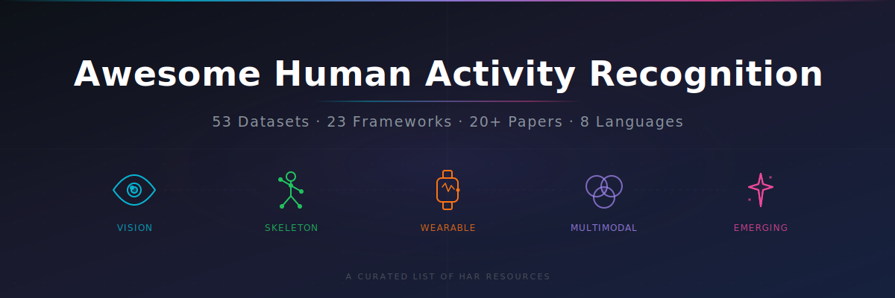
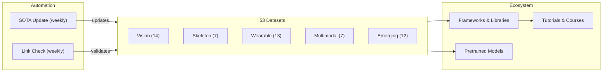

# Awesome Human Activity Recognition

<p align="center">
  
</p>

> Human Activity Recognition (HAR) is the field of recognizing human actions and activities from sensor data — including video, skeleton/mocap, wearable IMU, and multimodal egocentric inputs. This list covers 53 datasets, frameworks, pretrained models, tutorials, papers, competitions, and tools for HAR research.

[](https://awesome.re)
[](https://creativecommons.org/licenses/by/4.0/)
[](https://github.com/Leooo-Huang/awesome-human-activity-recognition/pulls)
[](https://github.com/Leooo-Huang/awesome-human-activity-recognition/commits/main)
[](https://github.com/Leooo-Huang/awesome-human-activity-recognition/blob/main/data/sota-snapshot.json)

<p align="center">
  <a href="https://github.com/Leooo-Huang/awesome-human-activity-recognition">
    
  </a>
  &nbsp;
  <a href="https://github.com/Leooo-Huang/awesome-human-activity-recognition/stargazers">
    
  </a>
</p>

---

## Quick Stats

| Modality | Datasets | Highlights |
|----------|----------|------------|
| Vision (RGB/Depth) | 14 | Kinetics-700, UCF-101, ActivityNet, AVA |
| Skeleton & MoCap | 7 | NTU RGB+D 60/120, AMASS, Human3.6M |
| Wearable Sensors | 13 | UCI-HAR, PAMAP2, CAPTURE-24 (3883 hrs) |
| Multimodal & Egocentric | 7 | Ego4D (3.3k hrs), EPIC-Kitchens-100 |
| Emerging & Frontier | 12 | HumanML3D, Motion-X++, Ego-Exo4D |

---

## Repository Architecture



---

## Which Dataset Should I Use?

!!! tip "Pick your modality and task, then follow the recommendation."

=== "Video Classification"

    Start with **[Kinetics-700](../datasets/vision/kinetics-700.md)** for pretraining, evaluate on **[UCF-101](../datasets/vision/ucf101.md)** or **[HMDB-51](../datasets/vision/hmdb51.md)** for comparison with prior work.

=== "Temporal Action Detection"

    **[ActivityNet](../datasets/vision/activitynet.md)** for proposals, **[AVA](../datasets/vision/ava.md)** for spatio-temporal, **[MultiTHUMOS](../datasets/vision/multithumos.md)** for dense multi-label.

=== "Skeleton / MoCap"

    **[NTU RGB+D 120](../datasets/vision/ntu-rgbd-120.md)** is the de facto standard. For text-motion alignment, use **[BABEL](../datasets/skeleton/babel.md)** or **[HumanML3D](../datasets/emerging/humanml3d.md)**.

=== "Wearable Sensors"

    **[UCI-HAR](../datasets/wearable/uci-har.md)** for baselines, **[PAMAP2](../datasets/wearable/pamap2.md)** for multi-sensor, **[CAPTURE-24](../datasets/wearable/capture24.md)** for real-world scale (151 subjects, 3883 hours).

=== "Egocentric / Multimodal"

    **[Ego4D](../datasets/multimodal/ego4d.md)** for scale (3.3k hours), **[EPIC-Kitchens-100](../datasets/multimodal/epic-kitchens-100.md)** for kitchen actions, **[Ego-Exo4D](../datasets/emerging/ego-exo4d.md)** for cross-view (CVPR 2024).

=== "Text-to-Motion Generation"

    **[HumanML3D](../datasets/emerging/humanml3d.md)** for single-person, **[InterHuman](../datasets/emerging/interhuman.md)** for two-person, **[Motion-X++](../datasets/emerging/motionx-plus.md)** for whole-body with face and hands.

---

## Explore

- **[Datasets](../datasets/vision/kinetics-700.md)** — Browse all 53 dataset cards organized by modality
- **[Taxonomy](taxonomy.md)** — Multi-dimensional classification by task, license, scale, and year
- **[Surveys](surveys.md)** — Curated survey papers across all modalities
- **[Benchmarking](benchmarking.md)** — SOTA baselines and performance bands per dataset
- **[Roadmap](roadmap.md)** — What is coming next
- **[Contributing](../CONTRIBUTING.md)** — How to add datasets or improve the list

---

## Citation

```bibtex
@misc{awesome_har_2025,
  title   = {Awesome Human Activity Recognition: A Curated List},
  author  = {Wenxuan Huang},
  year    = {2025},
  url     = {https://github.com/Leooo-Huang/awesome-human-activity-recognition},
  note    = {GitHub repository}
}
```
