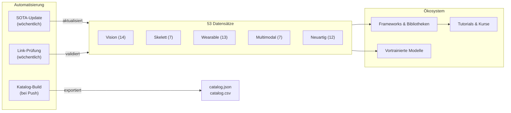

# Awesome Human Activity Recognition [](https://awesome.re)

<p align="center">
  <a href="https://github.com/Leooo-Huang/awesome-human-activity-recognition">
    
  </a>
</p>

> Ein kuratierter, forschungsorientierter Leitfaden zur **Erkennung menschlicher Aktivitäten** — 53 Datensätze, wichtige Frameworks, vortrainierte Modelle, Tutorials und Benchmark-Tools für die Modalitäten Vision, Wearable, Skelett und Multimodal.

[](https://creativecommons.org/licenses/by/4.0/)
[](https://github.com/Leooo-Huang/awesome-human-activity-recognition/pulls)
[](https://github.com/Leooo-Huang/awesome-human-activity-recognition/commits/main)
[](data/sota-snapshot.json)
[](https://leooo-huang.github.io/awesome-human-activity-recognition/)

[中文](README.zh.md) | **[Deutsch](README.de.md)** | [English](../README.md) | [Español](README.es.md) | [Français](README.fr.md) | [日本語](README.ja.md) | [한국어](README.ko.md) | [Português](README.pt.md) | [Русский](README.ru.md)

## Inhaltsverzeichnis

- [Repository-Architektur](#repository-architektur)
- [Welchen Datensatz sollte ich verwenden](#welchen-datensatz-sollte-ich-verwenden)
- [Datensätze](#datensätze)
- [Frameworks und Bibliotheken](#frameworks-und-bibliotheken)
- [Vortrainierte Modelle](#vortrainierte-modelle)
- [Tutorials und Kurse](#tutorials-und-kurse)
- [Schlüsselpublikationen](#schlüsselpublikationen)
- [Wettbewerbe und Challenges](#wettbewerbe-und-challenges)
- [Tools und Hilfsprogramme](#tools-und-hilfsprogramme)
- [Verwandte Awesome-Listen](#verwandte-awesome-listen)

## Repository-Architektur



## Welchen Datensatz sollte ich verwenden

> Wählen Sie Ihre Modalität und Aufgabe aus und folgen Sie der Empfehlung zum entsprechenden Abschnitt.

**Ich habe Videodaten und möchte Aktionen klassifizieren** — Beginnen Sie mit Kinetics-700 für das Pretraining und evaluieren Sie auf UCF-101 oder HMDB-51 zum Vergleich mit früheren Arbeiten. Siehe [Vision](#vision-rgb--tiefe).

**Ich benötige temporale Aktionserkennung in ungeschnittenen Videos** — ActivityNet für Proposals, AVA für räumlich-temporale Erkennung, MultiTHUMOS für dichte Multi-Label-Annotation. Ebenfalls unter Vision aufgeführt.

**Ich arbeite mit Skelett- oder Motion-Capture-Daten** — NTU RGB+D 120 ist der De-facto-Standard. Für Text-Bewegungs-Alignment verwenden Sie Babel oder HumanML3D. Siehe [Skelett](#skelett-und-motion-capture) und [Neuartig](#neuartige-und-experimentelle-datensätze).

**Ich habe IMU- oder Wearable-Sensordaten** — UCI-HAR für Baselines, PAMAP2 für Multi-Sensor-Setups, CAPTURE-24 für reale Szenarien im großen Maßstab (151 Probanden, 3883 Stunden). Siehe [Wearable](#tragbare-sensoren).

**Ich benötige egozentrische oder multimodale Daten** — Ego4D für großen Umfang (3,3k Stunden), EPIC-Kitchens-100 für Küchenaktionen, Ego-Exo4D für perspektivübergreifende Ansichten (NEU, CVPR 2024). Siehe [Multimodal](#multimodal-und-egozentrisch).

**Ich möchte Text-zu-Bewegung-Generierung betreiben** — HumanML3D für Einzelpersonen, InterHuman für Zweipersonen-Interaktionen, Motion-X++ für Ganzkörperbewegung mit Gesicht und Händen. Ebenfalls unter Neuartig aufgeführt.

## Datensätze

### Vision (RGB / Tiefe)

- [Kinetics-700](https://deepmind.com/research/open-source/kinetics) - Großer Pretraining-Benchmark mit 650k YouTube-Clips aus 700 Aktionsklassen.
- [UCF-101](https://www.crcv.ucf.edu/data/UCF101.php) - Klassischer Aktionserkennungs-Benchmark mit 13,3k Clips aus 101 Klassen.
- [HMDB-51](https://serre-lab.clps.brown.edu/resource/hmdb-a-large-human-motion-database/) - Vielfältiger Aktionserkennungs-Datensatz mit 6,8k Clips aus Filmen und Webvideos in 51 Klassen.
- [ActivityNet](http://activity-net.org/) - Benchmark für temporale Aktionserkennung mit 20k ungeschnittenen YouTube-Videos in 200 Klassen.
- [AVA](https://research.google.com/ava/) - Räumlich-temporale Aktionserkennung mit 430 Filmclips und 80 atomaren Aktionslabels mit Bounding Boxes.
- [NTU RGB+D 120](http://rose1.ntu.edu.sg/datasets/actionrecognition.asp) - Multi-View-3D-Aktionserkennung mit 114k Sequenzen in 120 Klassen unter Verwendung von RGB, Tiefe und Skelett.
- [Something-Something V2](https://developer.qualcomm.com/software/ai-datasets/something-something) - Feinkörniger Objektinteraktions-Datensatz mit 220k Clips in 174 Labels, der temporales Schlussfolgern erfordert.
- [FineGym](https://sdolivia.github.io/FineGym/) - Feinkörnige Erkennung von Turnbewegungen mit 32k hierarchisch annotierten Segmenten.
- [Moments in Time](http://moments.csail.mit.edu/) - Extrem vielfältiger Ereignis- und Aktionserkennungs-Datensatz mit 1M gelabelten 3-Sekunden-Videoclips in 339 Klassen.
- [Diving48](http://www.svcl.ucsd.edu/projects/resound/dataset.html) - Feinkörnige Erkennung von Sprungbewegungen mit 18k Clips in 48 Klassen, die temporales Schlussfolgern erfordern.
- [Toyota Smarthome](https://project.inria.fr/toyotasmarthome/) - Erkennung von Alltagsaktivitäten mit 16k Multi-View-Clips in 31 Klassen unter Verwendung von RGB, Tiefe und Skelett.
- [MultiSports](https://deeperaction.github.io/multisports/) - Räumlich-temporale Aktionserkennung in 4 Sportarten mit 3,2k Clips und 66 feinkörnigen Aktionsklassen.
- [MultiTHUMOS](https://ai.stanford.edu/~syyeung/everymoment.html) - Dichte Multi-Label-temporale Aktionserkennung mit 65 Klassen und 38k Annotationen.
- [FineSports](https://github.com/PKU-ICST-MIPL/FineSports_CVPR2024) - Feinkörniges Mehrpersonen-Sportverständnis mit 10k NBA-Videos und 52 Aktionstypen von der CVPR 2024.

### Skelett und Motion Capture

- [NTU RGB+D 60](https://rose1.ntu.edu.sg/dataset/actionRecognition/) - Grundlegender Datensatz für skelettbasierte Aktionserkennung mit 57k Sequenzen in 60 Klassen.
- [AMASS](https://amass.is.tue.mpg.de/) - Vereinheitlichte SMPL-Motion-Capture-Parameter aus über 40 Datensätzen mit 16k Minuten und 344 Probanden.
- [Human3.6M](http://vision.imar.ro/human3.6m/description.php) - De-facto-Standard für 3D-Posenschätzung mit 3,6M Frames von 11 professionellen Darstellern.
- [Babel](https://babel.is.tue.mpg.de/) - Datensatz für Bewegung-Sprache-Alignment mit 43 Stunden und 3,7k Sequenzen, annotiert mit SMPL und Textlabels.
- [TotalCapture](http://totalcapture.net/) - Multimodaler 3D-Posenschätzungs-Benchmark, der Motion Capture, Multi-View-RGB und IMU von 5 Probanden kombiniert.
- [PKU-MMD](https://www.icst.pku.edu.cn/struct/Projects/PKUMMD.html) - Multimodaler Aktionserkennungs-Benchmark mit 20k Instanzen in 51 Klassen.
- [Skeletics-152](https://github.com/skelemoa/quater-gcn) - Großangelegte skelettbasierte Aktionserkennung aus geschätzten Posen mit 150k Clips in 152 Klassen.

### Tragbare Sensoren

- [UCI-HAR](https://archive.ics.uci.edu/ml/datasets/human+activity+recognition+using+smartphones) - Klassischer Smartphone-IMU-Benchmark mit 30 Probanden und 6 Aktivitäten, nahezu gesättigt.
- [PAMAP2](https://archive.ics.uci.edu/ml/datasets/pamap2+physical+activity+monitoring) - Wearable-HAR-Standard mit Multi-IMU und Herzfrequenz von 9 Probanden in 18 Aktivitäten.
- [WISDM](https://www.cis.fordham.edu/wisdm/dataset.php) - Sensor-Data-Mining von Smartphone und Smartwatch mit 51 Probanden und über 1 Million Samples.
- [OPPORTUNITY](https://archive.ics.uci.edu/ml/datasets/OPPORTUNITY+Activity+Recognition) - Kontextbewusste Aktivitätserkennung mit 72 tragbaren und Umgebungssensoren von 4 Probanden.
- [HAPT](https://archive.ics.uci.edu/ml/datasets/Human+Activity+Recognition+Using+Smartphones) - Smartphone-IMU-Datensatz mit Erkennung von Haltungsübergängen von 30 Probanden in 12 Aktivitäten.
- [RealWorld HAR](https://sensor.informatik.uni-mannheim.de/#dataset_realworld) - Aktivitätserkennung unter realen Bedingungen mit mehreren Gerätepositionen von 60 Probanden in 15 Aktivitäten.
- [mHealth](https://archive.ics.uci.edu/ml/datasets/MHEALTH+Dataset) - Am Körper getragene Sensoren mit EKG für mobile Gesundheitsüberwachung von 10 Probanden in 12 Aktivitäten.
- [UniMiB-SHAR](http://www.sal.disco.unimib.it/technologies/unimib-shar/) - Smartphone-Beschleunigungsmesser-Datensatz für Alltagsaktivitäten und Sturzerkennung von 30 Probanden in 17 Aktivitäten.
- [Daphnet](https://archive.ics.uci.edu/ml/datasets/Daphnet+Freezing+of+Gait) - Erkennung von Freezing of Gait bei Parkinson-Patienten mittels 3 tragbarer Beschleunigungsmesser von 10 Probanden.
- [Sussex-Huawei Locomotion](http://www.shl-dataset.org/) - Großangelegte Fortbewegungsart-Erkennung mit über 2800 Stunden von 3 Nutzern mit Smartphone- und Smartwatch-Sensoren.
- [HARTH](https://archive.ics.uci.edu/dataset/779/harth) - Professionell videoannotierte Beschleunigungsmesser-HAR unter freien Lebensbedingungen von 22 Probanden.
- [CAPTURE-24](https://github.com/OxWearables/capture24) - Größter frei erhobener Handgelenk-Beschleunigungsmesser-Datensatz mit 151 Probanden und 3883 Stunden aus Nature Scientific Data 2024.
- [WEAR](https://github.com/mariusbock/wear) - Outdoor-Sport-Datensatz mit Smartwatch-IMU und egozentrischer Videoaufnahme von 22 Probanden in 18 Aktivitäten, veröffentlicht auf der IMWUT 2024.

### Multimodal und Egozentrisch

- [EPIC-Kitchens-100](https://epic-kitchens.github.io/2021) - Langzeit-egozentrische Küchenaktionen mit Audio über 700 Stunden in 90 Küchen.
- [Ego4D](https://ego4d-data.org/docs/data/) - Größter egozentrischer Datensatz mit Multi-Task-Benchmarks über 3,3k Stunden in 74 Szenarien.
- [Charades](https://allenai.org/plato/charades/) - Multi-Label-Aktionserkennung in Innenräumen mit geskripteten Beschreibungen über 9,8k Videos in 157 Labels.
- [NTU Mutual Actions](https://arxiv.org/abs/1905.04757) - Zweipersonen-Interaktionen aus NTU RGB+D mit Skelettdaten in 26 Interaktionsklassen.
- [ActivityNet Captions](https://cs.stanford.edu/people/ranber/densevid/) - Dichte Videobeschreibung und temporale Verortung mit 20k Videos und 100k Beschreibungen.
- [How2Sign](https://how2sign.github.io/) - Multimodaler Datensatz für Amerikanische Gebärdensprache mit RGB, Tiefe und Pose über 80 Stunden.
- [EgoExo-Fitness](https://github.com/iSEE-Laboratory/EgoExo-Fitness) - Ego- und Exo-Fitness-Aktionsqualitätsbewertung mit 31 Stunden und über 6k Aktionen von der ECCV 2024.

### Neuartige und experimentelle Datensätze

- [BEHAVE](https://virtualhumans.mpi-inf.mpg.de/behave/) - RGB-D-Mensch-Objekt-Interaktion mit 3D-Pose über 321 Sequenzen von 20 Probanden.
- [Motion-X](https://caizhongang.github.io/projects/Motion-X/) - Ganzkörper- und Handgelenk-Bewegung aus Multisensor-Motion-Capture mit 2M Frames von 10 Probanden.
- [Ego-Exo4D](https://ego-exo4d-data.org/) - Perspektivübergreifendes Aktionsverständnis mit synchronisiertem Ego- und Exo-Video über 1,4k Sequenzen.
- [HumanML3D](https://github.com/EricGuo5513/HumanML3D) - Text-zu-Bewegung-Generierungsdatensatz mit SMPL-Annotationen über 14k+ Bewegungssequenzen.
- [InterHuman](https://github.com/tr3e/InterHuman) - Zweipersonen-Interaktionsbewegung mit SMPL-X und Textbeschreibungen über 6k+ Sequenzen.
- [HOI4D](https://hoi4d.github.io/) - Egozentrische Hand-Objekt-Interaktion mit RGB-D und Handpose über 4k+ Videoclips.
- [FineBio](https://github.com/aistairc/FineBio) - Feinkörniges Verständnis von Laborhandlungen in der Biologie mit mehrstufigen Versuchsannotationen.
- [HAA500](https://www.cse.ust.hk/haa/) - Vielfältige feinkörnige atomare Aktionserkennung mit 10k Clips in 500 Klassen.
- [Motion-X++](https://motion-x-dataset.github.io/) - Ganzkörper-Bewegungsgenerierung mit Text und Audio über 120k+ Sequenzen.
- [FLAG3D](https://andytang15.github.io/FLAG3D/) - 3D-Fitnessaktivitätsverständnis mit Multi-View-RGB, Skelett und Text über 180k Sequenzen von der CVPR 2024.
- [InterX](https://liangxuy.github.io/inter-x/) - Umfassender Mensch-Mensch-Interaktionsdatensatz mit SMPL-X über 11k+ Sequenzen von der CVPR 2024.
- [WiMANS](https://arxiv.org/abs/2402.09430) - Erster WiFi-basierter Mehrbenutzer-Aktivitätserkennungs-Benchmark auf einer Top-Konferenz von der ECCV 2024.

## Frameworks und Bibliotheken

### Video-Aktionserkennung

- [MMAction2](https://github.com/open-mmlab/mmaction2) - OpenMMLab-Toolbox für Videoverständnis mit Unterstützung von über 20 Modellarchitekturen, darunter SlowFast, TimeSformer und VideoMAE.
- [PySlowFast](https://github.com/facebookresearch/SlowFast) - Facebook-Research-Bibliothek für Videoverständnis mit SlowFast, X3D, MViT und AVA-Modellen.
- [Video-Swin-Transformer](https://github.com/SwinTransformer/Video-Swin-Transformer) - Reines Transformer-Backbone für Videoerkennung mit SOTA-Ergebnissen auf Kinetics-400, Kinetics-600 und SSv2.
- [TimeSformer](https://github.com/facebookresearch/TimeSformer) - Facebook Research: Geteilte Raum-Zeit-Aufmerksamkeit für Videoklassifikation, ICML 2021.
- [VideoMAE](https://github.com/MCG-NJU/VideoMAE) - Selbstüberwachtes Video-Pretraining mit Masked Autoencodern, das SOTA auf mehreren Benchmarks erzielt.
- [InternVideo2](https://github.com/OpenGVLab/InternVideo2) - Foundation Model für Videoverständnis im großen Maßstab mit Unterstützung für Aktionserkennung, Retrieval und Beschreibung.

### Skelettbasierte Aktionserkennung

- [CTR-GCN](https://github.com/Uason-Chen/CTR-GCN) - Kanalweise Topologie-Verfeinerungs-Graph-Convolution für skelettbasierte Aktionserkennung, ICCV 2021.
- [ST-GCN](https://github.com/yysijie/st-gcn) - Wegweisendes räumlich-temporales Graph-Convolution-Netzwerk, das den GCN-Ansatz für skelettbasierte HAR etablierte.
- [2s-AGCN](https://github.com/lshiwjx/2s-AGCN) - Zweistrom-adaptives Graph-Convolutional-Netzwerk für skelettbasierte Aktionserkennung, CVPR 2019.
- [HD-GCN](https://github.com/Jho-Yonsei/HD-GCN) - Hierarchisch zerlegtes Graph-Convolutional-Netzwerk für Skelett-Aktionserkennung, AAAI 2024.
- [MotionBERT](https://github.com/Walter0807/MotionBERT) - Vereinheitlichtes Pretraining für Bewegungsanalyse, das 3D-Posenschätzung und Aktionserkennung abdeckt.
- [InfoGCN](https://github.com/stnoah1/infogcn) - Informationsengpass-Graph-Convolutional-Netzwerk für Skelett-Aktionserkennung, CVPR 2022.

### Wearable-Sensor-HAR

- [tsai](https://github.com/timeseriesAI/tsai) - Deep-Learning-Bibliothek für Zeitreihen und Sequenzen auf Basis von fastai und PyTorch, weit verbreitet für Sensor-HAR.
- [aeon](https://github.com/aeon-toolkit/aeon) - Einheitliches Python-Toolkit für Zeitreihen mit Klassifikation, Clustering und Anomalieerkennung.
- [NNCLR-HAR](https://github.com/mariusbock/nnclr-har) - Selbstüberwachtes kontrastives Lern-Framework für Wearable-Sensor-HAR, IMWUT 2022.
- [DeepConvLSTM](https://github.com/sussexwearlab/DeepConvLSTM) - Referenzimplementierung der Convolutional-LSTM-Architektur für tragbare Aktivitätserkennung.
- [Hang-Time HAR](https://github.com/ahoelzemann/hangtime_har) - Basketball-Aktivitätserkennung von einem einzelnen am Handgelenk getragenen Trägheitssensor mittels Deep Learning.

### Bewegungsgenerierung und -schätzung

- [MDM](https://github.com/GuyTevet/motion-diffusion-model) - Diffusionsmodell für menschliche Bewegung zur Text-zu-Bewegung-Generierung mit SOTA-Ergebnissen auf HumanML3D.
- [MLD](https://github.com/ChenFengYe/motion-latent-diffusion) - Latentes Diffusionsmodell für Bewegung zur effizienten textgesteuerten Generierung menschlicher Bewegung, CVPR 2023.
- [T2M-GPT](https://github.com/Mael-zys/T2M-GPT) - Generierung menschlicher Bewegung aus Textbeschreibungen mit diskreten Repräsentationen.
- [MotionGPT](https://github.com/OpenMotionLab/MotionGPT) - Vereinheitlichtes Bewegungs-Sprache-Generierungsmodell, das Bewegung als Fremdsprache behandelt.
- [SMPL-X](https://github.com/vchoutas/smplx) - Expressives Körpermodell, das Körper-, Gesichts- und Handposen erfasst — der Standard für moderne Bewegungsdatensätze.

## Vortrainierte Modelle

- [VideoMAE V2](https://github.com/OpenGVLab/VideoMAEv2) - Video-Foundation-Model mit Milliarden Parametern, vortrainiert auf Millionen von Clips, feinabstimmbar für Aktionserkennung.
- [InternVideo2 Model Zoo](https://huggingface.co/OpenGVLab/InternVideo2-Stage2_1B-224p-f4) - 6B-Parameter-Video-Sprache-Modell-Checkpoints auf Hugging Face für Aktionserkennung und Retrieval.
- [UniFormerV2](https://github.com/OpenGVLab/UniFormerV2) - Effizienter Video-Transformer mit Multi-Scale-Tokens, der 90,0 % Top-1 auf Kinetics-400 erreicht.
- [MVD](https://github.com/ruiwang2021/mvd) - Vortrainiertes Modell mit Masked Video Distillation, konkurrenzfähig mit VideoMAE bei nachgelagerten Aktionserkennungsaufgaben.
- [MotionBERT Checkpoints](https://huggingface.co/walterzhu/MotionBERT) - Vortrainierter Bewegungs-Encoder, übertragbar auf 3D-Posenschätzung, Aktionserkennung und Mesh-Rekonstruktion.

## Tutorials und Kurse

- [Dive into Deep Learning - Action Recognition](https://d2l.ai/) - Interaktives Lehrbuchkapitel über Videoverständnis und Aktionserkennung mit PyTorch-Code.
- [MMAction2 Tutorials](https://mmaction2.readthedocs.io/en/latest/get_started/overview.html) - Schritt-für-Schritt-Anleitung zum Training von Aktionserkennungsmodellen auf eigenen Datensätzen.
- [Sensor HAR Tutorial von Marius Bock](https://github.com/mariusbock/dl-for-har) - Umfassendes Deep-Learning-Tutorial für Trägheitssensor-HAR mit PyTorch.
- [Stanford CS231N - Video Understanding](https://cs231n.stanford.edu/) - Vorlesungsmaterialien zu temporaler Modellierung, Zweistrom-Netzwerken und 3D-Convolutions für Aktionserkennung.
- [Coursera - Motion Planning](https://www.coursera.org/learn/robotics-motion-planning) - Kurs der University of Pennsylvania zu Bewegungsrepräsentationen mit Relevanz für HAR.
- [Motion Diffusion Tutorial](https://colab.research.google.com/drive/1MvBaAhOrEk8MP_jwNdQKLnvMxXPOG6zU) - Colab-Notebook zum Training textbedingter Diffusionsmodelle für menschliche Bewegung auf HumanML3D.

## Schlüsselpublikationen

### Grundlegende Arbeiten

- [Two-Stream Convolutional Networks](https://arxiv.org/abs/1406.2199) - Simonyan und Zisserman, NeurIPS 2014, Begründung des räumlich-temporalen Zweistrom-Paradigmas.
- [C3D: Learning Spatiotemporal Features](https://arxiv.org/abs/1412.0767) - Tran et al., ICCV 2015, Pionierarbeit zu 3D-Convolutions für Video-Feature-Learning.
- [I3D: Quo Vadis Action Recognition](https://arxiv.org/abs/1705.07750) - Carreira und Zisserman, CVPR 2017, Inflation von 2D-ImageNet-Architekturen auf 3D-Video.
- [ST-GCN: Spatial Temporal Graph Convolutional Networks](https://arxiv.org/abs/1801.07455) - Yan et al., AAAI 2018, Definition des GCN-Ansatzes für skelettbasierte Aktionserkennung.
- [SlowFast Networks](https://arxiv.org/abs/1812.03982) - Feichtenhofer et al., ICCV 2019, Zweipfad-Architektur für Videoerkennung.

### Transformer-Ära (ab 2020)

- [ViViT: A Video Vision Transformer](https://arxiv.org/abs/2103.15691) - Arnab et al., ICCV 2021, reine Transformer-Modelle für Videoklassifikation.
- [TimeSformer](https://arxiv.org/abs/2102.05095) - Bertasius et al., ICML 2021, geteilte Raum-Zeit-Aufmerksamkeit für skalierbare Video-Transformer.
- [VideoMAE](https://arxiv.org/abs/2203.12602) - Tong et al., NeurIPS 2022, Masked-Autoencoder-Pretraining mit SOTA-Ergebnissen bei minimalem gelabelten Datenaufwand.
- [InternVideo2](https://arxiv.org/abs/2403.15377) - Wang et al., ECCV 2024, Skalierung von Video-Foundation-Models auf 6B Parameter über mehr als 60 Benchmarks.

### Wearable- und Sensor-HAR

- [DeepConvLSTM](https://arxiv.org/abs/1611.06759) - Ordonez und Roggen, Sensors 2016, Begründung von Deep Learning für tragbare Aktivitätserkennung.
- [Attend and Discriminate](https://arxiv.org/abs/2007.07426) - Abedin et al., IMWUT 2021, Aufmerksamkeitsmechanismen für Multi-Sensor-HAR.
- [Self-supervised HAR](https://arxiv.org/abs/2011.11542) - Tang et al., IJCAI 2021, kontrastives Lernen für sensorbasierte Aktivitätserkennung.

### Bewegungsgenerierung

- [MDM: Human Motion Diffusion Model](https://arxiv.org/abs/2209.14916) - Tevet et al., ICLR 2023, diffusionsbasierte Text-zu-Bewegung-Generierung.
- [MotionGPT](https://arxiv.org/abs/2306.14795) - Jiang et al., NeurIPS 2023, Vereinheitlichung von Bewegung und Sprache durch LLM-Architekturen.
- [Motion-X](https://arxiv.org/abs/2307.00818) - Lin et al., NeurIPS 2023, erster großangelegter Ganzkörper-Bewegungsdatensatz mit expressiven Annotationen.

### Übersichtsarbeiten

- [Deep Learning for HAR: A Survey](https://dl.acm.org/doi/10.1145/3472290) - Li et al., ACM Computing Surveys 2022, umfassender Überblick über Deep-Learning-Ansätze für HAR.
- [Skeleton-based Action Recognition Survey](https://arxiv.org/abs/2012.12231) - Liu et al., IEEE TPAMI 2022, eingehende Betrachtung von GCN- und Transformer-Methoden für Skelett-HAR.
- [Multimodal HAR with Emphasis on Classification](https://www.sciencedirect.com/science/article/pii/S0950705124000029) - Yadav et al., Knowledge-Based Systems 2024, neueste Übersichtsarbeit zu Fusionsstrategien.

## Wettbewerbe und Challenges

- [Ego-Exo4D Challenge 2025](https://eval.ai/web/challenges/challenge-page/2249/overview) - CVPR-2025-Multi-Track-Benchmark für Ego-Pose, Aktionserkennung und Sprachverständnis.
- [ActivityNet Challenge](http://activity-net.org/challenges/2024/) - Jährlicher Wettbewerb für temporale Aktionserkennung, Proposals und dichte Beschreibung.
- [EPIC-Kitchens Challenge](https://epic-kitchens.github.io/2024) - Wettbewerb für egozentrische Aktionserkennung, -erkennung und -antizipation.
- [SHL Recognition Challenge](http://www.shl-dataset.org/activity-recognition-challenge/) - Jährlicher Wettbewerb zur Erkennung von Fortbewegungsarten anhand von Smartphone-Sensoren.
- [Babel Challenge](https://teach.is.tue.mpg.de/) - Bewegung-Sprache-Verständnis und temporale Aktionssegmentierung auf Motion-Capture-Daten.
- [UAV-Human Challenge](https://github.com/SUTDCV/UAV-Human) - Verständnis menschlichen Verhaltens aus UAV-Perspektiven mit multimodalen Daten.

## Tools und Hilfsprogramme

- [Papers with Code - HAR Leaderboards](https://paperswithcode.com/task/activity-recognition) - Live-SOTA-Tracking über alle wichtigen HAR-Benchmarks.
- [MMAction2 Model Zoo](https://mmaction2.readthedocs.io/en/latest/model_zoo/modelzoo.html) - Vortrainierte Checkpoints und Konfigurationen für über 100 Aktionserkennungsmodelle.
- [Decord](https://github.com/dmlc/decord) - Effizienter GPU-beschleunigter Video-Reader für Deep-Learning-Trainingspipelines.
- [vid2player](https://github.com/jhgan00/vid2player) - Charakteranimation aus Videoinput, nützlich für die Visualisierung von Aktivitätserkennung.
- [OpenPose](https://github.com/CMU-Perceptual-Computing-Lab/openpose) - Echtzeit-Mehrpersonen-Keypoint-Erkennung zur Skelettextraktion aus Video.
- [MediaPipe](https://developers.google.com/mediapipe) - Googles On-Device-ML-Framework für Posenschätzung, Handtracking und Gestenerkennung.
- [YOLO-Pose](https://github.com/ultralytics/ultralytics) - Ultralytics YOLOv8 Pose für Echtzeit-Mehrpersonen-Skelettschätzung.

## Verwandte Awesome-Listen

- [Awesome Action Recognition](https://github.com/jinwchoi/awesome-action-recognition) - Publikationen und Datensätze zur Aktionserkennung.
- [Awesome Skeleton-based Action Recognition](https://github.com/firework8/Awesome-Skeleton-based-Action-Recognition) - GCN- und Transformer-Methoden für skelettbasierte HAR.
- [Awesome Self-Supervised Learning](https://github.com/jason718/awesome-self-supervised-learning) - Selbstüberwachte Lernmethoden für Video- und Sensor-Modalitäten.
- [Awesome Video Understanding](https://github.com/HuaizhengZhang/Awesome-System-for-Machine-Learning) - Systeme und Architekturen für Videoverständnis.
- [Awesome IMU Sensing](https://github.com/rh20624/Awesome-IMU-Sensing) - IMU-basierte Sensorik für Aktivitätserkennung und Navigation.
- [Awesome Pose Estimation](https://github.com/cbsudux/awesome-human-pose-estimation) - Methoden und Benchmarks zur Schätzung menschlicher Posen.

## Fußnoten

Siehe auch: [Mehrdimensionale Taxonomie](docs/taxonomy.md) | [Übersichtsarbeiten](docs/surveys.md) | [Benchmarks](docs/benchmarking.md) | [Katalog-Builder](tools/) | [Roadmap](docs/roadmap.md) | [Beitragsleitfaden](CONTRIBUTING.md)

### Zitation

```bibtex
@misc{awesome_har_2025,
  title   = {Awesome Human Activity Recognition: A Curated List},
  author  = {Wenxuan Huang},
  year    = {2025},
  url     = {https://github.com/Leooo-Huang/awesome-human-activity-recognition},
  note    = {GitHub repository}
}
```

### Danksagung

Wir danken den Datensatz-Autorinnen und -Autoren, Annotationsteams und Benchmark-Maintainern, deren Arbeit die offene Forschung im Bereich der Erkennung menschlicher Aktivitäten ermöglicht.
