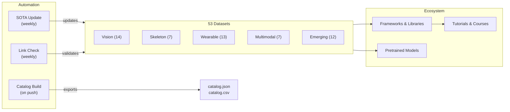

# Awesome Human Activity Recognition [](https://awesome.re)

<p align="center">
  <a href="https://github.com/Leooo-Huang/awesome-human-activity-recognition">
    
  </a>
</p>

> Una guía curada e impulsada por investigadores sobre el **Reconocimiento de Actividad Humana** — 53 conjuntos de datos, marcos de trabajo clave, modelos preentrenados, tutoriales y herramientas de evaluación comparativa en las modalidades de visión, sensores vestibles, esqueleto y multimodal.

[](https://creativecommons.org/licenses/by/4.0/)
[](https://github.com/Leooo-Huang/awesome-human-activity-recognition/pulls)
[](https://github.com/Leooo-Huang/awesome-human-activity-recognition/commits/main)
[](data/sota-snapshot.json)
[](https://leooo-huang.github.io/awesome-human-activity-recognition/)

[中文](README.zh.md) | [Deutsch](README.de.md) | **[Español](README.es.md)** | [Français](README.fr.md) | [日本語](README.ja.md) | [한국어](README.ko.md) | [Português](README.pt.md) | [Русский](README.ru.md)

## Contenidos

- [Arquitectura del repositorio](#arquitectura-del-repositorio)
- [¿Qué conjunto de datos debería usar?](#qué-conjunto-de-datos-debería-usar)
- [Conjuntos de datos](#conjuntos-de-datos)
- [Marcos de trabajo y bibliotecas](#marcos-de-trabajo-y-bibliotecas)
- [Modelos preentrenados](#modelos-preentrenados)
- [Tutoriales y cursos](#tutoriales-y-cursos)
- [Artículos clave](#artículos-clave)
- [Competiciones y desafíos](#competiciones-y-desafíos)
- [Herramientas y utilidades](#herramientas-y-utilidades)
- [Listas Awesome relacionadas](#listas-awesome-relacionadas)

## Arquitectura del repositorio



## ¿Qué conjunto de datos debería usar?

> Elija su modalidad y tarea, luego siga la recomendación hacia la sección correspondiente.

**Tengo vídeo y quiero clasificar acciones** — Comience con Kinetics-700 para el preentrenamiento, evalúe en UCF-101 o HMDB-51 para comparar con trabajos previos. Consulte [Visión](#visión-rgb--profundidad).

**Necesito detección temporal de acciones en vídeo sin recortar** — ActivityNet para propuestas, AVA para detección espacio-temporal, MultiTHUMOS para etiquetado múltiple denso. También en la sección Visión anterior.

**Trabajo con datos de esqueleto o captura de movimiento** — NTU RGB+D 120 es el estándar de facto. Para alineación texto-movimiento, use Babel o HumanML3D. Consulte [Esqueleto](#esqueleto-y-captura-de-movimiento) y [Emergentes](#emergentes-y-frontera).

**Tengo datos de IMU o sensores vestibles** — UCI-HAR para líneas base, PAMAP2 para múltiples sensores, CAPTURE-24 para escala real (151 sujetos, 3883 horas). Consulte [Sensores vestibles](#sensores-vestibles).

**Necesito datos egocéntricos o multimodales** — Ego4D para escala (3.3k horas), EPIC-Kitchens-100 para acciones en cocina, Ego-Exo4D para visión cruzada (NUEVO, CVPR 2024). Consulte [Multimodal](#multimodal-y-egocéntrico).

**Quiero generación de movimiento a partir de texto** — HumanML3D para una persona, InterHuman para dos personas, Motion-X++ para cuerpo completo con cara y manos. También en la sección Emergentes anterior.

## Conjuntos de datos

### Visión (RGB / Profundidad)

- [Kinetics-700](https://deepmind.com/research/open-source/kinetics) - Benchmark de preentrenamiento a gran escala con 650k clips de YouTube en 700 clases de acciones.
- [UCF-101](https://www.crcv.ucf.edu/data/UCF101.php) - Benchmark clásico de reconocimiento de acciones con 13.3k clips en 101 clases.
- [HMDB-51](https://serre-lab.clps.brown.edu/resource/hmdb-a-large-human-motion-database/) - Conjunto de datos diverso de reconocimiento de acciones con 6.8k clips de películas y vídeos web en 51 clases.
- [ActivityNet](http://activity-net.org/) - Benchmark de detección temporal de acciones con 20k vídeos de YouTube sin recortar en 200 clases.
- [AVA](https://research.google.com/ava/) - Detección espacio-temporal de acciones con 430 clips de películas y 80 etiquetas de acciones atómicas con cuadros delimitadores.
- [NTU RGB+D 120](http://rose1.ntu.edu.sg/datasets/actionrecognition.asp) - Reconocimiento de acciones 3D multivista con 114k secuencias en 120 clases usando RGB, profundidad y esqueleto.
- [Something-Something V2](https://developer.qualcomm.com/software/ai-datasets/something-something) - Conjunto de datos de interacción con objetos de grano fino con 220k clips en 174 etiquetas que requieren razonamiento temporal.
- [FineGym](https://sdolivia.github.io/FineGym/) - Reconocimiento de acciones de gimnasia de grano fino con 32k segmentos etiquetados jerárquicamente.
- [Moments in Time](http://moments.csail.mit.edu/) - Conjunto de datos extremadamente diverso de reconocimiento de eventos y acciones con 1M de clips de vídeo de 3 segundos en 339 clases.
- [Diving48](http://www.svcl.ucsd.edu/projects/resound/dataset.html) - Reconocimiento de acciones de clavados de grano fino con 18k clips en 48 clases que requieren razonamiento temporal.
- [Toyota Smarthome](https://project.inria.fr/toyotasmarthome/) - Reconocimiento de actividades de la vida diaria con 16k clips multivista en 31 clases usando RGB, profundidad y esqueleto.
- [MultiSports](https://deeperaction.github.io/multisports/) - Detección espacio-temporal de acciones en 4 deportes con 3.2k clips y 66 clases de acciones de grano fino.
- [MultiTHUMOS](https://ai.stanford.edu/~syyeung/everymoment.html) - Detección temporal densa de acciones multietiqueta con 65 clases y 38k anotaciones.
- [FineSports](https://github.com/PKU-ICST-MIPL/FineSports_CVPR2024) - Comprensión deportiva de grano fino con múltiples personas, con 10k vídeos de la NBA y 52 tipos de acciones de CVPR 2024.

### Esqueleto y captura de movimiento

- [NTU RGB+D 60](https://rose1.ntu.edu.sg/dataset/actionRecognition/) - Conjunto de datos fundamental para el reconocimiento de acciones basado en esqueleto con 57k secuencias en 60 clases.
- [AMASS](https://amass.is.tue.mpg.de/) - Parámetros unificados de captura de movimiento SMPL de más de 40 conjuntos de datos que cubren 16k minutos y 344 sujetos.
- [Human3.6M](http://vision.imar.ro/human3.6m/description.php) - Estándar de facto para la estimación de pose 3D con 3.6M de cuadros de 11 actores profesionales.
- [Babel](https://babel.is.tue.mpg.de/) - Conjunto de datos de alineación movimiento-lenguaje con 43 horas y 3.7k secuencias anotadas con SMPL y etiquetas de texto.
- [TotalCapture](http://totalcapture.net/) - Benchmark de estimación de pose 3D multimodal que combina captura de movimiento, RGB multivista e IMU de 5 sujetos.
- [PKU-MMD](https://www.icst.pku.edu.cn/struct/Projects/PKUMMD.html) - Benchmark de detección de acciones multimodalidad con 20k instancias en 51 clases.
- [Skeletics-152](https://github.com/skelemoa/quater-gcn) - Reconocimiento de acciones por esqueleto a gran escala a partir de poses estimadas con 150k clips en 152 clases.

### Sensores vestibles

- [UCI-HAR](https://archive.ics.uci.edu/ml/datasets/human+activity+recognition+using+smartphones) - Benchmark clásico de IMU de smartphone con 30 sujetos y 6 actividades, casi saturado.
- [PAMAP2](https://archive.ics.uci.edu/ml/datasets/pamap2+physical+activity+monitoring) - Estándar de HAR vestible con múltiples IMU y frecuencia cardíaca de 9 sujetos en 18 actividades.
- [WISDM](https://www.cis.fordham.edu/wisdm/dataset.php) - Minería de datos de sensores de teléfono y reloj inteligente con 51 sujetos y más de 1 millón de muestras.
- [OPPORTUNITY](https://archive.ics.uci.edu/ml/datasets/OPPORTUNITY+Activity+Recognition) - Reconocimiento de actividad consciente del contexto con 72 sensores vestibles y ambientales de 4 sujetos.
- [HAPT](https://archive.ics.uci.edu/ml/datasets/Human+Activity+Recognition+Using+Smartphones) - Conjunto de datos de IMU de smartphone con detección de transiciones posturales de 30 sujetos en 12 actividades.
- [RealWorld HAR](https://sensor.informatik.uni-mannheim.de/#dataset_realworld) - Reconocimiento de actividad en condiciones reales con múltiples ubicaciones de dispositivos de 60 sujetos en 15 actividades.
- [mHealth](https://archive.ics.uci.edu/ml/datasets/MHEALTH+Dataset) - Sensores corporales con ECG para monitorización de salud móvil de 10 sujetos en 12 actividades.
- [UniMiB-SHAR](http://www.sal.disco.unimib.it/technologies/unimib-shar/) - Conjunto de datos de acelerómetro de smartphone para actividades diarias y detección de caídas de 30 sujetos en 17 actividades.
- [Daphnet](https://archive.ics.uci.edu/ml/datasets/Daphnet+Freezing+of+Gait) - Detección de congelación de la marcha para pacientes de Parkinson usando 3 acelerómetros vestibles de 10 sujetos.
- [Sussex-Huawei Locomotion](http://www.shl-dataset.org/) - Reconocimiento de modos de locomoción a gran escala con más de 2800 horas de 3 usuarios con sensores de teléfono y reloj.
- [HARTH](https://archive.ics.uci.edu/dataset/779/harth) - HAR con acelerómetro en vida libre anotado por vídeo profesional de 22 sujetos en condiciones reales.
- [CAPTURE-24](https://github.com/OxWearables/capture24) - El mayor conjunto de datos de acelerómetro de muñeca en vida libre con 151 sujetos y 3883 horas de Nature Scientific Data 2024.
- [WEAR](https://github.com/mariusbock/wear) - Conjunto de datos de deportes al aire libre con IMU de reloj inteligente y vídeo egocéntrico de 22 sujetos en 18 actividades, publicado en IMWUT 2024.

### Multimodal y egocéntrico

- [EPIC-Kitchens-100](https://epic-kitchens.github.io/2021) - Acciones egocéntricas de cocina a largo plazo con audio que abarca 700 horas en 90 cocinas.
- [Ego4D](https://ego4d-data.org/docs/data/) - El mayor conjunto de datos egocéntrico con benchmarks multitarea que abarca 3.3k horas en 74 escenas.
- [Charades](https://allenai.org/plato/charades/) - Reconocimiento de acciones multietiqueta en interiores con descripciones guionizadas que abarca 9.8k vídeos en 157 etiquetas.
- [NTU Mutual Actions](https://arxiv.org/abs/1905.04757) - Interacciones entre dos personas de NTU RGB+D con datos de esqueleto en 26 clases de interacción.
- [ActivityNet Captions](https://cs.stanford.edu/people/ranber/densevid/) - Descripción densa de vídeo y localización temporal con 20k vídeos y 100k descripciones.
- [How2Sign](https://how2sign.github.io/) - Conjunto de datos multimodal de lengua de señas americana con RGB, profundidad y pose que abarca 80 horas.
- [EgoExo-Fitness](https://github.com/iSEE-Laboratory/EgoExo-Fitness) - Evaluación de calidad de acciones fitness con perspectiva ego y exo con 31 horas y más de 6k acciones de ECCV 2024.

### Emergentes y frontera

- [BEHAVE](https://virtualhumans.mpi-inf.mpg.de/behave/) - Interacción humano-objeto RGB-D con pose 3D que abarca 321 secuencias de 20 sujetos.
- [Motion-X](https://caizhongang.github.io/projects/Motion-X/) - Movimiento de cuerpo completo y manos a partir de captura de movimiento multisensor con 2M de cuadros de 10 sujetos.
- [Ego-Exo4D](https://ego-exo4d-data.org/) - Comprensión de acciones con visión cruzada con vídeo ego y exo sincronizado que abarca 1.4k secuencias.
- [HumanML3D](https://github.com/EricGuo5513/HumanML3D) - Conjunto de datos de generación de movimiento a partir de texto con anotaciones SMPL que abarca más de 14k secuencias de movimiento.
- [InterHuman](https://github.com/tr3e/InterHuman) - Movimiento de interacción entre dos personas con SMPL-X y descripciones textuales que abarca más de 6k secuencias.
- [HOI4D](https://hoi4d.github.io/) - Interacción egocéntrica mano-objeto con RGB-D y pose de mano que abarca más de 4k clips de vídeo.
- [FineBio](https://github.com/aistairc/FineBio) - Comprensión de acciones de grano fino en laboratorio de biología con anotaciones de procedimientos de múltiples pasos.
- [HAA500](https://www.cse.ust.hk/haa/) - Reconocimiento diverso de acciones atómicas de grano fino con 10k clips en 500 clases.
- [Motion-X++](https://motion-x-dataset.github.io/) - Generación de movimiento de cuerpo completo con texto y audio que abarca más de 120k secuencias.
- [FLAG3D](https://andytang15.github.io/FLAG3D/) - Comprensión de actividad fitness 3D con RGB multivista, esqueleto y texto que abarca 180k secuencias de CVPR 2024.
- [InterX](https://liangxuy.github.io/inter-x/) - Conjunto de datos integral de interacción humano-humano con SMPL-X que abarca más de 11k secuencias de CVPR 2024.
- [WiMANS](https://arxiv.org/abs/2402.09430) - Primer benchmark de detección de actividad multiusuario basado en WiFi en una conferencia de primer nivel de ECCV 2024.

## Marcos de trabajo y bibliotecas

### Reconocimiento de acciones en vídeo

- [MMAction2](https://github.com/open-mmlab/mmaction2) - Caja de herramientas de OpenMMLab para comprensión de vídeo con soporte para más de 20 arquitecturas de modelos incluyendo SlowFast, TimeSformer y VideoMAE.
- [PySlowFast](https://github.com/facebookresearch/SlowFast) - Biblioteca de Facebook Research para comprensión de vídeo con modelos SlowFast, X3D, MViT y AVA.
- [Video-Swin-Transformer](https://github.com/SwinTransformer/Video-Swin-Transformer) - Backbone de transformer puro para reconocimiento de vídeo que alcanza SOTA en Kinetics-400, Kinetics-600 y SSv2.
- [TimeSformer](https://github.com/facebookresearch/TimeSformer) - Atención dividida espacio-temporal de Facebook Research para clasificación de vídeo de ICML 2021.
- [VideoMAE](https://github.com/MCG-NJU/VideoMAE) - Preentrenamiento autosupervisado de vídeo con autoencoders enmascarados que alcanza SOTA en múltiples benchmarks.
- [InternVideo2](https://github.com/OpenGVLab/InternVideo2) - Modelo fundacional para comprensión de vídeo a escala con soporte para reconocimiento de acciones, recuperación y descripción.

### Reconocimiento de acciones por esqueleto

- [CTR-GCN](https://github.com/Uason-Chen/CTR-GCN) - Convolución de grafos con refinamiento de topología por canal para reconocimiento de acciones basado en esqueleto de ICCV 2021.
- [ST-GCN](https://github.com/yysijie/st-gcn) - Red de convolución de grafos espacio-temporal seminal que estableció el enfoque GCN para HAR basado en esqueleto.
- [2s-AGCN](https://github.com/lshiwjx/2s-AGCN) - Red de convolución de grafos adaptativa de dos flujos para reconocimiento de acciones basado en esqueleto de CVPR 2019.
- [HD-GCN](https://github.com/Jho-Yonsei/HD-GCN) - Red de convolución de grafos descompuesta jerárquicamente para reconocimiento de acciones por esqueleto de AAAI 2024.
- [MotionBERT](https://github.com/Walter0807/MotionBERT) - Preentrenamiento unificado para análisis de movimiento humano que cubre estimación de pose 3D y reconocimiento de acciones.
- [InfoGCN](https://github.com/stnoah1/infogcn) - Red de convolución de grafos con cuello de botella de información para reconocimiento de acciones por esqueleto de CVPR 2022.

### HAR con sensores vestibles

- [tsai](https://github.com/timeseriesAI/tsai) - Biblioteca de aprendizaje profundo para series temporales y secuencias construida sobre fastai y PyTorch, ampliamente utilizada para HAR con sensores.
- [aeon](https://github.com/aeon-toolkit/aeon) - Toolkit unificado de Python para series temporales incluyendo clasificación, agrupamiento y detección de anomalías.
- [NNCLR-HAR](https://github.com/mariusbock/nnclr-har) - Marco de aprendizaje contrastivo autosupervisado para HAR con sensores vestibles de IMWUT 2022.
- [DeepConvLSTM](https://github.com/sussexwearlab/DeepConvLSTM) - Implementación de referencia de la arquitectura LSTM convolucional para reconocimiento de actividad vestible.
- [Hang-Time HAR](https://github.com/ahoelzemann/hangtime_har) - Reconocimiento de actividad de baloncesto a partir de un único sensor inercial de muñeca usando aprendizaje profundo.

### Generación y estimación de movimiento

- [MDM](https://github.com/GuyTevet/motion-diffusion-model) - Modelo de difusión de movimiento humano para generación de movimiento a partir de texto que alcanza SOTA en HumanML3D.
- [MLD](https://github.com/ChenFengYe/motion-latent-diffusion) - Modelo de difusión latente de movimiento para generación eficiente de movimiento humano a partir de texto de CVPR 2023.
- [T2M-GPT](https://github.com/Mael-zys/T2M-GPT) - Generación de movimiento humano a partir de descripciones textuales con representaciones discretas.
- [MotionGPT](https://github.com/OpenMotionLab/MotionGPT) - Modelo unificado de generación movimiento-lenguaje que trata el movimiento como un idioma extranjero.
- [SMPL-X](https://github.com/vchoutas/smplx) - Modelo corporal expresivo que captura poses de cuerpo, cara y manos, el estándar para conjuntos de datos de movimiento modernos.

## Modelos preentrenados

- [VideoMAE V2](https://github.com/OpenGVLab/VideoMAEv2) - Modelo fundacional de vídeo con miles de millones de parámetros preentrenado en millones de clips, ajustable para reconocimiento de acciones.
- [InternVideo2 Model Zoo](https://huggingface.co/OpenGVLab/InternVideo2-Stage2_1B-224p-f4) - Checkpoints de modelo vídeo-lenguaje de 6B parámetros en Hugging Face para reconocimiento de acciones y recuperación.
- [UniFormerV2](https://github.com/OpenGVLab/UniFormerV2) - Transformer de vídeo eficiente con tokens multiescala que alcanza 90.0% top-1 en Kinetics-400.
- [MVD](https://github.com/ruiwang2021/mvd) - Modelo preentrenado de destilación de vídeo enmascarado competitivo con VideoMAE en reconocimiento de acciones downstream.
- [MotionBERT Checkpoints](https://huggingface.co/walterzhu/MotionBERT) - Codificador de movimiento preentrenado transferible a estimación de pose 3D, reconocimiento de acciones y recuperación de malla.

## Tutoriales y cursos

- [Dive into Deep Learning - Action Recognition](https://d2l.ai/) - Capítulo de libro de texto interactivo sobre comprensión de vídeo y reconocimiento de acciones con código en PyTorch.
- [MMAction2 Tutorials](https://mmaction2.readthedocs.io/en/latest/get_started/overview.html) - Guía paso a paso para entrenar modelos de reconocimiento de acciones en conjuntos de datos personalizados.
- [Sensor HAR Tutorial by Marius Bock](https://github.com/mariusbock/dl-for-har) - Tutorial integral de aprendizaje profundo para HAR con sensores inerciales con PyTorch.
- [Stanford CS231N - Video Understanding](https://cs231n.stanford.edu/) - Materiales de clase que cubren modelado temporal, redes de dos flujos y convoluciones 3D para reconocimiento de acciones.
- [Coursera - Motion Planning](https://www.coursera.org/learn/robotics-motion-planning) - Curso de la Universidad de Pensilvania que cubre representaciones de movimiento relevantes para HAR.
- [Motion Diffusion Tutorial](https://colab.research.google.com/drive/1MvBaAhOrEk8MP_jwNdQKLnvMxXPOG6zU) - Notebook en Colab para entrenar modelos de difusión de movimiento humano condicionados por texto en HumanML3D.

## Artículos clave

### Fundacionales

- [Two-Stream Convolutional Networks](https://arxiv.org/abs/1406.2199) - Simonyan y Zisserman, NeurIPS 2014, que establece el paradigma de dos flujos espacio-temporales.
- [C3D: Learning Spatiotemporal Features](https://arxiv.org/abs/1412.0767) - Tran et al., ICCV 2015, pionero en convoluciones 3D para aprendizaje de características de vídeo.
- [I3D: Quo Vadis Action Recognition](https://arxiv.org/abs/1705.07750) - Carreira y Zisserman, CVPR 2017, inflando arquitecturas 2D de ImageNet a vídeo 3D.
- [ST-GCN: Spatial Temporal Graph Convolutional Networks](https://arxiv.org/abs/1801.07455) - Yan et al., AAAI 2018, que define el enfoque GCN para reconocimiento de acciones por esqueleto.
- [SlowFast Networks](https://arxiv.org/abs/1812.03982) - Feichtenhofer et al., ICCV 2019, arquitectura de doble vía para reconocimiento de vídeo.

### Era Transformer (2020 en adelante)

- [ViViT: A Video Vision Transformer](https://arxiv.org/abs/2103.15691) - Arnab et al., ICCV 2021, modelos de transformer puro para clasificación de vídeo.
- [TimeSformer](https://arxiv.org/abs/2102.05095) - Bertasius et al., ICML 2021, atención dividida espacio-temporal para transformers de vídeo escalables.
- [VideoMAE](https://arxiv.org/abs/2203.12602) - Tong et al., NeurIPS 2022, preentrenamiento con autoencoder enmascarado que alcanza SOTA con datos etiquetados mínimos.
- [InternVideo2](https://arxiv.org/abs/2403.15377) - Wang et al., ECCV 2024, escalando modelos fundacionales de vídeo a 6B parámetros en más de 60 benchmarks.

### HAR con sensores vestibles

- [DeepConvLSTM](https://arxiv.org/abs/1611.06759) - Ordonez y Roggen, Sensors 2016, que establece el aprendizaje profundo para reconocimiento de actividad vestible.
- [Attend and Discriminate](https://arxiv.org/abs/2007.07426) - Abedin et al., IMWUT 2021, mecanismos de atención para HAR multisensor.
- [Self-supervised HAR](https://arxiv.org/abs/2011.11542) - Tang et al., IJCAI 2021, aprendizaje contrastivo para reconocimiento de actividad basado en sensores.

### Generación de movimiento

- [MDM: Human Motion Diffusion Model](https://arxiv.org/abs/2209.14916) - Tevet et al., ICLR 2023, generación de movimiento a partir de texto basada en difusión.
- [MotionGPT](https://arxiv.org/abs/2306.14795) - Jiang et al., NeurIPS 2023, unificando movimiento y lenguaje a través de arquitecturas LLM.
- [Motion-X](https://arxiv.org/abs/2307.00818) - Lin et al., NeurIPS 2023, primer conjunto de datos de movimiento de cuerpo completo a gran escala con anotaciones expresivas.

### Revisiones

- [Deep Learning for HAR: A Survey](https://dl.acm.org/doi/10.1145/3472290) - Li et al., ACM Computing Surveys 2022, revisión integral de enfoques de aprendizaje profundo para HAR.
- [Skeleton-based Action Recognition Survey](https://arxiv.org/abs/2012.12231) - Liu et al., IEEE TPAMI 2022, revisión en profundidad de métodos GCN y transformer para HAR por esqueleto.
- [Multimodal HAR with Emphasis on Classification](https://www.sciencedirect.com/science/article/pii/S0950705124000029) - Yadav et al., Knowledge-Based Systems 2024, última revisión que cubre estrategias de fusión.

## Competiciones y desafíos

- [Ego-Exo4D Challenge 2025](https://eval.ai/web/challenges/challenge-page/2249/overview) - Benchmark multipista de CVPR 2025 que cubre ego-pose, reconocimiento de acciones y comprensión del lenguaje.
- [ActivityNet Challenge](http://activity-net.org/challenges/2024/) - Desafío anual para detección temporal de acciones, propuestas y descripción densa.
- [EPIC-Kitchens Challenge](https://epic-kitchens.github.io/2024) - Competición de reconocimiento, detección y anticipación de acciones egocéntricas.
- [SHL Recognition Challenge](http://www.shl-dataset.org/activity-recognition-challenge/) - Desafío anual para reconocimiento de modo de transporte a partir de sensores de smartphone.
- [Babel Challenge](https://teach.is.tue.mpg.de/) - Comprensión movimiento-lenguaje y segmentación temporal de acciones en datos de captura de movimiento.
- [UAV-Human Challenge](https://github.com/SUTDCV/UAV-Human) - Comprensión de comportamiento humano desde perspectivas de UAV con datos multimodales.

## Herramientas y utilidades

- [Papers with Code - HAR Leaderboards](https://paperswithcode.com/task/activity-recognition) - Seguimiento en vivo del estado del arte en todos los principales benchmarks de HAR.
- [MMAction2 Model Zoo](https://mmaction2.readthedocs.io/en/latest/model_zoo/modelzoo.html) - Checkpoints preentrenados y configuraciones para más de 100 modelos de reconocimiento de acciones.
- [Decord](https://github.com/dmlc/decord) - Lector de vídeo eficiente acelerado por GPU para pipelines de entrenamiento de aprendizaje profundo.
- [vid2player](https://github.com/jhgan00/vid2player) - Animación de personajes a partir de entrada de vídeo, útil para visualización de reconocimiento de actividad.
- [OpenPose](https://github.com/CMU-Perceptual-Computing-Lab/openpose) - Detección de puntos clave de múltiples personas en tiempo real para extracción de esqueleto a partir de vídeo.
- [MediaPipe](https://developers.google.com/mediapipe) - Marco de ML en dispositivo de Google para estimación de pose, seguimiento de manos y reconocimiento de gestos.
- [YOLO-Pose](https://github.com/ultralytics/ultralytics) - YOLOv8 Pose de Ultralytics para estimación de esqueleto de múltiples personas en tiempo real.

## Listas Awesome relacionadas

- [Awesome Action Recognition](https://github.com/jinwchoi/awesome-action-recognition) - Artículos y conjuntos de datos de reconocimiento de acciones.
- [Awesome Skeleton-based Action Recognition](https://github.com/firework8/Awesome-Skeleton-based-Action-Recognition) - Métodos GCN y transformer para HAR por esqueleto.
- [Awesome Self-Supervised Learning](https://github.com/jason718/awesome-self-supervised-learning) - Métodos de aprendizaje autosupervisado aplicables a modalidades de vídeo y sensores.
- [Awesome Video Understanding](https://github.com/HuaizhengZhang/Awesome-System-for-Machine-Learning) - Sistemas y arquitecturas de comprensión de vídeo.
- [Awesome IMU Sensing](https://github.com/rh20624/Awesome-IMU-Sensing) - Detección basada en IMU para reconocimiento de actividad y navegación.
- [Awesome Pose Estimation](https://github.com/cbsudux/awesome-human-pose-estimation) - Métodos y benchmarks de estimación de pose humana.

## Notas al pie

Consulte también: [Taxonomía multidimensional](../docs/taxonomy.md) | [Revisiones](../docs/surveys.md) | [Benchmarks](../docs/benchmarking.md) | [Constructor de catálogo](../tools/) | [Hoja de ruta](../docs/roadmap.md) | [Cómo contribuir](../CONTRIBUTING.md)

### Citación

```bibtex
@misc{awesome_har_2025,
  title   = {Awesome Human Activity Recognition: A Curated List},
  author  = {Wenxuan Huang},
  year    = {2025},
  url     = {https://github.com/Leooo-Huang/awesome-human-activity-recognition},
  note    = {GitHub repository}
}
```

### Agradecimientos

Gracias a los autores de conjuntos de datos, equipos de anotación y mantenedores de benchmarks que hacen posible la investigación abierta en comprensión de la actividad humana.
