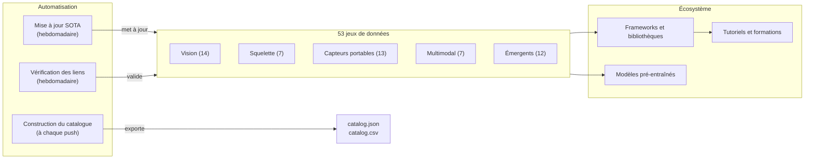

# Awesome Reconnaissance d'Activités Humaines [](https://awesome.re)

<p align="center">
  <a href="https://github.com/Leooo-Huang/awesome-human-activity-recognition">
    
  </a>
</p>

> Un guide collaboratif et organisé sur la **Reconnaissance d'Activités Humaines** — 53 jeux de données, frameworks clés, modèles pré-entraînés, tutoriels et outils de benchmark couvrant la vision, les capteurs portables, le squelette et les modalités multimodales.

[](https://creativecommons.org/licenses/by/4.0/)
[](https://github.com/Leooo-Huang/awesome-human-activity-recognition/pulls)
[](https://github.com/Leooo-Huang/awesome-human-activity-recognition/commits/main)
[](data/sota-snapshot.json)
[](https://leooo-huang.github.io/awesome-human-activity-recognition/)

[中文](README.zh.md) | [English](../README.md) | [Deutsch](README.de.md) | [Español](README.es.md) | **[Français](README.fr.md)** | [日本語](README.ja.md) | [한국어](README.ko.md) | [Português](README.pt.md) | [Русский](README.ru.md)

## Sommaire

- [Architecture du dépôt](#architecture-du-dépôt)
- [Quel jeu de données choisir](#quel-jeu-de-données-choisir)
- [Jeux de données](#jeux-de-données)
- [Frameworks et bibliothèques](#frameworks-et-bibliothèques)
- [Modèles pré-entraînés](#modèles-pré-entraînés)
- [Tutoriels et formations](#tutoriels-et-formations)
- [Articles clés](#articles-clés)
- [Compétitions et défis](#compétitions-et-défis)
- [Outils et utilitaires](#outils-et-utilitaires)
- [Listes Awesome connexes](#listes-awesome-connexes)

## Architecture du dépôt



## Quel jeu de données choisir

> Choisissez votre modalité et votre tâche, puis suivez la recommandation vers la section correspondante.

**J'ai de la vidéo et je veux classifier des actions** — Commencez par Kinetics-700 pour le pré-entraînement, évaluez sur UCF-101 ou HMDB-51 pour comparer avec les travaux antérieurs. Voir [Vision](#vision-rgb--profondeur).

**J'ai besoin de détection temporelle d'actions dans des vidéos non découpées** — ActivityNet pour les propositions, AVA pour le spatio-temporel, MultiTHUMOS pour l'annotation dense multi-étiquettes. Également listé sous Vision ci-dessus.

**Je travaille avec des données de squelette ou de capture de mouvement** — NTU RGB+D 120 est le standard de facto. Pour l'alignement texte-mouvement, utilisez Babel ou HumanML3D. Voir [Squelette](#squelette-et-capture-de-mouvement) et [Émergents](#émergents-et-frontières).

**J'ai des données IMU ou de capteurs portables** — UCI-HAR pour les lignes de base, PAMAP2 pour le multi-capteur, CAPTURE-24 pour l'échelle réelle (151 sujets, 3883 heures). Voir [Capteurs portables](#capteurs-portables).

**J'ai besoin de données égocentriques ou multimodales** — Ego4D pour l'échelle (3 300 heures), EPIC-Kitchens-100 pour les actions en cuisine, Ego-Exo4D pour la vision croisée (NOUVEAU, CVPR 2024). Voir [Multimodal](#multimodal-et-égocentrique).

**Je veux générer du mouvement à partir de texte** — HumanML3D pour une personne, InterHuman pour deux personnes, Motion-X++ pour le corps entier avec visage et mains. Également listé sous Émergents ci-dessus.

## Jeux de données

### Vision (RGB / Profondeur)

- [Kinetics-700](https://deepmind.com/research/open-source/kinetics) - Benchmark de pré-entraînement à grande échelle avec 650k clips YouTube répartis en 700 classes d'actions.
- [UCF-101](https://www.crcv.ucf.edu/data/UCF101.php) - Benchmark classique de reconnaissance d'actions avec 13,3k clips répartis en 101 classes.
- [HMDB-51](https://serre-lab.clps.brown.edu/resource/hmdb-a-large-human-motion-database/) - Jeu de données diversifié de reconnaissance d'actions avec 6,8k clips issus de films et vidéos web, répartis en 51 classes.
- [ActivityNet](http://activity-net.org/) - Benchmark de détection temporelle d'actions avec 20k vidéos YouTube non découpées réparties en 200 classes.
- [AVA](https://research.google.com/ava/) - Détection spatio-temporelle d'actions avec 430 clips de films et 80 étiquettes d'actions atomiques avec boîtes englobantes.
- [NTU RGB+D 120](http://rose1.ntu.edu.sg/datasets/actionrecognition.asp) - Reconnaissance d'actions 3D multi-vues avec 114k séquences réparties en 120 classes utilisant RGB, profondeur et squelette.
- [Something-Something V2](https://developer.qualcomm.com/software/ai-datasets/something-something) - Jeu de données d'interactions fines avec des objets, 220k clips répartis en 174 étiquettes nécessitant un raisonnement temporel.
- [FineGym](https://sdolivia.github.io/FineGym/) - Reconnaissance fine d'actions gymniques avec 32k segments annotés hiérarchiquement.
- [Moments in Time](http://moments.csail.mit.edu/) - Jeu de données extrêmement diversifié de reconnaissance d'événements et d'actions avec 1M de clips vidéo de 3 secondes répartis en 339 classes.
- [Diving48](http://www.svcl.ucsd.edu/projects/resound/dataset.html) - Reconnaissance fine d'actions de plongeon avec 18k clips répartis en 48 classes nécessitant un raisonnement temporel.
- [Toyota Smarthome](https://project.inria.fr/toyotasmarthome/) - Reconnaissance d'activités de la vie quotidienne avec 16k clips multi-vues répartis en 31 classes utilisant RGB, profondeur et squelette.
- [MultiSports](https://deeperaction.github.io/multisports/) - Détection spatio-temporelle d'actions dans 4 sports avec 3,2k clips et 66 classes d'actions fines.
- [MultiTHUMOS](https://ai.stanford.edu/~syyeung/everymoment.html) - Détection temporelle dense d'actions multi-étiquettes avec 65 classes et 38k annotations.
- [FineSports](https://github.com/PKU-ICST-MIPL/FineSports_CVPR2024) - Compréhension fine d'actions sportives multi-personnes avec 10k vidéos NBA et 52 types d'actions, CVPR 2024.

### Squelette et capture de mouvement

- [NTU RGB+D 60](https://rose1.ntu.edu.sg/dataset/actionRecognition/) - Jeu de données fondateur pour la reconnaissance d'actions par squelette avec 57k séquences réparties en 60 classes.
- [AMASS](https://amass.is.tue.mpg.de/) - Paramètres unifiés de capture de mouvement SMPL issus de plus de 40 jeux de données, couvrant 16k minutes et 344 sujets.
- [Human3.6M](http://vision.imar.ro/human3.6m/description.php) - Standard de facto pour l'estimation de pose 3D avec 3,6M d'images provenant de 11 acteurs professionnels.
- [Babel](https://babel.is.tue.mpg.de/) - Jeu de données d'alignement mouvement-langage avec 43 heures et 3,7k séquences annotées avec SMPL et étiquettes textuelles.
- [TotalCapture](http://totalcapture.net/) - Benchmark multi-modal d'estimation de pose 3D combinant capture de mouvement, RGB multi-vues et IMU pour 5 sujets.
- [PKU-MMD](https://www.icst.pku.edu.cn/struct/Projects/PKUMMD.html) - Benchmark de détection d'actions multi-modalités avec 20k instances réparties en 51 classes.
- [Skeletics-152](https://github.com/skelemoa/quater-gcn) - Reconnaissance d'actions par squelette à grande échelle à partir de poses estimées avec 150k clips répartis en 152 classes.

### Capteurs portables

- [UCI-HAR](https://archive.ics.uci.edu/ml/datasets/human+activity+recognition+using+smartphones) - Benchmark classique d'IMU smartphone avec 30 sujets et 6 activités, quasi saturé.
- [PAMAP2](https://archive.ics.uci.edu/ml/datasets/pamap2+physical+activity+monitoring) - Standard de la HAR portable avec multi-IMU et fréquence cardiaque pour 9 sujets et 18 activités.
- [WISDM](https://www.cis.fordham.edu/wisdm/dataset.php) - Fouille de données capteurs de téléphone et montre connectée avec 51 sujets et plus d'un million d'échantillons.
- [OPPORTUNITY](https://archive.ics.uci.edu/ml/datasets/OPPORTUNITY+Activity+Recognition) - Reconnaissance d'activités contextuelles riches avec 72 capteurs portables et ambiants pour 4 sujets.
- [HAPT](https://archive.ics.uci.edu/ml/datasets/Human+Activity+Recognition+Using+Smartphones) - Jeu de données IMU smartphone avec détection de transitions posturales pour 30 sujets et 12 activités.
- [RealWorld HAR](https://sensor.informatik.uni-mannheim.de/#dataset_realworld) - Reconnaissance d'activités en conditions réelles avec placements multiples d'appareils pour 60 sujets et 15 activités.
- [mHealth](https://archive.ics.uci.edu/ml/datasets/MHEALTH+Dataset) - Capteurs corporels avec ECG pour le suivi de santé mobile pour 10 sujets et 12 activités.
- [UniMiB-SHAR](http://www.sal.disco.unimib.it/technologies/unimib-shar/) - Jeu de données d'accéléromètre smartphone pour activités quotidiennes et détection de chutes pour 30 sujets et 17 activités.
- [Daphnet](https://archive.ics.uci.edu/ml/datasets/Daphnet+Freezing+of+Gait) - Détection du gel de la marche chez les patients parkinsoniens à l'aide de 3 accéléromètres portables pour 10 sujets.
- [Sussex-Huawei Locomotion](http://www.shl-dataset.org/) - Reconnaissance du mode de locomotion à grande échelle avec plus de 2800 heures pour 3 utilisateurs avec capteurs de téléphone et montre.
- [HARTH](https://archive.ics.uci.edu/dataset/779/harth) - HAR par accéléromètre en vie quotidienne avec annotations vidéo professionnelles pour 22 sujets en conditions réelles.
- [CAPTURE-24](https://github.com/OxWearables/capture24) - Plus grand jeu de données d'accéléromètre au poignet en vie quotidienne avec 151 sujets et 3883 heures, Nature Scientific Data 2024.
- [WEAR](https://github.com/mariusbock/wear) - Jeu de données de sports en extérieur avec IMU de montre connectée et vidéo égocentrique pour 22 sujets et 18 activités, IMWUT 2024.

### Multimodal et égocentrique

- [EPIC-Kitchens-100](https://epic-kitchens.github.io/2021) - Actions égocentriques en cuisine de longue durée avec audio couvrant 700 heures dans 90 cuisines.
- [Ego4D](https://ego4d-data.org/docs/data/) - Plus grand jeu de données égocentrique avec benchmarks multi-tâches couvrant 3 300 heures dans 74 scènes.
- [Charades](https://allenai.org/plato/charades/) - Reconnaissance d'actions multi-étiquettes en intérieur avec descriptions scénarisées couvrant 9,8k vidéos et 157 étiquettes.
- [NTU Mutual Actions](https://arxiv.org/abs/1905.04757) - Interactions entre deux personnes issues de NTU RGB+D avec données de squelette pour 26 classes d'interactions.
- [ActivityNet Captions](https://cs.stanford.edu/people/ranber/densevid/) - Description vidéo dense et ancrage temporel avec 20k vidéos et 100k descriptions.
- [How2Sign](https://how2sign.github.io/) - Jeu de données multimodal de langue des signes américaine avec RGB, profondeur et pose couvrant 80 heures.
- [EgoExo-Fitness](https://github.com/iSEE-Laboratory/EgoExo-Fitness) - Évaluation de la qualité d'actions fitness en vues égo et exo avec 31 heures et plus de 6k actions, ECCV 2024.

### Émergents et frontières

- [BEHAVE](https://virtualhumans.mpi-inf.mpg.de/behave/) - Interaction humain-objet en RGB-D avec pose 3D couvrant 321 séquences pour 20 sujets.
- [Motion-X](https://caizhongang.github.io/projects/Motion-X/) - Mouvement corps entier et mains issu de capture de mouvement multi-capteurs avec 2M d'images pour 10 sujets.
- [Ego-Exo4D](https://ego-exo4d-data.org/) - Compréhension d'actions en vision croisée avec vidéo égo et exo synchronisée couvrant 1,4k séquences.
- [HumanML3D](https://github.com/EricGuo5513/HumanML3D) - Jeu de données de génération de mouvement à partir de texte avec annotations SMPL couvrant plus de 14k séquences de mouvement.
- [InterHuman](https://github.com/tr3e/InterHuman) - Mouvement d'interaction à deux personnes avec SMPL-X et descriptions textuelles couvrant plus de 6k séquences.
- [HOI4D](https://hoi4d.github.io/) - Interaction main-objet égocentrique avec RGB-D et pose de la main couvrant plus de 4k clips vidéo.
- [FineBio](https://github.com/aistairc/FineBio) - Compréhension fine d'actions en laboratoire de biologie avec annotations de procédures multi-étapes.
- [HAA500](https://www.cse.ust.hk/haa/) - Reconnaissance diversifiée d'actions atomiques fines avec 10k clips répartis en 500 classes.
- [Motion-X++](https://motion-x-dataset.github.io/) - Génération de mouvement corps entier avec texte et audio couvrant plus de 120k séquences.
- [FLAG3D](https://andytang15.github.io/FLAG3D/) - Compréhension d'activités fitness en 3D avec RGB multi-vues, squelette et texte couvrant 180k séquences, CVPR 2024.
- [InterX](https://liangxuy.github.io/inter-x/) - Jeu de données complet d'interactions humain-humain avec SMPL-X couvrant plus de 11k séquences, CVPR 2024.
- [WiMANS](https://arxiv.org/abs/2402.09430) - Premier benchmark de reconnaissance d'activités multi-utilisateurs par WiFi présenté dans une conférence majeure, ECCV 2024.

## Frameworks et bibliothèques

### Reconnaissance d'actions vidéo

- [MMAction2](https://github.com/open-mmlab/mmaction2) - Boîte à outils OpenMMLab pour la compréhension vidéo prenant en charge plus de 20 architectures de modèles dont SlowFast, TimeSformer et VideoMAE.
- [PySlowFast](https://github.com/facebookresearch/SlowFast) - Bibliothèque Facebook Research pour la compréhension vidéo avec les modèles SlowFast, X3D, MViT et AVA.
- [Video-Swin-Transformer](https://github.com/SwinTransformer/Video-Swin-Transformer) - Backbone pur transformer pour la reconnaissance vidéo atteignant l'état de l'art sur Kinetics-400, Kinetics-600 et SSv2.
- [TimeSformer](https://github.com/facebookresearch/TimeSformer) - Attention espace-temps divisée de Facebook Research pour la classification vidéo, ICML 2021.
- [VideoMAE](https://github.com/MCG-NJU/VideoMAE) - Pré-entraînement vidéo auto-supervisé par autoencodeurs masqués atteignant l'état de l'art sur plusieurs benchmarks.
- [InternVideo2](https://github.com/OpenGVLab/InternVideo2) - Modèle de fondation pour la compréhension vidéo à grande échelle prenant en charge la reconnaissance d'actions, la recherche et le sous-titrage.

### Reconnaissance d'actions par squelette

- [CTR-GCN](https://github.com/Uason-Chen/CTR-GCN) - Convolution de graphe à raffinement topologique par canal pour la reconnaissance d'actions par squelette, ICCV 2021.
- [ST-GCN](https://github.com/yysijie/st-gcn) - Réseau de convolution de graphe spatio-temporel fondateur qui a établi l'approche GCN pour la HAR par squelette.
- [2s-AGCN](https://github.com/lshiwjx/2s-AGCN) - Réseau de convolution de graphe adaptatif à deux flux pour la reconnaissance d'actions par squelette, CVPR 2019.
- [HD-GCN](https://github.com/Jho-Yonsei/HD-GCN) - Réseau de convolution de graphe à décomposition hiérarchique pour la reconnaissance d'actions par squelette, AAAI 2024.
- [MotionBERT](https://github.com/Walter0807/MotionBERT) - Pré-entraînement unifié pour l'analyse du mouvement humain couvrant l'estimation de pose 3D et la reconnaissance d'actions.
- [InfoGCN](https://github.com/stnoah1/infogcn) - Réseau de convolution de graphe à goulot d'information pour la reconnaissance d'actions par squelette, CVPR 2022.

### HAR par capteurs portables

- [tsai](https://github.com/timeseriesAI/tsai) - Bibliothèque d'apprentissage profond pour les séries temporelles et les séquences construite sur fastai et PyTorch, largement utilisée pour la HAR par capteurs.
- [aeon](https://github.com/aeon-toolkit/aeon) - Boîte à outils Python unifiée pour les séries temporelles incluant classification, clustering et détection d'anomalies.
- [NNCLR-HAR](https://github.com/mariusbock/nnclr-har) - Framework d'apprentissage contrastif auto-supervisé pour la HAR par capteurs portables, IMWUT 2022.
- [DeepConvLSTM](https://github.com/sussexwearlab/DeepConvLSTM) - Implémentation de référence de l'architecture convolutionnelle LSTM pour la reconnaissance d'activités par capteurs portables.
- [Hang-Time HAR](https://github.com/ahoelzemann/hangtime_har) - Reconnaissance d'activités de basketball à partir d'un seul capteur inertiel au poignet par apprentissage profond.

### Génération et estimation de mouvement

- [MDM](https://github.com/GuyTevet/motion-diffusion-model) - Modèle de diffusion du mouvement humain pour la génération de mouvement à partir de texte atteignant l'état de l'art sur HumanML3D.
- [MLD](https://github.com/ChenFengYe/motion-latent-diffusion) - Modèle de diffusion latente du mouvement pour la génération efficace de mouvement humain à partir de texte, CVPR 2023.
- [T2M-GPT](https://github.com/Mael-zys/T2M-GPT) - Génération de mouvement humain à partir de descriptions textuelles avec représentations discrètes.
- [MotionGPT](https://github.com/OpenMotionLab/MotionGPT) - Modèle unifié de génération mouvement-langage traitant le mouvement comme une langue étrangère.
- [SMPL-X](https://github.com/vchoutas/smplx) - Modèle corporel expressif capturant les poses du corps, du visage et des mains, standard pour les jeux de données de mouvement modernes.

## Modèles pré-entraînés

- [VideoMAE V2](https://github.com/OpenGVLab/VideoMAEv2) - Modèle de fondation vidéo à un milliard de paramètres pré-entraîné sur des millions de clips, affinable pour la reconnaissance d'actions.
- [InternVideo2 Model Zoo](https://huggingface.co/OpenGVLab/InternVideo2-Stage2_1B-224p-f4) - Points de contrôle du modèle vidéo-langage à 6 milliards de paramètres sur Hugging Face pour la reconnaissance d'actions et la recherche.
- [UniFormerV2](https://github.com/OpenGVLab/UniFormerV2) - Transformer vidéo efficace avec tokens multi-échelles atteignant 90,0 % de top-1 sur Kinetics-400.
- [MVD](https://github.com/ruiwang2021/mvd) - Modèle pré-entraîné par distillation vidéo masquée compétitif avec VideoMAE sur les tâches aval de reconnaissance d'actions.
- [MotionBERT Checkpoints](https://huggingface.co/walterzhu/MotionBERT) - Encodeur de mouvement pré-entraîné transférable à l'estimation de pose 3D, la reconnaissance d'actions et la reconstruction de maillage.

## Tutoriels et formations

- [Dive into Deep Learning - Action Recognition](https://d2l.ai/) - Chapitre de manuel interactif sur la compréhension vidéo et la reconnaissance d'actions avec code PyTorch.
- [MMAction2 Tutorials](https://mmaction2.readthedocs.io/en/latest/get_started/overview.html) - Guide pas à pas pour entraîner des modèles de reconnaissance d'actions sur des jeux de données personnalisés.
- [Sensor HAR Tutorial by Marius Bock](https://github.com/mariusbock/dl-for-har) - Tutoriel complet d'apprentissage profond pour la HAR par capteurs inertiels avec PyTorch.
- [Stanford CS231N - Video Understanding](https://cs231n.stanford.edu/) - Supports de cours couvrant la modélisation temporelle, les réseaux à deux flux et les convolutions 3D pour la reconnaissance d'actions.
- [Coursera - Motion Planning](https://www.coursera.org/learn/robotics-motion-planning) - Cours de l'Université de Pennsylvanie couvrant les représentations de mouvement pertinentes pour la HAR.
- [Motion Diffusion Tutorial](https://colab.research.google.com/drive/1MvBaAhOrEk8MP_jwNdQKLnvMxXPOG6zU) - Notebook Colab pour entraîner des modèles de diffusion de mouvement humain conditionnés par le texte sur HumanML3D.

## Articles clés

### Fondateurs

- [Two-Stream Convolutional Networks](https://arxiv.org/abs/1406.2199) - Simonyan et Zisserman, NeurIPS 2014, établissant le paradigme à deux flux spatio-temporels.
- [C3D: Learning Spatiotemporal Features](https://arxiv.org/abs/1412.0767) - Tran et al., ICCV 2015, pionnier des convolutions 3D pour l'apprentissage de caractéristiques vidéo.
- [I3D: Quo Vadis Action Recognition](https://arxiv.org/abs/1705.07750) - Carreira et Zisserman, CVPR 2017, inflation des architectures 2D ImageNet vers la vidéo 3D.
- [ST-GCN: Spatial Temporal Graph Convolutional Networks](https://arxiv.org/abs/1801.07455) - Yan et al., AAAI 2018, définissant l'approche GCN pour la reconnaissance d'actions par squelette.
- [SlowFast Networks](https://arxiv.org/abs/1812.03982) - Feichtenhofer et al., ICCV 2019, architecture à double voie pour la reconnaissance vidéo.

### Ère des Transformers (à partir de 2020)

- [ViViT: A Video Vision Transformer](https://arxiv.org/abs/2103.15691) - Arnab et al., ICCV 2021, modèles pur transformer pour la classification vidéo.
- [TimeSformer](https://arxiv.org/abs/2102.05095) - Bertasius et al., ICML 2021, attention espace-temps divisée pour des transformers vidéo évolutifs.
- [VideoMAE](https://arxiv.org/abs/2203.12602) - Tong et al., NeurIPS 2022, pré-entraînement par autoencodeur masqué atteignant l'état de l'art avec un minimum de données étiquetées.
- [InternVideo2](https://arxiv.org/abs/2403.15377) - Wang et al., ECCV 2024, passage à l'échelle des modèles de fondation vidéo à 6 milliards de paramètres sur plus de 60 benchmarks.

### HAR par capteurs portables

- [DeepConvLSTM](https://arxiv.org/abs/1611.06759) - Ordonez et Roggen, Sensors 2016, établissant l'apprentissage profond pour la reconnaissance d'activités par capteurs portables.
- [Attend and Discriminate](https://arxiv.org/abs/2007.07426) - Abedin et al., IMWUT 2021, mécanismes d'attention pour la HAR multi-capteurs.
- [Self-supervised HAR](https://arxiv.org/abs/2011.11542) - Tang et al., IJCAI 2021, apprentissage contrastif pour la reconnaissance d'activités par capteurs.

### Génération de mouvement

- [MDM: Human Motion Diffusion Model](https://arxiv.org/abs/2209.14916) - Tevet et al., ICLR 2023, génération de mouvement à partir de texte par diffusion.
- [MotionGPT](https://arxiv.org/abs/2306.14795) - Jiang et al., NeurIPS 2023, unification du mouvement et du langage par des architectures LLM.
- [Motion-X](https://arxiv.org/abs/2307.00818) - Lin et al., NeurIPS 2023, premier jeu de données de mouvement corps entier à grande échelle avec annotations expressives.

### Synthèses et revues

- [Deep Learning for HAR: A Survey](https://dl.acm.org/doi/10.1145/3472290) - Li et al., ACM Computing Surveys 2022, revue complète des approches d'apprentissage profond pour la HAR.
- [Skeleton-based Action Recognition Survey](https://arxiv.org/abs/2012.12231) - Liu et al., IEEE TPAMI 2022, revue approfondie des méthodes GCN et transformer pour la HAR par squelette.
- [Multimodal HAR with Emphasis on Classification](https://www.sciencedirect.com/science/article/pii/S0950705124000029) - Yadav et al., Knowledge-Based Systems 2024, dernière synthèse couvrant les stratégies de fusion.

## Compétitions et défis

- [Ego-Exo4D Challenge 2025](https://eval.ai/web/challenges/challenge-page/2249/overview) - Benchmark multi-pistes CVPR 2025 couvrant l'égo-pose, la reconnaissance d'actions et la compréhension du langage.
- [ActivityNet Challenge](http://activity-net.org/challenges/2024/) - Défi annuel pour la détection temporelle d'actions, les propositions et le sous-titrage dense.
- [EPIC-Kitchens Challenge](https://epic-kitchens.github.io/2024) - Compétition de reconnaissance, détection et anticipation d'actions égocentriques.
- [SHL Recognition Challenge](http://www.shl-dataset.org/activity-recognition-challenge/) - Défi annuel de reconnaissance du mode de transport à partir de capteurs de smartphone.
- [Babel Challenge](https://teach.is.tue.mpg.de/) - Compréhension mouvement-langage et segmentation temporelle d'actions sur données de capture de mouvement.
- [UAV-Human Challenge](https://github.com/SUTDCV/UAV-Human) - Compréhension du comportement humain depuis des perspectives de drones avec données multi-modales.

## Outils et utilitaires

- [Papers with Code - HAR Leaderboards](https://paperswithcode.com/task/activity-recognition) - Suivi en temps réel de l'état de l'art sur tous les benchmarks HAR majeurs.
- [MMAction2 Model Zoo](https://mmaction2.readthedocs.io/en/latest/model_zoo/modelzoo.html) - Points de contrôle pré-entraînés et configurations pour plus de 100 modèles de reconnaissance d'actions.
- [Decord](https://github.com/dmlc/decord) - Lecteur vidéo efficace accéléré par GPU pour les pipelines d'entraînement en apprentissage profond.
- [vid2player](https://github.com/jhgan00/vid2player) - Animation de personnages à partir d'entrée vidéo, utile pour la visualisation de la reconnaissance d'activités.
- [OpenPose](https://github.com/CMU-Perceptual-Computing-Lab/openpose) - Détection de points clés multi-personnes en temps réel pour l'extraction de squelettes à partir de vidéo.
- [MediaPipe](https://developers.google.com/mediapipe) - Framework ML embarqué de Google pour l'estimation de pose, le suivi des mains et la reconnaissance gestuelle.
- [YOLO-Pose](https://github.com/ultralytics/ultralytics) - YOLOv8 Pose d'Ultralytics pour l'estimation de squelette multi-personnes en temps réel.

## Listes Awesome connexes

- [Awesome Action Recognition](https://github.com/jinwchoi/awesome-action-recognition) - Articles et jeux de données sur la reconnaissance d'actions.
- [Awesome Skeleton-based Action Recognition](https://github.com/firework8/Awesome-Skeleton-based-Action-Recognition) - Méthodes GCN et transformer pour la HAR par squelette.
- [Awesome Self-Supervised Learning](https://github.com/jason718/awesome-self-supervised-learning) - Méthodes d'apprentissage auto-supervisé applicables aux modalités vidéo et capteurs.
- [Awesome Video Understanding](https://github.com/HuaizhengZhang/Awesome-System-for-Machine-Learning) - Systèmes et architectures de compréhension vidéo.
- [Awesome IMU Sensing](https://github.com/rh20624/Awesome-IMU-Sensing) - Détection par IMU pour la reconnaissance d'activités et la navigation.
- [Awesome Pose Estimation](https://github.com/cbsudux/awesome-human-pose-estimation) - Méthodes et benchmarks d'estimation de pose humaine.

## Notes de bas de page

Voir aussi : [Taxonomie multidimensionnelle](../docs/taxonomy.md) | [Synthèses](../docs/surveys.md) | [Benchmarks](../docs/benchmarking.md) | [Constructeur de catalogue](../tools/) | [Feuille de route](../docs/roadmap.md) | [Comment contribuer](../CONTRIBUTING.md)

### Citation

```bibtex
@misc{awesome_har_2025,
  title   = {Awesome Human Activity Recognition: A Curated List},
  author  = {Wenxuan Huang},
  year    = {2025},
  url     = {https://github.com/Leooo-Huang/awesome-human-activity-recognition},
  note    = {GitHub repository}
}
```

### Remerciements

Merci aux auteurs de jeux de données, aux équipes d'annotation et aux mainteneurs de benchmarks qui rendent possible la recherche ouverte dans le domaine de la compréhension de l'activité humaine.
