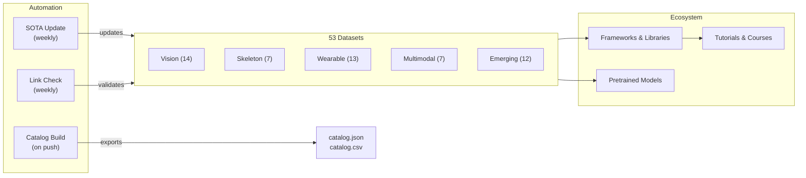

# Awesome Human Activity Recognition [](https://awesome.re)

<p align="center">
  <a href="https://github.com/Leo-Cyberautonomy/awesome-human-activity-recognition">
    
  </a>
</p>

> 研究者主導で厳選された**人間行動認識（HAR）**ガイド — 53 データセット、主要フレームワーク、事前学習モデル、チュートリアル、ベンチマークツールを、ビジョン・ウェアラブル・骨格・マルチモーダルの各モダリティにわたり網羅。

[](https://creativecommons.org/licenses/by/4.0/)
[](https://github.com/Leo-Cyberautonomy/awesome-human-activity-recognition/pulls)
[](https://github.com/Leo-Cyberautonomy/awesome-human-activity-recognition/commits/main)
[](data/sota-snapshot.json)
[](https://leo-cyberautonomy.github.io/awesome-human-activity-recognition/)

[中文](README.zh.md) | [Deutsch](README.de.md) | [English](../README.md) | [Español](README.es.md) | [Français](README.fr.md) | **[日本語](README.ja.md)** | [한국어](README.ko.md) | [Português](README.pt.md) | [Русский](README.ru.md)

## 目次

- [リポジトリ・アーキテクチャ](#リポジトリアーキテクチャ)
- [どのデータセットを使うべきか](#どのデータセットを使うべきか)
- [データセット](#データセット)
- [フレームワークとライブラリ](#フレームワークとライブラリ)
- [事前学習モデル](#事前学習モデル)
- [チュートリアルとコース](#チュートリアルとコース)
- [主要論文](#主要論文)
- [コンペティションとチャレンジ](#コンペティションとチャレンジ)
- [ツールとユーティリティ](#ツールとユーティリティ)
- [関連 Awesome リスト](#関連-awesome-リスト)

## リポジトリ・アーキテクチャ



## どのデータセットを使うべきか

> モダリティとタスクを選び、右側の推奨セクションに進んでください。

**動画から行動を分類したい** — 事前学習には Kinetics-700、先行研究との比較には UCF-101 または HMDB-51 で評価。[ビジョン](#ビジョンrgb--深度)を参照。

**未トリミング動画で時間的行動検出を行いたい** — プロポーザルには ActivityNet、時空間検出には AVA、密な多ラベル検出には MultiTHUMOS。上記ビジョンセクションにも掲載。

**骨格やモーションキャプチャデータを扱っている** — NTU RGB+D 120 がデファクトスタンダード。テキスト-動作アライメントには Babel または HumanML3D。[骨格](#骨格とモーションキャプチャ)および[最先端・新興](#最先端新興)を参照。

**IMU やウェアラブルセンサデータがある** — ベースラインには UCI-HAR、マルチセンサには PAMAP2、実環境スケールには CAPTURE-24（151 名、3883 時間）。[ウェアラブルセンサ](#ウェアラブルセンサ)を参照。

**一人称視点やマルチモーダルデータが必要** — スケールでは Ego4D（3.3k 時間）、キッチン行動には EPIC-Kitchens-100、クロスビューには Ego-Exo4D（NEW、CVPR 2024）。[マルチモーダル](#マルチモーダルエゴセントリック)を参照。

**テキストから動作を生成したい** — 単人数では HumanML3D、二人称では InterHuman、顔・手を含む全身では Motion-X++。上記最先端・新興セクションにも掲載。

## データセット

### ビジョン（RGB / 深度）

- [Kinetics-700](https://deepmind.com/research/open-source/kinetics) - 700 行動クラス・65 万 YouTube クリップの大規模事前学習ベンチマーク。
- [UCF-101](https://www.crcv.ucf.edu/data/UCF101.php) - 101 クラス・1.3 万クリップの古典的行動認識ベンチマーク。
- [HMDB-51](https://serre-lab.clps.brown.edu/resource/hmdb-a-large-human-motion-database/) - 映画やウェブ動画から収集した 51 クラス・6.8k クリップの多様な行動認識データセット。
- [ActivityNet](http://activity-net.org/) - 200 クラス・2 万本の未トリミング YouTube 動画による時間的行動検出ベンチマーク。
- [AVA](https://research.google.com/ava/) - 430 本の映画クリップと 80 種のアトミック行動ラベル＋バウンディングボックスによる時空間行動検出。
- [NTU RGB+D 120](http://rose1.ntu.edu.sg/datasets/actionrecognition.asp) - RGB・深度・骨格を使用した 120 クラス・11.4 万シーケンスのマルチビュー 3D 行動認識。
- [Something-Something V2](https://developer.qualcomm.com/software/ai-datasets/something-something) - 時間推論を要する 174 ラベル・22 万クリップの細粒度オブジェクトインタラクションデータセット。
- [FineGym](https://sdolivia.github.io/FineGym/) - 階層ラベル付き 3.2 万セグメントの細粒度体操行動認識。
- [Moments in Time](http://moments.csail.mit.edu/) - 339 クラス・100 万本の 3 秒動画クリップによる極めて多様なイベント・行動認識データセット。
- [Diving48](http://www.svcl.ucsd.edu/projects/resound/dataset.html) - 時間推論を要する 48 クラス・1.8 万クリップの細粒度飛び込み行動認識。
- [Toyota Smarthome](https://project.inria.fr/toyotasmarthome/) - RGB・深度・骨格を使用した 31 クラス・1.6 万マルチビュークリップの日常生活行動認識。
- [MultiSports](https://deeperaction.github.io/multisports/) - 4 競技・66 細粒度行動クラス・3.2k クリップの時空間行動検出。
- [MultiTHUMOS](https://ai.stanford.edu/~syyeung/everymoment.html) - 65 クラス・3.8 万アノテーションの密な多ラベル時間的行動検出。
- [FineSports](https://github.com/PKU-ICST-MIPL/FineSports_CVPR2024) - CVPR 2024 発表、52 行動タイプ・1 万本の NBA 動画による多人数細粒度スポーツ理解。

### 骨格とモーションキャプチャ

- [NTU RGB+D 60](https://rose1.ntu.edu.sg/dataset/actionRecognition/) - 60 クラス・5.7 万シーケンスの骨格ベース行動認識の基盤データセット。
- [AMASS](https://amass.is.tue.mpg.de/) - 40 以上のデータセットから統合された SMPL モーションキャプチャパラメータ、1.6 万分・344 被験者。
- [Human3.6M](http://vision.imar.ro/human3.6m/description.php) - 11 名のプロ俳優による 360 万フレームの 3D 姿勢推定デファクトスタンダード。
- [Babel](https://babel.is.tue.mpg.de/) - SMPL とテキストラベルでアノテーションされた 43 時間・3.7k シーケンスの動作-言語アライメントデータセット。
- [TotalCapture](http://totalcapture.net/) - 5 名の被験者からモーキャプ・マルチビュー RGB・IMU を組み合わせたマルチモーダル 3D 姿勢推定ベンチマーク。
- [PKU-MMD](https://www.icst.pku.edu.cn/struct/Projects/PKUMMD.html) - 51 クラス・2 万インスタンスのマルチモダリティ行動検出ベンチマーク。
- [Skeletics-152](https://github.com/skelemoa/quater-gcn) - 推定姿勢から得た 152 クラス・15 万クリップの大規模骨格行動認識。

### ウェアラブルセンサ

- [UCI-HAR](https://archive.ics.uci.edu/ml/datasets/human+activity+recognition+using+smartphones) - 30 名・6 行動の古典的スマートフォン IMU ベンチマーク（精度はほぼ飽和）。
- [PAMAP2](https://archive.ics.uci.edu/ml/datasets/pamap2+physical+activity+monitoring) - 9 名・18 行動のマルチ IMU と心拍によるウェアラブル HAR 標準。
- [WISDM](https://www.cis.fordham.edu/wisdm/dataset.php) - 51 名・100 万サンプル超のスマートフォンとスマートウォッチによるセンサデータマイニング。
- [OPPORTUNITY](https://archive.ics.uci.edu/ml/datasets/OPPORTUNITY+Activity+Recognition) - 4 名・72 センサによるリッチなコンテキスト対応行動認識。
- [HAPT](https://archive.ics.uci.edu/ml/datasets/Human+Activity+Recognition+Using+Smartphones) - 30 名・12 行動のスマートフォン IMU による姿勢遷移検出。
- [RealWorld HAR](https://sensor.informatik.uni-mannheim.de/#dataset_realworld) - 60 名・15 行動の複数デバイス配置による実環境行動認識。
- [mHealth](https://archive.ics.uci.edu/ml/datasets/MHEALTH+Dataset) - 10 名・12 行動の ECG 付き体表センサによるモバイルヘルスモニタリング。
- [UniMiB-SHAR](http://www.sal.disco.unimib.it/technologies/unimib-shar/) - 30 名・17 行動の日常行動と転倒検出のためのスマートフォン加速度計データセット。
- [Daphnet](https://archive.ics.uci.edu/ml/datasets/Daphnet+Freezing+of+Gait) - 10 名・3 ウェアラブル加速度計によるパーキンソン病患者のすくみ足検出。
- [Sussex-Huawei Locomotion](http://www.shl-dataset.org/) - 3 名・2800 時間超のスマートフォン＋スマートウォッチセンサによる大規模移動モード認識。
- [HARTH](https://archive.ics.uci.edu/dataset/779/harth) - 22 名の実環境条件下でプロのビデオアノテーション付き自由行動加速度計 HAR。
- [CAPTURE-24](https://github.com/OxWearables/capture24) - 151 名・3883 時間の最大規模自由行動手首加速度計データセット（Nature Scientific Data 2024）。
- [WEAR](https://github.com/mariusbock/wear) - 22 名・18 行動のスマートウォッチ IMU とエゴセントリック映像によるアウトドアスポーツデータセット（IMWUT 2024）。

### マルチモーダル・エゴセントリック

- [EPIC-Kitchens-100](https://epic-kitchens.github.io/2021) - 90 キッチン・700 時間にわたる音声付き長時間エゴセントリックキッチン行動。
- [Ego4D](https://ego4d-data.org/docs/data/) - 74 シーン・3.3k 時間のマルチタスクベンチマークを備えた最大規模エゴセントリックデータセット。
- [Charades](https://allenai.org/plato/charades/) - 157 ラベル・9.8k 動画のスクリプト付き室内マルチラベル行動認識。
- [NTU Mutual Actions](https://arxiv.org/abs/1905.04757) - NTU RGB+D からの骨格データによる 26 インタラクションクラスの二者間行動。
- [ActivityNet Captions](https://cs.stanford.edu/people/ranber/densevid/) - 2 万動画・10 万キャプションの密な動画記述と時間的グラウンディング。
- [How2Sign](https://how2sign.github.io/) - RGB・深度・姿勢を含む 80 時間のマルチモーダルアメリカ手話データセット。
- [EgoExo-Fitness](https://github.com/iSEE-Laboratory/EgoExo-Fitness) - ECCV 2024 発表、31 時間・6k 以上の行動によるエゴ＋エクソフィットネス行動品質評価。

### 最先端・新興

- [BEHAVE](https://virtualhumans.mpi-inf.mpg.de/behave/) - 20 名・321 シーケンスの 3D 姿勢付き RGB-D 人-物インタラクション。
- [Motion-X](https://caizhongang.github.io/projects/Motion-X/) - 10 名・200 万フレームのマルチセンサモーキャプによる全身＋手関節モーション。
- [Ego-Exo4D](https://ego-exo4d-data.org/) - 1.4k シーケンスの同期されたエゴ＋エクソ映像によるクロスビュー行動理解。
- [HumanML3D](https://github.com/EricGuo5513/HumanML3D) - 1.4 万以上の動作シーケンスの SMPL アノテーション付きテキスト-動作生成データセット。
- [InterHuman](https://github.com/tr3e/InterHuman) - 6k 以上のシーケンスの SMPL-X とテキスト記述による二者間インタラクション動作。
- [HOI4D](https://hoi4d.github.io/) - 4k 以上の動画クリップの RGB-D と手姿勢によるエゴセントリック手-物インタラクション。
- [FineBio](https://github.com/aistairc/FineBio) - 多段階手順アノテーション付き細粒度生物学実験室行動理解。
- [HAA500](https://www.cse.ust.hk/haa/) - 500 クラス・1 万クリップの多様な細粒度アトミック行動認識。
- [Motion-X++](https://motion-x-dataset.github.io/) - 12 万以上のシーケンスのテキストと音声付き全身モーション生成。
- [FLAG3D](https://andytang15.github.io/FLAG3D/) - CVPR 2024 発表、18 万シーケンスのマルチビュー RGB・骨格・テキストによる 3D フィットネス行動理解。
- [InterX](https://liangxuy.github.io/inter-x/) - CVPR 2024 発表、1.1 万以上のシーケンスの SMPL-X による包括的人-人インタラクションデータセット。
- [WiMANS](https://arxiv.org/abs/2402.09430) - ECCV 2024 発表、トップ会議初の WiFi ベース多人数行動センシングベンチマーク。

## フレームワークとライブラリ

### 映像行動認識

- [MMAction2](https://github.com/open-mmlab/mmaction2) - SlowFast、TimeSformer、VideoMAE など 20 以上のモデルアーキテクチャをサポートする OpenMMLab 映像理解ツールボックス。
- [PySlowFast](https://github.com/facebookresearch/SlowFast) - SlowFast、X3D、MViT、AVA モデルを備えた Facebook Research の映像理解ライブラリ。
- [Video-Swin-Transformer](https://github.com/SwinTransformer/Video-Swin-Transformer) - Kinetics-400、Kinetics-600、SSv2 で SOTA を達成した純トランスフォーマー映像認識バックボーン。
- [TimeSformer](https://github.com/facebookresearch/TimeSformer) - ICML 2021 発表の Facebook Research による分割時空間アテンション映像分類。
- [VideoMAE](https://github.com/MCG-NJU/VideoMAE) - 複数ベンチマークで SOTA を達成したマスクドオートエンコーダによる自己教師あり映像事前学習。
- [InternVideo2](https://github.com/OpenGVLab/InternVideo2) - 行動認識・検索・キャプショニングをサポートする大規模映像理解基盤モデル。

### 骨格行動認識

- [CTR-GCN](https://github.com/Uason-Chen/CTR-GCN) - ICCV 2021 発表、骨格ベース行動認識のためのチャネル別トポロジー改良グラフ畳み込み。
- [ST-GCN](https://github.com/yysijie/st-gcn) - 骨格ベース HAR における GCN アプローチを確立した先駆的時空間グラフ畳み込みネットワーク。
- [2s-AGCN](https://github.com/lshiwjx/2s-AGCN) - CVPR 2019 発表、骨格ベース行動認識のための二ストリーム適応グラフ畳み込みネットワーク。
- [HD-GCN](https://github.com/Jho-Yonsei/HD-GCN) - AAAI 2024 発表、骨格行動認識のための階層的分解グラフ畳み込みネットワーク。
- [MotionBERT](https://github.com/Walter0807/MotionBERT) - 3D 姿勢推定と行動認識をカバーする人体動作解析の統合事前学習。
- [InfoGCN](https://github.com/stnoah1/infogcn) - CVPR 2022 発表、骨格行動認識のための情報ボトルネックグラフ畳み込みネットワーク。

### ウェアラブルセンサ HAR

- [tsai](https://github.com/timeseriesAI/tsai) - fastai と PyTorch 上に構築された時系列・シーケンス向け深層学習ライブラリ（センサ HAR で広く使用）。
- [aeon](https://github.com/aeon-toolkit/aeon) - 分類・クラスタリング・異常検出を含む時系列のための統合 Python ツールキット。
- [NNCLR-HAR](https://github.com/mariusbock/nnclr-har) - IMWUT 2022 発表、ウェアラブルセンサ HAR のための自己教師ありコントラスト学習フレームワーク。
- [DeepConvLSTM](https://github.com/sussexwearlab/DeepConvLSTM) - ウェアラブル行動認識のための畳み込み LSTM アーキテクチャのリファレンス実装。
- [Hang-Time HAR](https://github.com/ahoelzemann/hangtime_har) - 深層学習を用いた単一手首装着慣性センサからのバスケットボール行動認識。

### 動作生成・推定

- [MDM](https://github.com/GuyTevet/motion-diffusion-model) - HumanML3D で SOTA を達成したテキスト-動作生成のための人体動作拡散モデル。
- [MLD](https://github.com/ChenFengYe/motion-latent-diffusion) - CVPR 2023 発表、効率的なテキスト駆動人体動作生成のための動作潜在拡散モデル。
- [T2M-GPT](https://github.com/Mael-zys/T2M-GPT) - 離散表現によるテキスト記述からの人体動作生成。
- [MotionGPT](https://github.com/OpenMotionLab/MotionGPT) - 動作を外国語として扱う統合動作-言語生成モデル。
- [SMPL-X](https://github.com/vchoutas/smplx) - 身体・顔・手の姿勢をキャプチャする表現力豊かな身体モデル（現代の動作データセットの標準）。

## 事前学習モデル

- [VideoMAE V2](https://github.com/OpenGVLab/VideoMAEv2) - 数百万クリップで事前学習された数十億パラメータの映像基盤モデル（行動認識にファインチューニング可能）。
- [InternVideo2 Model Zoo](https://huggingface.co/OpenGVLab/InternVideo2-Stage2_1B-224p-f4) - Hugging Face 上の行動認識・検索向け 6B パラメータ映像言語モデルチェックポイント。
- [UniFormerV2](https://github.com/OpenGVLab/UniFormerV2) - Kinetics-400 で top-1 90.0% を達成したマルチスケールトークンによる効率的映像トランスフォーマー。
- [MVD](https://github.com/ruiwang2021/mvd) - 下流行動認識で VideoMAE に匹敵するマスクドビデオ蒸留事前学習モデル。
- [MotionBERT Checkpoints](https://huggingface.co/walterzhu/MotionBERT) - 3D 姿勢推定・行動認識・メッシュ復元に転移可能な事前学習動作エンコーダ。

## チュートリアルとコース

- [Dive into Deep Learning - Action Recognition](https://d2l.ai/) - PyTorch コード付きの映像理解と行動認識に関するインタラクティブ教科書章。
- [MMAction2 Tutorials](https://mmaction2.readthedocs.io/en/latest/get_started/overview.html) - カスタムデータセットで行動認識モデルを学習するためのステップバイステップガイド。
- [Sensor HAR Tutorial by Marius Bock](https://github.com/mariusbock/dl-for-har) - PyTorch による慣性センサ HAR のための包括的深層学習チュートリアル。
- [Stanford CS231N - Video Understanding](https://cs231n.stanford.edu/) - 時間モデリング・二ストリームネットワーク・3D 畳み込みを扱う行動認識の講義資料。
- [Coursera - Motion Planning](https://www.coursera.org/learn/robotics-motion-planning) - HAR に関連する動作表現をカバーするペンシルベニア大学のコース。
- [Motion Diffusion Tutorial](https://colab.research.google.com/drive/1MvBaAhOrEk8MP_jwNdQKLnvMxXPOG6zU) - HumanML3D でテキスト条件付き人体動作拡散モデルを学習するための Colab ノートブック。

## 主要論文

### 基盤的論文

- [Two-Stream Convolutional Networks](https://arxiv.org/abs/1406.2199) - Simonyan and Zisserman, NeurIPS 2014。空間-時間二ストリームパラダイムを確立。
- [C3D: Learning Spatiotemporal Features](https://arxiv.org/abs/1412.0767) - Tran et al., ICCV 2015。映像特徴学習のための 3D 畳み込みの先駆け。
- [I3D: Quo Vadis Action Recognition](https://arxiv.org/abs/1705.07750) - Carreira and Zisserman, CVPR 2017。2D ImageNet アーキテクチャを 3D 映像に拡張。
- [ST-GCN: Spatial Temporal Graph Convolutional Networks](https://arxiv.org/abs/1801.07455) - Yan et al., AAAI 2018。骨格行動認識における GCN アプローチを定義。
- [SlowFast Networks](https://arxiv.org/abs/1812.03982) - Feichtenhofer et al., ICCV 2019。映像認識のためのデュアルパスウェイアーキテクチャ。

### トランスフォーマー時代（2020 年以降）

- [ViViT: A Video Vision Transformer](https://arxiv.org/abs/2103.15691) - Arnab et al., ICCV 2021。映像分類のための純トランスフォーマーモデル。
- [TimeSformer](https://arxiv.org/abs/2102.05095) - Bertasius et al., ICML 2021。スケーラブルな映像トランスフォーマーのための分割時空間アテンション。
- [VideoMAE](https://arxiv.org/abs/2203.12602) - Tong et al., NeurIPS 2022。最小限のラベル付きデータで SOTA を達成したマスクドオートエンコーダ事前学習。
- [InternVideo2](https://arxiv.org/abs/2403.15377) - Wang et al., ECCV 2024。60 以上のベンチマークにわたる 6B パラメータの映像基盤モデルのスケーリング。

### ウェアラブル・センサ HAR

- [DeepConvLSTM](https://arxiv.org/abs/1611.06759) - Ordonez and Roggen, Sensors 2016。ウェアラブル行動認識における深層学習を確立。
- [Attend and Discriminate](https://arxiv.org/abs/2007.07426) - Abedin et al., IMWUT 2021。マルチセンサ HAR のためのアテンション機構。
- [Self-supervised HAR](https://arxiv.org/abs/2011.11542) - Tang et al., IJCAI 2021。センサベース行動認識のためのコントラスト学習。

### 動作生成

- [MDM: Human Motion Diffusion Model](https://arxiv.org/abs/2209.14916) - Tevet et al., ICLR 2023。拡散ベースのテキスト-動作生成。
- [MotionGPT](https://arxiv.org/abs/2306.14795) - Jiang et al., NeurIPS 2023。LLM アーキテクチャによる動作と言語の統合。
- [Motion-X](https://arxiv.org/abs/2307.00818) - Lin et al., NeurIPS 2023。表現力豊かなアノテーション付き初の大規模全身動作データセット。

### サーベイ

- [Deep Learning for HAR: A Survey](https://dl.acm.org/doi/10.1145/3472290) - Li et al., ACM Computing Surveys 2022。HAR における深層学習アプローチの包括的レビュー。
- [Skeleton-based Action Recognition Survey](https://arxiv.org/abs/2012.12231) - Liu et al., IEEE TPAMI 2022。骨格 HAR における GCN およびトランスフォーマー手法の詳細レビュー。
- [Multimodal HAR with Emphasis on Classification](https://www.sciencedirect.com/science/article/pii/S0950705124000029) - Yadav et al., Knowledge-Based Systems 2024。融合戦略をカバーする最新サーベイ。

## コンペティションとチャレンジ

- [Ego-Exo4D Challenge 2025](https://eval.ai/web/challenges/challenge-page/2249/overview) - CVPR 2025 のエゴ姿勢・行動認識・言語理解をカバーするマルチトラックベンチマーク。
- [ActivityNet Challenge](http://activity-net.org/challenges/2024/) - 時間的行動検出・プロポーザル・密なキャプショニングの年次チャレンジ。
- [EPIC-Kitchens Challenge](https://epic-kitchens.github.io/2024) - エゴセントリック行動認識・検出・予測コンペティション。
- [SHL Recognition Challenge](http://www.shl-dataset.org/activity-recognition-challenge/) - スマートフォンセンサからの移動モード認識の年次チャレンジ。
- [Babel Challenge](https://teach.is.tue.mpg.de/) - モーキャプデータにおける動作-言語理解と時間的行動セグメンテーション。
- [UAV-Human Challenge](https://github.com/SUTDCV/UAV-Human) - マルチモーダルデータによる UAV 視点からの人間行動理解。

## ツールとユーティリティ

- [Papers with Code - HAR Leaderboards](https://paperswithcode.com/task/activity-recognition) - すべての主要 HAR ベンチマークにわたるライブ SOTA トラッキング。
- [MMAction2 Model Zoo](https://mmaction2.readthedocs.io/en/latest/model_zoo/modelzoo.html) - 100 以上の行動認識モデルの事前学習チェックポイントと設定ファイル。
- [Decord](https://github.com/dmlc/decord) - 深層学習トレーニングパイプライン向けの効率的 GPU 加速映像リーダー。
- [vid2player](https://github.com/jhgan00/vid2player) - 映像入力からのキャラクターアニメーション（行動認識の可視化に有用）。
- [OpenPose](https://github.com/CMU-Perceptual-Computing-Lab/openpose) - 映像からの骨格抽出のためのリアルタイム多人数キーポイント検出。
- [MediaPipe](https://developers.google.com/mediapipe) - 姿勢推定・手のトラッキング・ジェスチャー認識のための Google のオンデバイス ML フレームワーク。
- [YOLO-Pose](https://github.com/ultralytics/ultralytics) - リアルタイム多人数骨格推定のための Ultralytics YOLOv8 Pose。

## 関連 Awesome リスト

- [Awesome Action Recognition](https://github.com/jinwchoi/awesome-action-recognition) - 行動認識の論文とデータセット。
- [Awesome Skeleton-based Action Recognition](https://github.com/firework8/Awesome-Skeleton-based-Action-Recognition) - 骨格 HAR のための GCN とトランスフォーマー手法。
- [Awesome Self-Supervised Learning](https://github.com/jason718/awesome-self-supervised-learning) - 映像・センサモダリティに適用可能な自己教師あり学習手法。
- [Awesome Video Understanding](https://github.com/HuaizhengZhang/Awesome-System-for-Machine-Learning) - 映像理解システムとアーキテクチャ。
- [Awesome IMU Sensing](https://github.com/rh20624/Awesome-IMU-Sensing) - 行動認識とナビゲーションのための IMU ベースセンシング。
- [Awesome Pose Estimation](https://github.com/cbsudux/awesome-human-pose-estimation) - 人体姿勢推定の手法とベンチマーク。

## 脚注

関連資料: [多次元タクソノミー](docs/taxonomy.md) | [サーベイ](docs/surveys.md) | [ベンチマーク](docs/benchmarking.md) | [カタログビルダー](tools/) | [ロードマップ](docs/roadmap.md) | [コントリビューション方法](CONTRIBUTING.md)

### 引用

```bibtex
@misc{awesome_har_2025,
  title   = {Awesome Human Activity Recognition: A Curated List},
  author  = {Wenxuan Huang},
  year    = {2025},
  url     = {https://github.com/Leo-Cyberautonomy/awesome-human-activity-recognition},
  note    = {GitHub repository}
}
```

### 謝辞

データセット作成者、アノテーションチーム、ベンチマーク管理者の皆様に感謝いたします。彼らのおかげで人間行動理解におけるオープンリサーチが可能となっています。
