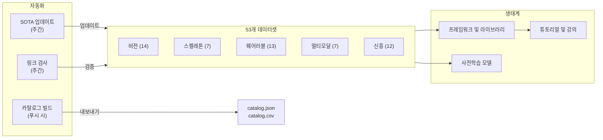

# Awesome Human Activity Recognition [](https://awesome.re)

<p align="center">
  <a href="https://github.com/Leooo-Huang/awesome-human-activity-recognition">
    
  </a>
</p>

> 항상 최신 상태를 유지하는 가장 포괄적인 HAR 리소스 — Papers with Code에서 지속적으로 스캔 및 자동 업데이트. 전 모달리티에 걸쳐 53개 데이터셋 통합.

[](https://creativecommons.org/licenses/by/4.0/)
[](https://github.com/Leooo-Huang/awesome-human-activity-recognition/pulls)
[](https://github.com/Leooo-Huang/awesome-human-activity-recognition/commits/main)
[](data/sota-snapshot.json)
[](https://leooo-huang.github.io/awesome-human-activity-recognition/)

[中文](README.zh.md) | [English](../README.md) | [Deutsch](README.de.md) | [Español](README.es.md) | [Français](README.fr.md) | [日本語](README.ja.md) | [**한국어**](README.ko.md) | [Português](README.pt.md) | [Русский](README.ru.md)

## 목차

- [저장소 아키텍처](#저장소-아키텍처)
- [어떤 데이터셋을 사용해야 할까요](#어떤-데이터셋을-사용해야-할까요)
- [데이터셋](#데이터셋)
- [프레임워크 및 라이브러리](#프레임워크-및-라이브러리)
- [사전학습 모델](#사전학습-모델)
- [튜토리얼 및 강의](#튜토리얼-및-강의)
- [주요 논문](#주요-논문)
- [대회 및 챌린지](#대회-및-챌린지)
- [도구 및 유틸리티](#도구-및-유틸리티)
- [관련 Awesome 목록](#관련-awesome-목록)

## 저장소 아키텍처



## 어떤 데이터셋을 사용해야 할까요

> 모달리티와 태스크를 선택한 뒤, 오른쪽의 추천 섹션으로 이동하십시오.

**비디오로 행동을 분류하고 싶습니다** — 사전학습에는 Kinetics-700으로 시작하고, 기존 연구와의 비교를 위해 UCF-101 또는 HMDB-51에서 평가하십시오. [비전](#비전-rgb--깊이) 섹션을 참조하십시오.

**편집되지 않은 비디오에서 시간적 행동 탐지가 필요합니다** — 제안(proposal)에는 ActivityNet, 시공간 탐지에는 AVA, 밀집 다중 레이블에는 MultiTHUMOS를 사용하십시오. 위의 비전 섹션에도 수록되어 있습니다.

**스켈레톤 또는 모션 캡처 데이터를 다룹니다** — NTU RGB+D 120이 사실상 표준입니다. 텍스트-모션 정렬에는 Babel 또는 HumanML3D를 사용하십시오. [스켈레톤](#스켈레톤-및-모션-캡처) 및 [신흥](#신흥-및-프론티어) 섹션을 참조하십시오.

**IMU 또는 웨어러블 센서 데이터를 보유하고 있습니다** — 기본 베이스라인에는 UCI-HAR, 다중 센서에는 PAMAP2, 실환경 대규모 데이터에는 CAPTURE-24(151명, 3883시간)를 사용하십시오. [웨어러블](#웨어러블-센서) 섹션을 참조하십시오.

**1인칭 시점 또는 멀티모달 데이터가 필요합니다** — 대규모에는 Ego4D(3.3k시간), 주방 행동에는 EPIC-Kitchens-100, 교차 시점에는 Ego-Exo4D(신규, CVPR 2024)를 사용하십시오. [멀티모달](#멀티모달-및-1인칭-시점) 섹션을 참조하십시오.

**텍스트-모션 생성을 원합니다** — 1인 모션에는 HumanML3D, 2인 모션에는 InterHuman, 얼굴 및 손을 포함한 전신 모션에는 Motion-X++를 사용하십시오. 위의 신흥 섹션에도 수록되어 있습니다.

## 데이터셋

### 비전 (RGB / 깊이)

- [Kinetics-700](https://deepmind.com/research/open-source/kinetics) - 700개 행동 클래스에 걸친 65만 YouTube 클립을 포함하는 대규모 사전학습 벤치마크입니다.
- [UCF-101](https://www.crcv.ucf.edu/data/UCF101.php) - 101개 클래스에 걸친 1.33만 클립을 포함하는 고전적인 행동 인식 벤치마크입니다.
- [HMDB-51](https://serre-lab.clps.brown.edu/resource/hmdb-a-large-human-motion-database/) - 영화 및 웹 비디오에서 수집한 51개 클래스, 6.8k 클립의 다양한 행동 인식 데이터셋입니다.
- [ActivityNet](http://activity-net.org/) - 200개 클래스에 걸친 2만 개의 편집되지 않은 YouTube 비디오를 포함하는 시간적 행동 탐지 벤치마크입니다.
- [AVA](https://research.google.com/ava/) - 430개 영화 클립과 바운딩 박스가 포함된 80개 원자 행동 레이블을 갖춘 시공간 행동 탐지 데이터셋입니다.
- [NTU RGB+D 120](http://rose1.ntu.edu.sg/datasets/actionrecognition.asp) - RGB, 깊이, 스켈레톤을 활용한 120개 클래스, 11.4만 시퀀스의 다시점 3D 행동 인식 데이터셋입니다.
- [Something-Something V2](https://developer.qualcomm.com/software/ai-datasets/something-something) - 시간적 추론이 필요한 174개 레이블, 22만 클립의 세밀한 객체 상호작용 데이터셋입니다.
- [FineGym](https://sdolivia.github.io/FineGym/) - 계층적으로 레이블이 부여된 3.2만 세그먼트를 포함하는 세밀한 체조 동작 인식 데이터셋입니다.
- [Moments in Time](http://moments.csail.mit.edu/) - 339개 클래스에 걸친 100만 개의 레이블된 3초 비디오 클립을 포함하는 대규모 이벤트 및 행동 인식 데이터셋입니다.
- [Diving48](http://www.svcl.ucsd.edu/projects/resound/dataset.html) - 시간적 추론이 필요한 48개 클래스, 1.8만 클립의 세밀한 다이빙 동작 인식 데이터셋입니다.
- [Toyota Smarthome](https://project.inria.fr/toyotasmarthome/) - RGB, 깊이, 스켈레톤을 사용한 31개 클래스, 1.6만 다시점 클립의 일상생활 활동 인식 데이터셋입니다.
- [MultiSports](https://deeperaction.github.io/multisports/) - 4종 스포츠에 걸친 3.2k 클립과 66개 세밀한 행동 클래스를 포함하는 시공간 행동 탐지 데이터셋입니다.
- [MultiTHUMOS](https://ai.stanford.edu/~syyeung/everymoment.html) - 65개 클래스와 3.8만 주석을 포함하는 밀집 다중 레이블 시간적 행동 탐지 데이터셋입니다.
- [FineSports](https://github.com/PKU-ICST-MIPL/FineSports_CVPR2024) - CVPR 2024에서 발표된, 1만 NBA 비디오와 52개 행동 유형을 포함하는 다인 세밀한 스포츠 이해 데이터셋입니다.

### 스켈레톤 및 모션 캡처

- [NTU RGB+D 60](https://rose1.ntu.edu.sg/dataset/actionRecognition/) - 60개 클래스에 걸친 5.7만 시퀀스를 포함하는 스켈레톤 기반 행동 인식의 기초 데이터셋입니다.
- [AMASS](https://amass.is.tue.mpg.de/) - 40개 이상의 데이터셋에서 344명의 피험자, 1.6만 분의 통합된 SMPL 모션 캡처 파라미터입니다.
- [Human3.6M](http://vision.imar.ro/human3.6m/description.php) - 11명의 전문 배우로부터 수집한 360만 프레임을 포함하는 3D 자세 추정의 사실상 표준 데이터셋입니다.
- [Babel](https://babel.is.tue.mpg.de/) - SMPL 및 텍스트 레이블이 주석된 43시간, 3.7k 시퀀스의 모션-언어 정렬 데이터셋입니다.
- [TotalCapture](http://totalcapture.net/) - 5명의 피험자로부터 모션 캡처, 다시점 RGB, IMU를 결합한 멀티모달 3D 자세 추정 벤치마크입니다.
- [PKU-MMD](https://www.icst.pku.edu.cn/struct/Projects/PKUMMD.html) - 51개 클래스에 걸친 2만 인스턴스를 포함하는 다중 모달리티 행동 탐지 벤치마크입니다.
- [Skeletics-152](https://github.com/skelemoa/quater-gcn) - 추정된 자세로부터 152개 클래스, 15만 클립을 포함하는 대규모 스켈레톤 행동 인식 데이터셋입니다.

### 웨어러블 센서

- [UCI-HAR](https://archive.ics.uci.edu/ml/datasets/human+activity+recognition+using+smartphones) - 30명의 피험자와 6종 활동을 포함하는 고전적인 스마트폰 IMU 벤치마크로, 성능이 거의 포화 상태입니다.
- [PAMAP2](https://archive.ics.uci.edu/ml/datasets/pamap2+physical+activity+monitoring) - 9명의 피험자와 18종 활동에 대해 다중 IMU 및 심박수를 포함하는 웨어러블 HAR 표준 데이터셋입니다.
- [WISDM](https://www.cis.fordham.edu/wisdm/dataset.php) - 51명의 피험자와 100만 개 이상의 샘플을 포함하는 스마트폰 및 스마트워치 센서 데이터 마이닝 데이터셋입니다.
- [OPPORTUNITY](https://archive.ics.uci.edu/ml/datasets/OPPORTUNITY+Activity+Recognition) - 4명의 피험자로부터 72개의 웨어러블 및 환경 센서를 사용한 풍부한 상황 인식 활동 인식 데이터셋입니다.
- [HAPT](https://archive.ics.uci.edu/ml/datasets/Human+Activity+Recognition+Using+Smartphones) - 30명의 피험자와 12종 활동에 대한 자세 전환 탐지를 포함하는 스마트폰 IMU 데이터셋입니다.
- [RealWorld HAR](https://sensor.informatik.uni-mannheim.de/#dataset_realworld) - 60명의 피험자와 15종 활동에 대해 다양한 기기 배치 위치를 사용한 실환경 활동 인식 데이터셋입니다.
- [mHealth](https://archive.ics.uci.edu/ml/datasets/MHEALTH+Dataset) - 10명의 피험자와 12종 활동에 대해 ECG를 포함한 체표 부착 센서 기반 모바일 건강 모니터링 데이터셋입니다.
- [UniMiB-SHAR](http://www.sal.disco.unimib.it/technologies/unimib-shar/) - 30명의 피험자와 17종 활동에 대한 일상 활동 및 낙상 탐지를 위한 스마트폰 가속도계 데이터셋입니다.
- [Daphnet](https://archive.ics.uci.edu/ml/datasets/Daphnet+Freezing+of+Gait) - 10명의 피험자로부터 3개의 웨어러블 가속도계를 사용한 파킨슨병 환자의 보행 동결 탐지 데이터셋입니다.
- [Sussex-Huawei Locomotion](http://www.shl-dataset.org/) - 3명의 사용자로부터 스마트폰 및 스마트워치 센서를 사용한 2800시간 이상의 대규모 이동 모드 인식 데이터셋입니다.
- [HARTH](https://archive.ics.uci.edu/dataset/779/harth) - 22명의 피험자에 대해 전문 비디오 주석이 부여된 실환경 가속도계 HAR 데이터셋입니다.
- [CAPTURE-24](https://github.com/OxWearables/capture24) - 151명의 피험자와 3883시간을 포함하는 최대 규모의 실환경 손목 가속도계 데이터셋으로, Nature Scientific Data 2024에 발표되었습니다.
- [WEAR](https://github.com/mariusbock/wear) - 22명의 피험자와 18종 활동에 대해 스마트워치 IMU 및 1인칭 시점 비디오를 포함하는 야외 스포츠 데이터셋으로, IMWUT 2024에 발표되었습니다.

### 멀티모달 및 1인칭 시점

- [EPIC-Kitchens-100](https://epic-kitchens.github.io/2021) - 90개 주방에서 700시간에 걸친 오디오를 포함하는 장시간 1인칭 시점 주방 행동 데이터셋입니다.
- [Ego4D](https://ego4d-data.org/docs/data/) - 74개 장면에서 3.3k 시간에 걸친 다중 태스크 벤치마크를 포함하는 최대 규모의 1인칭 시점 데이터셋입니다.
- [Charades](https://allenai.org/plato/charades/) - 157개 레이블, 9.8k 비디오에 대한 스크립트 기반 실내 다중 레이블 행동 인식 데이터셋입니다.
- [NTU Mutual Actions](https://arxiv.org/abs/1905.04757) - NTU RGB+D에서 추출한 스켈레톤 데이터를 포함하는 26개 상호작용 클래스의 2인 상호작용 데이터셋입니다.
- [ActivityNet Captions](https://cs.stanford.edu/people/ranber/densevid/) - 2만 비디오와 10만 캡션을 포함하는 밀집 비디오 캡셔닝 및 시간적 그라운딩 데이터셋입니다.
- [How2Sign](https://how2sign.github.io/) - RGB, 깊이, 자세를 포함하는 80시간 분량의 멀티모달 미국 수어 데이터셋입니다.
- [EgoExo-Fitness](https://github.com/iSEE-Laboratory/EgoExo-Fitness) - ECCV 2024에서 발표된, 31시간과 6k개 이상의 행동을 포함하는 1인칭/3인칭 피트니스 행동 품질 평가 데이터셋입니다.

### 신흥 및 프론티어

- [BEHAVE](https://virtualhumans.mpi-inf.mpg.de/behave/) - 20명의 피험자로부터 321개 시퀀스의 3D 자세를 포함하는 RGB-D 인간-객체 상호작용 데이터셋입니다.
- [Motion-X](https://caizhongang.github.io/projects/Motion-X/) - 10명의 피험자로부터 200만 프레임의 다중 센서 모션 캡처를 통한 전신 및 손 관절 모션 데이터셋입니다.
- [Ego-Exo4D](https://ego-exo4d-data.org/) - 1.4k 시퀀스에 걸쳐 1인칭 및 3인칭 비디오가 동기화된 교차 시점 행동 이해 데이터셋입니다.
- [HumanML3D](https://github.com/EricGuo5513/HumanML3D) - SMPL 주석이 포함된 1.4만개 이상의 모션 시퀀스를 갖춘 텍스트-모션 생성 데이터셋입니다.
- [InterHuman](https://github.com/tr3e/InterHuman) - SMPL-X 및 텍스트 설명이 포함된 6k개 이상의 시퀀스를 갖춘 2인 상호작용 모션 데이터셋입니다.
- [HOI4D](https://hoi4d.github.io/) - RGB-D 및 손 자세가 포함된 4k개 이상의 비디오 클립을 갖춘 1인칭 시점 손-객체 상호작용 데이터셋입니다.
- [FineBio](https://github.com/aistairc/FineBio) - 다단계 절차 주석이 포함된 세밀한 생물학 실험실 행동 이해 데이터셋입니다.
- [HAA500](https://www.cse.ust.hk/haa/) - 500개 클래스에 걸친 1만 클립을 포함하는 다양한 세밀한 원자 행동 인식 데이터셋입니다.
- [Motion-X++](https://motion-x-dataset.github.io/) - 텍스트 및 오디오를 포함하는 12만개 이상의 시퀀스를 갖춘 전신 모션 생성 데이터셋입니다.
- [FLAG3D](https://andytang15.github.io/FLAG3D/) - CVPR 2024에서 발표된, 다시점 RGB, 스켈레톤, 텍스트를 포함하는 18만 시퀀스의 3D 피트니스 활동 이해 데이터셋입니다.
- [InterX](https://liangxuy.github.io/inter-x/) - CVPR 2024에서 발표된, SMPL-X를 포함하는 1.1만개 이상의 시퀀스를 갖춘 포괄적 인간-인간 상호작용 데이터셋입니다.
- [WiMANS](https://arxiv.org/abs/2402.09430) - ECCV 2024에서 발표된, 최초의 WiFi 기반 다중 사용자 활동 감지 벤치마크입니다.

## 프레임워크 및 라이브러리

### 비디오 행동 인식

- [MMAction2](https://github.com/open-mmlab/mmaction2) - SlowFast, TimeSformer, VideoMAE 등 20개 이상의 모델 아키텍처를 지원하는 OpenMMLab 비디오 이해 도구 상자입니다.
- [PySlowFast](https://github.com/facebookresearch/SlowFast) - SlowFast, X3D, MViT, AVA 모델을 포함하는 Facebook Research 비디오 이해 라이브러리입니다.
- [Video-Swin-Transformer](https://github.com/SwinTransformer/Video-Swin-Transformer) - Kinetics-400, Kinetics-600, SSv2에서 SOTA를 달성한 순수 트랜스포머 비디오 인식 백본입니다.
- [TimeSformer](https://github.com/facebookresearch/TimeSformer) - ICML 2021에서 발표된 Facebook Research의 분할 시공간 어텐션 기반 비디오 분류 모델입니다.
- [VideoMAE](https://github.com/MCG-NJU/VideoMAE) - 다수의 벤치마크에서 SOTA를 달성한 마스크 오토인코더 기반 자기지도 비디오 사전학습 프레임워크입니다.
- [InternVideo2](https://github.com/OpenGVLab/InternVideo2) - 행동 인식, 검색, 캡셔닝을 지원하는 대규모 비디오 이해 파운데이션 모델입니다.

### 스켈레톤 행동 인식

- [CTR-GCN](https://github.com/Uason-Chen/CTR-GCN) - ICCV 2021에서 발표된 스켈레톤 기반 행동 인식을 위한 채널별 토폴로지 정제 그래프 합성곱 네트워크입니다.
- [ST-GCN](https://github.com/yysijie/st-gcn) - 스켈레톤 기반 HAR을 위한 GCN 접근법을 확립한 선구적인 시공간 그래프 합성곱 네트워크입니다.
- [2s-AGCN](https://github.com/lshiwjx/2s-AGCN) - CVPR 2019에서 발표된 스켈레톤 기반 행동 인식을 위한 2스트림 적응형 그래프 합성곱 네트워크입니다.
- [HD-GCN](https://github.com/Jho-Yonsei/HD-GCN) - AAAI 2024에서 발표된 스켈레톤 행동 인식을 위한 계층적 분해 그래프 합성곱 네트워크입니다.
- [MotionBERT](https://github.com/Walter0807/MotionBERT) - 3D 자세 추정 및 행동 인식을 아우르는 인간 모션 분석을 위한 통합 사전학습 프레임워크입니다.
- [InfoGCN](https://github.com/stnoah1/infogcn) - CVPR 2022에서 발표된 스켈레톤 행동 인식을 위한 정보 병목 그래프 합성곱 네트워크입니다.

### 웨어러블 센서 HAR

- [tsai](https://github.com/timeseriesAI/tsai) - fastai 및 PyTorch 기반의 시계열 및 시퀀스 딥러닝 라이브러리로, 센서 HAR에 널리 사용됩니다.
- [aeon](https://github.com/aeon-toolkit/aeon) - 분류, 클러스터링, 이상 탐지를 포함하는 시계열 통합 Python 툴킷입니다.
- [NNCLR-HAR](https://github.com/mariusbock/nnclr-har) - IMWUT 2022에서 발표된 웨어러블 센서 HAR을 위한 자기지도 대조 학습 프레임워크입니다.
- [DeepConvLSTM](https://github.com/sussexwearlab/DeepConvLSTM) - 웨어러블 활동 인식을 위한 합성곱 LSTM 아키텍처의 참조 구현입니다.
- [Hang-Time HAR](https://github.com/ahoelzemann/hangtime_har) - 딥러닝을 활용한 단일 손목 착용 관성 센서 기반 농구 활동 인식 프레임워크입니다.

### 모션 생성 및 추정

- [MDM](https://github.com/GuyTevet/motion-diffusion-model) - HumanML3D에서 SOTA를 달성한 텍스트-모션 생성을 위한 인간 모션 확산 모델입니다.
- [MLD](https://github.com/ChenFengYe/motion-latent-diffusion) - CVPR 2023에서 발표된 효율적인 텍스트 기반 인간 모션 생성을 위한 모션 잠재 확산 모델입니다.
- [T2M-GPT](https://github.com/Mael-zys/T2M-GPT) - 이산 표현을 사용하여 텍스트 설명으로부터 인간 모션을 생성하는 모델입니다.
- [MotionGPT](https://github.com/OpenMotionLab/MotionGPT) - 모션을 외국어처럼 취급하는 통합 모션-언어 생성 모델입니다.
- [SMPL-X](https://github.com/vchoutas/smplx) - 신체, 얼굴, 손 자세를 포착하는 표현적 인체 모델로, 현대 모션 데이터셋의 표준입니다.

## 사전학습 모델

- [VideoMAE V2](https://github.com/OpenGVLab/VideoMAEv2) - 수백만 클립으로 사전학습된 10억 파라미터 규모의 비디오 파운데이션 모델로, 행동 인식에 파인튜닝이 가능합니다.
- [InternVideo2 Model Zoo](https://huggingface.co/OpenGVLab/InternVideo2-Stage2_1B-224p-f4) - 행동 인식 및 검색을 위한 60억 파라미터 비디오-언어 모델 체크포인트가 Hugging Face에 공개되어 있습니다.
- [UniFormerV2](https://github.com/OpenGVLab/UniFormerV2) - 다중 스케일 토큰을 사용하여 Kinetics-400에서 top-1 90.0%를 달성한 효율적인 비디오 트랜스포머입니다.
- [MVD](https://github.com/ruiwang2021/mvd) - 하류 행동 인식에서 VideoMAE와 경쟁력 있는 마스크 비디오 증류 사전학습 모델입니다.
- [MotionBERT Checkpoints](https://huggingface.co/walterzhu/MotionBERT) - 3D 자세 추정, 행동 인식, 메시 복원에 전이 가능한 사전학습 모션 인코더입니다.

## 튜토리얼 및 강의

- [Dive into Deep Learning - Action Recognition](https://d2l.ai/) - PyTorch 코드를 포함하는 비디오 이해 및 행동 인식에 관한 인터랙티브 교재 챕터입니다.
- [MMAction2 Tutorials](https://mmaction2.readthedocs.io/en/latest/get_started/overview.html) - 커스텀 데이터셋에서 행동 인식 모델을 학습시키는 단계별 가이드입니다.
- [Sensor HAR Tutorial by Marius Bock](https://github.com/mariusbock/dl-for-har) - PyTorch를 활용한 관성 센서 HAR을 위한 포괄적인 딥러닝 튜토리얼입니다.
- [Stanford CS231N - Video Understanding](https://cs231n.stanford.edu/) - 행동 인식을 위한 시간 모델링, 2스트림 네트워크, 3D 합성곱을 다루는 강의 자료입니다.
- [Coursera - Motion Planning](https://www.coursera.org/learn/robotics-motion-planning) - HAR과 관련된 모션 표현을 다루는 University of Pennsylvania 강좌입니다.
- [Motion Diffusion Tutorial](https://colab.research.google.com/drive/1MvBaAhOrEk8MP_jwNdQKLnvMxXPOG6zU) - HumanML3D에서 텍스트 조건부 인간 모션 확산 모델을 학습시키는 Colab 노트북입니다.

## 주요 논문

### 기초 연구

- [Two-Stream Convolutional Networks](https://arxiv.org/abs/1406.2199) - Simonyan and Zisserman, NeurIPS 2014. 시공간 2스트림 패러다임을 확립한 논문입니다.
- [C3D: Learning Spatiotemporal Features](https://arxiv.org/abs/1412.0767) - Tran et al., ICCV 2015. 비디오 특징 학습을 위한 3D 합성곱을 개척한 논문입니다.
- [I3D: Quo Vadis Action Recognition](https://arxiv.org/abs/1705.07750) - Carreira and Zisserman, CVPR 2017. 2D ImageNet 아키텍처를 3D 비디오로 팽창시킨 논문입니다.
- [ST-GCN: Spatial Temporal Graph Convolutional Networks](https://arxiv.org/abs/1801.07455) - Yan et al., AAAI 2018. 스켈레톤 행동 인식을 위한 GCN 접근법을 정의한 논문입니다.
- [SlowFast Networks](https://arxiv.org/abs/1812.03982) - Feichtenhofer et al., ICCV 2019. 비디오 인식을 위한 이중 경로 아키텍처를 제안한 논문입니다.

### 트랜스포머 시대 (2020년 이후)

- [ViViT: A Video Vision Transformer](https://arxiv.org/abs/2103.15691) - Arnab et al., ICCV 2021. 비디오 분류를 위한 순수 트랜스포머 모델을 제안한 논문입니다.
- [TimeSformer](https://arxiv.org/abs/2102.05095) - Bertasius et al., ICML 2021. 확장 가능한 비디오 트랜스포머를 위한 분할 시공간 어텐션을 제안한 논문입니다.
- [VideoMAE](https://arxiv.org/abs/2203.12602) - Tong et al., NeurIPS 2022. 최소한의 레이블 데이터로 SOTA를 달성한 마스크 오토인코더 사전학습 논문입니다.
- [InternVideo2](https://arxiv.org/abs/2403.15377) - Wang et al., ECCV 2024. 60개 이상의 벤치마크에 걸쳐 60억 파라미터로 확장한 비디오 파운데이션 모델 논문입니다.

### 웨어러블 및 센서 HAR

- [DeepConvLSTM](https://arxiv.org/abs/1611.06759) - Ordonez and Roggen, Sensors 2016. 웨어러블 활동 인식을 위한 딥러닝을 확립한 논문입니다.
- [Attend and Discriminate](https://arxiv.org/abs/2007.07426) - Abedin et al., IMWUT 2021. 다중 센서 HAR을 위한 어텐션 메커니즘을 제안한 논문입니다.
- [Self-supervised HAR](https://arxiv.org/abs/2011.11542) - Tang et al., IJCAI 2021. 센서 기반 활동 인식을 위한 대조 학습 논문입니다.

### 모션 생성

- [MDM: Human Motion Diffusion Model](https://arxiv.org/abs/2209.14916) - Tevet et al., ICLR 2023. 확산 기반 텍스트-모션 생성 논문입니다.
- [MotionGPT](https://arxiv.org/abs/2306.14795) - Jiang et al., NeurIPS 2023. LLM 아키텍처를 통해 모션과 언어를 통합한 논문입니다.
- [Motion-X](https://arxiv.org/abs/2307.00818) - Lin et al., NeurIPS 2023. 표현적 주석을 갖춘 최초의 대규모 전신 모션 데이터셋 논문입니다.

### 서베이

- [Deep Learning for HAR: A Survey](https://dl.acm.org/doi/10.1145/3472290) - Li et al., ACM Computing Surveys 2022. HAR을 위한 딥러닝 접근법에 대한 포괄적 리뷰입니다.
- [Skeleton-based Action Recognition Survey](https://arxiv.org/abs/2012.12231) - Liu et al., IEEE TPAMI 2022. 스켈레톤 HAR을 위한 GCN 및 트랜스포머 방법에 대한 심층 리뷰입니다.
- [Multimodal HAR with Emphasis on Classification](https://www.sciencedirect.com/science/article/pii/S0950705124000029) - Yadav et al., Knowledge-Based Systems 2024. 융합 전략을 다루는 최신 서베이입니다.

## 대회 및 챌린지

- [Ego-Exo4D Challenge 2025](https://eval.ai/web/challenges/challenge-page/2249/overview) - CVPR 2025 다중 트랙 벤치마크로, 1인칭 자세, 행동 인식, 언어 이해를 포함합니다.
- [ActivityNet Challenge](http://activity-net.org/challenges/2024/) - 시간적 행동 탐지, 제안, 밀집 캡셔닝을 위한 연례 챌린지입니다.
- [EPIC-Kitchens Challenge](https://epic-kitchens.github.io/2024) - 1인칭 시점 행동 인식, 탐지, 예측 대회입니다.
- [SHL Recognition Challenge](http://www.shl-dataset.org/activity-recognition-challenge/) - 스마트폰 센서를 활용한 이동 모드 인식을 위한 연례 챌린지입니다.
- [Babel Challenge](https://teach.is.tue.mpg.de/) - 모션 캡처 데이터에 대한 모션-언어 이해 및 시간적 행동 분할 챌린지입니다.
- [UAV-Human Challenge](https://github.com/SUTDCV/UAV-Human) - 멀티모달 데이터를 활용한 UAV 관점 인간 행동 이해 챌린지입니다.

## 도구 및 유틸리티

- [Papers with Code - HAR Leaderboards](https://paperswithcode.com/task/activity-recognition) - 주요 HAR 벤치마크 전반에 걸친 실시간 SOTA 추적 사이트입니다.
- [MMAction2 Model Zoo](https://mmaction2.readthedocs.io/en/latest/model_zoo/modelzoo.html) - 100개 이상의 행동 인식 모델에 대한 사전학습 체크포인트 및 설정 파일입니다.
- [Decord](https://github.com/dmlc/decord) - 딥러닝 학습 파이프라인을 위한 효율적인 GPU 가속 비디오 리더입니다.
- [vid2player](https://github.com/jhgan00/vid2player) - 활동 인식 시각화에 유용한 비디오 입력 기반 캐릭터 애니메이션 도구입니다.
- [OpenPose](https://github.com/CMU-Perceptual-Computing-Lab/openpose) - 비디오에서 스켈레톤을 추출하기 위한 실시간 다인 키포인트 탐지 프레임워크입니다.
- [MediaPipe](https://developers.google.com/mediapipe) - 자세 추정, 손 추적, 제스처 인식을 위한 Google의 온디바이스 ML 프레임워크입니다.
- [YOLO-Pose](https://github.com/ultralytics/ultralytics) - 실시간 다인 스켈레톤 추정을 위한 Ultralytics YOLOv8 Pose입니다.

## 관련 Awesome 목록

- [Awesome Action Recognition](https://github.com/jinwchoi/awesome-action-recognition) - 행동 인식 논문 및 데이터셋 목록입니다.
- [Awesome Skeleton-based Action Recognition](https://github.com/firework8/Awesome-Skeleton-based-Action-Recognition) - 스켈레톤 HAR을 위한 GCN 및 트랜스포머 방법 목록입니다.
- [Awesome Self-Supervised Learning](https://github.com/jason718/awesome-self-supervised-learning) - 비디오 및 센서 모달리티에 적용 가능한 자기지도 학습 방법 목록입니다.
- [Awesome Video Understanding](https://github.com/HuaizhengZhang/Awesome-System-for-Machine-Learning) - 비디오 이해 시스템 및 아키텍처 목록입니다.
- [Awesome IMU Sensing](https://github.com/rh20624/Awesome-IMU-Sensing) - 활동 인식 및 내비게이션을 위한 IMU 기반 센싱 목록입니다.
- [Awesome Pose Estimation](https://github.com/cbsudux/awesome-human-pose-estimation) - 인간 자세 추정 방법 및 벤치마크 목록입니다.

## 각주

참조: [다차원 분류 체계](docs/taxonomy.md) | [서베이](docs/surveys.md) | [벤치마크](docs/benchmarking.md) | [카탈로그 빌더](tools/) | [로드맵](docs/roadmap.md) | [기여 가이드](CONTRIBUTING.md)

### 인용

```bibtex
@misc{awesome_har_2025,
  title   = {Awesome Human Activity Recognition: A Curated List},
  author  = {Wenxuan Huang},
  year    = {2025},
  url     = {https://github.com/Leooo-Huang/awesome-human-activity-recognition},
  note    = {GitHub repository}
}
```

### 감사의 말

데이터셋 저자, 주석 팀, 벤치마크 관리자분들께 감사드립니다. 이분들 덕분에 인간 활동 이해 분야의 오픈 연구가 가능해졌습니다.
