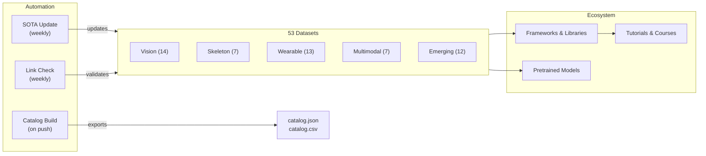

# Awesome Human Activity Recognition [](https://awesome.re)

<p align="center">
  <a href="https://github.com/Leooo-Huang/awesome-human-activity-recognition">
    
  </a>
</p>

> Sempre atualizado, o recurso HAR mais abrangente — continuamente verificado e atualizado automaticamente a partir do Papers with Code. 53 conjuntos de dados integrados em todas as modalidades.

[](https://creativecommons.org/licenses/by/4.0/)
[](https://github.com/Leooo-Huang/awesome-human-activity-recognition/pulls)
[](https://github.com/Leooo-Huang/awesome-human-activity-recognition/commits/main)
[](data/sota-snapshot.json)
[](https://leooo-huang.github.io/awesome-human-activity-recognition/)

[中文](README.zh.md) | [English](../README.md) | [Deutsch](README.de.md) | [Español](README.es.md) | [Français](README.fr.md) | [日本語](README.ja.md) | [한국어](README.ko.md) | **[Português](README.pt.md)** | [Русский](README.ru.md)

## Conteúdo

- [Arquitetura do Repositório](#arquitetura-do-repositório)
- [Qual Conjunto de Dados Devo Usar](#qual-conjunto-de-dados-devo-usar)
- [Conjuntos de Dados](#conjuntos-de-dados)
- [Frameworks e Bibliotecas](#frameworks-e-bibliotecas)
- [Modelos Pré-treinados](#modelos-pré-treinados)
- [Tutoriais e Cursos](#tutoriais-e-cursos)
- [Artigos Fundamentais](#artigos-fundamentais)
- [Competições e Desafios](#competições-e-desafios)
- [Ferramentas e Utilitários](#ferramentas-e-utilitários)
- [Listas Awesome Relacionadas](#listas-awesome-relacionadas)

## Arquitetura do Repositório



## Qual Conjunto de Dados Devo Usar

> Escolha sua modalidade e tarefa, depois siga a recomendação para a seção correspondente.

**Tenho vídeo e quero classificar ações** — Comece com Kinetics-700 para pré-treinamento, avalie no UCF-101 ou HMDB-51 para comparação com trabalhos anteriores. Veja [Visão](#visão-rgb--profundidade).

**Preciso de detecção temporal de ações em vídeo não segmentado** — ActivityNet para propostas, AVA para espaço-temporal, MultiTHUMOS para multi-rótulo denso. Também listado em Visão acima.

**Trabalho com esqueleto ou dados de captura de movimento** — NTU RGB+D 120 é o padrão de facto. Para alinhamento texto-movimento, use Babel ou HumanML3D. Veja [Esqueleto](#esqueleto-e-captura-de-movimento) e [Emergentes](#emergentes-e-de-fronteira).

**Tenho dados de IMU ou sensores vestíveis** — UCI-HAR para baselines, PAMAP2 para multi-sensor, CAPTURE-24 para escala real (151 sujeitos, 3883 horas). Veja [Sensores Vestíveis](#sensores-vestíveis).

**Preciso de dados egocêntricos ou multimodais** — Ego4D para escala (3,3 mil horas), EPIC-Kitchens-100 para ações na cozinha, Ego-Exo4D para visão cruzada (NOVO, CVPR 2024). Veja [Multimodal](#multimodal-e-egocêntrico).

**Quero geração de movimento a partir de texto** — HumanML3D para uma pessoa, InterHuman para duas pessoas, Motion-X++ para corpo inteiro com rosto e mãos. Também listado em Emergentes acima.

## Conjuntos de Dados

### Visão (RGB / Profundidade)

- [Kinetics-700](https://deepmind.com/research/open-source/kinetics) - Benchmark de pré-treinamento em larga escala com 650 mil clipes do YouTube em 700 classes de ação.
- [UCF-101](https://www.crcv.ucf.edu/data/UCF101.php) - Benchmark clássico de reconhecimento de ações com 13,3 mil clipes em 101 classes.
- [HMDB-51](https://serre-lab.clps.brown.edu/resource/hmdb-a-large-human-motion-database/) - Conjunto de dados diversificado de reconhecimento de ações com 6,8 mil clipes de filmes e vídeos da web em 51 classes.
- [ActivityNet](http://activity-net.org/) - Benchmark de detecção temporal de ações com 20 mil vídeos não segmentados do YouTube em 200 classes.
- [AVA](https://research.google.com/ava/) - Detecção espaço-temporal de ações com 430 clipes de filmes e 80 rótulos de ações atômicas com caixas delimitadoras.
- [NTU RGB+D 120](http://rose1.ntu.edu.sg/datasets/actionrecognition.asp) - Reconhecimento de ações 3D multi-vista com 114 mil sequências em 120 classes usando RGB, profundidade e esqueleto.
- [Something-Something V2](https://developer.qualcomm.com/software/ai-datasets/something-something) - Conjunto de dados de interação fina com objetos com 220 mil clipes em 174 rótulos que exigem raciocínio temporal.
- [FineGym](https://sdolivia.github.io/FineGym/) - Reconhecimento de ações de ginástica finas com 32 mil segmentos rotulados hierarquicamente.
- [Moments in Time](http://moments.csail.mit.edu/) - Conjunto de dados extremamente diversificado de reconhecimento de eventos e ações com 1M de clipes de vídeo de 3 segundos rotulados em 339 classes.
- [Diving48](http://www.svcl.ucsd.edu/projects/resound/dataset.html) - Reconhecimento de ações finas de salto ornamental com 18 mil clipes em 48 classes que exigem raciocínio temporal.
- [Toyota Smarthome](https://project.inria.fr/toyotasmarthome/) - Reconhecimento de atividades da vida diária com 16 mil clipes multi-vista em 31 classes usando RGB, profundidade e esqueleto.
- [MultiSports](https://deeperaction.github.io/multisports/) - Detecção espaço-temporal de ações em 4 esportes com 3,2 mil clipes e 66 classes de ações finas.
- [MultiTHUMOS](https://ai.stanford.edu/~syyeung/everymoment.html) - Detecção temporal de ações densa multi-rótulo com 65 classes e 38 mil anotações.
- [FineSports](https://github.com/PKU-ICST-MIPL/FineSports_CVPR2024) - Compreensão fina de esportes com múltiplas pessoas, com 10 mil vídeos da NBA e 52 tipos de ação do CVPR 2024.

### Esqueleto e Captura de Movimento

- [NTU RGB+D 60](https://rose1.ntu.edu.sg/dataset/actionRecognition/) - Conjunto de dados fundacional para reconhecimento de ações baseado em esqueleto com 57 mil sequências em 60 classes.
- [AMASS](https://amass.is.tue.mpg.de/) - Parâmetros unificados de captura de movimento SMPL de mais de 40 conjuntos de dados, cobrindo 16 mil minutos e 344 sujeitos.
- [Human3.6M](http://vision.imar.ro/human3.6m/description.php) - Padrão de facto para estimativa de pose 3D com 3,6M de quadros de 11 atores profissionais.
- [Babel](https://babel.is.tue.mpg.de/) - Conjunto de dados de alinhamento movimento-linguagem com 43 horas e 3,7 mil sequências anotadas com SMPL e rótulos textuais.
- [TotalCapture](http://totalcapture.net/) - Benchmark multimodal de estimativa de pose 3D combinando captura de movimento, RGB multi-vista e IMU de 5 sujeitos.
- [PKU-MMD](https://www.icst.pku.edu.cn/struct/Projects/PKUMMD.html) - Benchmark de detecção de ações multi-modalidade com 20 mil instâncias em 51 classes.
- [Skeletics-152](https://github.com/skelemoa/quater-gcn) - Reconhecimento de ações de esqueleto em larga escala a partir de poses estimadas com 150 mil clipes em 152 classes.

### Sensores Vestíveis

- [UCI-HAR](https://archive.ics.uci.edu/ml/datasets/human+activity+recognition+using+smartphones) - Benchmark clássico de IMU de smartphone com 30 sujeitos e 6 atividades, quase saturado.
- [PAMAP2](https://archive.ics.uci.edu/ml/datasets/pamap2+physical+activity+monitoring) - Padrão de HAR vestível com multi-IMU e frequência cardíaca de 9 sujeitos em 18 atividades.
- [WISDM](https://www.cis.fordham.edu/wisdm/dataset.php) - Mineração de dados de sensores de celular e smartwatch com 51 sujeitos e mais de 1 milhão de amostras.
- [OPPORTUNITY](https://archive.ics.uci.edu/ml/datasets/OPPORTUNITY+Activity+Recognition) - Reconhecimento de atividades com contexto rico, com 72 sensores vestíveis e ambientais de 4 sujeitos.
- [HAPT](https://archive.ics.uci.edu/ml/datasets/Human+Activity+Recognition+Using+Smartphones) - Conjunto de dados de IMU de smartphone com detecção de transição postural de 30 sujeitos em 12 atividades.
- [RealWorld HAR](https://sensor.informatik.uni-mannheim.de/#dataset_realworld) - Reconhecimento de atividades em ambiente real com múltiplas posições de dispositivos de 60 sujeitos em 15 atividades.
- [mHealth](https://archive.ics.uci.edu/ml/datasets/MHEALTH+Dataset) - Sensores corporais com ECG para monitoramento de saúde móvel de 10 sujeitos em 12 atividades.
- [UniMiB-SHAR](http://www.sal.disco.unimib.it/technologies/unimib-shar/) - Conjunto de dados de acelerômetro de smartphone para atividades diárias e detecção de quedas de 30 sujeitos em 17 atividades.
- [Daphnet](https://archive.ics.uci.edu/ml/datasets/Daphnet+Freezing+of+Gait) - Detecção de congelamento de marcha para pacientes com Parkinson usando 3 acelerômetros vestíveis de 10 sujeitos.
- [Sussex-Huawei Locomotion](http://www.shl-dataset.org/) - Reconhecimento de modo de locomoção em larga escala com mais de 2800 horas de 3 usuários com sensores de celular e relógio.
- [HARTH](https://archive.ics.uci.edu/dataset/779/harth) - HAR de acelerômetro em vida livre anotado por vídeo profissional de 22 sujeitos em condições reais.
- [CAPTURE-24](https://github.com/OxWearables/capture24) - Maior conjunto de dados de acelerômetro de pulso em vida livre com 151 sujeitos e 3883 horas do Nature Scientific Data 2024.
- [WEAR](https://github.com/mariusbock/wear) - Conjunto de dados de esportes ao ar livre com IMU de smartwatch e vídeo egocêntrico de 22 sujeitos em 18 atividades, publicado no IMWUT 2024.

### Multimodal e Egocêntrico

- [EPIC-Kitchens-100](https://epic-kitchens.github.io/2021) - Ações egocêntricas de longa duração na cozinha com áudio, abrangendo 700 horas em 90 cozinhas.
- [Ego4D](https://ego4d-data.org/docs/data/) - Maior conjunto de dados egocêntrico com benchmarks multi-tarefa, abrangendo 3,3 mil horas em 74 cenas.
- [Charades](https://allenai.org/plato/charades/) - Reconhecimento de ações multi-rótulo em ambientes internos com descrições roteirizadas, abrangendo 9,8 mil vídeos em 157 rótulos.
- [NTU Mutual Actions](https://arxiv.org/abs/1905.04757) - Interações entre duas pessoas do NTU RGB+D com dados de esqueleto em 26 classes de interação.
- [ActivityNet Captions](https://cs.stanford.edu/people/ranber/densevid/) - Legendagem densa de vídeo e fundamentação temporal com 20 mil vídeos e 100 mil legendas.
- [How2Sign](https://how2sign.github.io/) - Conjunto de dados multimodal de Língua de Sinais Americana com RGB, profundidade e pose, abrangendo 80 horas.
- [EgoExo-Fitness](https://github.com/iSEE-Laboratory/EgoExo-Fitness) - Avaliação de qualidade de ações fitness em visão ego e exo com 31 horas e mais de 6 mil ações do ECCV 2024.

### Emergentes e de Fronteira

- [BEHAVE](https://virtualhumans.mpi-inf.mpg.de/behave/) - Interação humano-objeto em RGB-D com pose 3D, abrangendo 321 sequências de 20 sujeitos.
- [Motion-X](https://caizhongang.github.io/projects/Motion-X/) - Movimento corporal completo e articulações das mãos de captura de movimento multi-sensor com 2M de quadros de 10 sujeitos.
- [Ego-Exo4D](https://ego-exo4d-data.org/) - Compreensão de ações em visão cruzada com vídeo ego e exo sincronizado, abrangendo 1,4 mil sequências.
- [HumanML3D](https://github.com/EricGuo5513/HumanML3D) - Conjunto de dados de geração de movimento a partir de texto com anotações SMPL, abrangendo mais de 14 mil sequências de movimento.
- [InterHuman](https://github.com/tr3e/InterHuman) - Movimento de interação entre duas pessoas com SMPL-X e descrições textuais, abrangendo mais de 6 mil sequências.
- [HOI4D](https://hoi4d.github.io/) - Interação mão-objeto egocêntrica com RGB-D e pose da mão, abrangendo mais de 4 mil clipes de vídeo.
- [FineBio](https://github.com/aistairc/FineBio) - Compreensão fina de ações em laboratório de biologia com anotações de procedimentos multi-etapa.
- [HAA500](https://www.cse.ust.hk/haa/) - Reconhecimento diversificado de ações atômicas finas com 10 mil clipes em 500 classes.
- [Motion-X++](https://motion-x-dataset.github.io/) - Geração de movimento de corpo inteiro com texto e áudio, abrangendo mais de 120 mil sequências.
- [FLAG3D](https://andytang15.github.io/FLAG3D/) - Compreensão de atividades fitness 3D com RGB multi-vista, esqueleto e texto, abrangendo 180 mil sequências do CVPR 2024.
- [InterX](https://liangxuy.github.io/inter-x/) - Conjunto de dados abrangente de interação humano-humano com SMPL-X, abrangendo mais de 11 mil sequências do CVPR 2024.
- [WiMANS](https://arxiv.org/abs/2402.09430) - Primeiro benchmark de detecção de atividades multi-usuário baseado em WiFi em um venue de topo, do ECCV 2024.

## Frameworks e Bibliotecas

### Reconhecimento de Ações em Vídeo

- [MMAction2](https://github.com/open-mmlab/mmaction2) - Toolbox OpenMMLab para compreensão de vídeo, suportando mais de 20 arquiteturas de modelos incluindo SlowFast, TimeSformer e VideoMAE.
- [PySlowFast](https://github.com/facebookresearch/SlowFast) - Biblioteca do Facebook Research para compreensão de vídeo com modelos SlowFast, X3D, MViT e AVA.
- [Video-Swin-Transformer](https://github.com/SwinTransformer/Video-Swin-Transformer) - Backbone puramente transformer para reconhecimento de vídeo alcançando SOTA no Kinetics-400, Kinetics-600 e SSv2.
- [TimeSformer](https://github.com/facebookresearch/TimeSformer) - Atenção dividida espaço-temporal do Facebook Research para classificação de vídeo do ICML 2021.
- [VideoMAE](https://github.com/MCG-NJU/VideoMAE) - Pré-treinamento auto-supervisionado de vídeo com autoencoders mascarados alcançando SOTA em múltiplos benchmarks.
- [InternVideo2](https://github.com/OpenGVLab/InternVideo2) - Modelo fundacional para compreensão de vídeo em escala, suportando reconhecimento de ações, recuperação e legendagem.

### Reconhecimento de Ações por Esqueleto

- [CTR-GCN](https://github.com/Uason-Chen/CTR-GCN) - Convolução em grafo com refinamento de topologia por canal para reconhecimento de ações baseado em esqueleto do ICCV 2021.
- [ST-GCN](https://github.com/yysijie/st-gcn) - Rede seminal de convolução em grafo espaço-temporal que estabeleceu a abordagem GCN para HAR baseado em esqueleto.
- [2s-AGCN](https://github.com/lshiwjx/2s-AGCN) - Rede convolucional de grafo adaptativa de dois fluxos para reconhecimento de ações baseado em esqueleto do CVPR 2019.
- [HD-GCN](https://github.com/Jho-Yonsei/HD-GCN) - Rede convolucional de grafo hierarquicamente decomposta para reconhecimento de ações por esqueleto do AAAI 2024.
- [MotionBERT](https://github.com/Walter0807/MotionBERT) - Pré-treinamento unificado para análise de movimento humano cobrindo estimativa de pose 3D e reconhecimento de ações.
- [InfoGCN](https://github.com/stnoah1/infogcn) - Rede convolucional de grafo com gargalo de informação para reconhecimento de ações por esqueleto do CVPR 2022.

### HAR com Sensores Vestíveis

- [tsai](https://github.com/timeseriesAI/tsai) - Biblioteca de deep learning para séries temporais e sequências construída sobre fastai e PyTorch, amplamente usada para HAR com sensores.
- [aeon](https://github.com/aeon-toolkit/aeon) - Toolkit Python unificado para séries temporais incluindo classificação, clustering e detecção de anomalias.
- [NNCLR-HAR](https://github.com/mariusbock/nnclr-har) - Framework de aprendizado contrastivo auto-supervisionado para HAR com sensores vestíveis do IMWUT 2022.
- [DeepConvLSTM](https://github.com/sussexwearlab/DeepConvLSTM) - Implementação de referência da arquitetura convolucional LSTM para reconhecimento de atividades vestível.
- [Hang-Time HAR](https://github.com/ahoelzemann/hangtime_har) - Reconhecimento de atividades de basquete a partir de um único sensor inercial de pulso usando deep learning.

### Geração e Estimativa de Movimento

- [MDM](https://github.com/GuyTevet/motion-diffusion-model) - Modelo de difusão de movimento humano para geração de movimento a partir de texto alcançando SOTA no HumanML3D.
- [MLD](https://github.com/ChenFengYe/motion-latent-diffusion) - Modelo de difusão de movimento latente para geração eficiente de movimento humano a partir de texto do CVPR 2023.
- [T2M-GPT](https://github.com/Mael-zys/T2M-GPT) - Geração de movimento humano a partir de descrições textuais com representações discretas.
- [MotionGPT](https://github.com/OpenMotionLab/MotionGPT) - Modelo unificado de geração movimento-linguagem que trata o movimento como uma língua estrangeira.
- [SMPL-X](https://github.com/vchoutas/smplx) - Modelo corporal expressivo capturando poses de corpo, rosto e mãos, o padrão para conjuntos de dados de movimento modernos.

## Modelos Pré-treinados

- [VideoMAE V2](https://github.com/OpenGVLab/VideoMAEv2) - Modelo fundacional de vídeo com bilhões de parâmetros pré-treinado em milhões de clipes, ajustável para reconhecimento de ações.
- [InternVideo2 Model Zoo](https://huggingface.co/OpenGVLab/InternVideo2-Stage2_1B-224p-f4) - Checkpoints de modelo vídeo-linguagem com 6B de parâmetros no Hugging Face para reconhecimento de ações e recuperação.
- [UniFormerV2](https://github.com/OpenGVLab/UniFormerV2) - Transformer de vídeo eficiente com tokens multi-escala alcançando 90,0% top-1 no Kinetics-400.
- [MVD](https://github.com/ruiwang2021/mvd) - Modelo pré-treinado de destilação de vídeo mascarado competitivo com VideoMAE em reconhecimento de ações downstream.
- [MotionBERT Checkpoints](https://huggingface.co/walterzhu/MotionBERT) - Encoder de movimento pré-treinado transferível para estimativa de pose 3D, reconhecimento de ações e reconstrução de malha.

## Tutoriais e Cursos

- [Dive into Deep Learning - Action Recognition](https://d2l.ai/) - Capítulo de livro interativo sobre compreensão de vídeo e reconhecimento de ações com código PyTorch.
- [MMAction2 Tutorials](https://mmaction2.readthedocs.io/en/latest/get_started/overview.html) - Guia passo a passo para treinar modelos de reconhecimento de ações em conjuntos de dados personalizados.
- [Sensor HAR Tutorial by Marius Bock](https://github.com/mariusbock/dl-for-har) - Tutorial abrangente de deep learning para HAR com sensores inerciais usando PyTorch.
- [Stanford CS231N - Video Understanding](https://cs231n.stanford.edu/) - Materiais de aula cobrindo modelagem temporal, redes de dois fluxos e convoluções 3D para reconhecimento de ações.
- [Coursera - Motion Planning](https://www.coursera.org/learn/robotics-motion-planning) - Curso da Universidade da Pensilvânia cobrindo representações de movimento relevantes para HAR.
- [Motion Diffusion Tutorial](https://colab.research.google.com/drive/1MvBaAhOrEk8MP_jwNdQKLnvMxXPOG6zU) - Notebook Colab para treinar modelos de difusão de movimento humano condicionados por texto no HumanML3D.

## Artigos Fundamentais

### Fundacionais

- [Two-Stream Convolutional Networks](https://arxiv.org/abs/1406.2199) - Simonyan e Zisserman, NeurIPS 2014, estabelecendo o paradigma de dois fluxos espaço-temporal.
- [C3D: Learning Spatiotemporal Features](https://arxiv.org/abs/1412.0767) - Tran et al., ICCV 2015, pioneiro em convoluções 3D para aprendizado de características de vídeo.
- [I3D: Quo Vadis Action Recognition](https://arxiv.org/abs/1705.07750) - Carreira e Zisserman, CVPR 2017, inflando arquiteturas 2D ImageNet para vídeo 3D.
- [ST-GCN: Spatial Temporal Graph Convolutional Networks](https://arxiv.org/abs/1801.07455) - Yan et al., AAAI 2018, definindo a abordagem GCN para reconhecimento de ações por esqueleto.
- [SlowFast Networks](https://arxiv.org/abs/1812.03982) - Feichtenhofer et al., ICCV 2019, arquitetura de via dupla para reconhecimento de vídeo.

### Era dos Transformers (2020 em diante)

- [ViViT: A Video Vision Transformer](https://arxiv.org/abs/2103.15691) - Arnab et al., ICCV 2021, modelos puramente transformer para classificação de vídeo.
- [TimeSformer](https://arxiv.org/abs/2102.05095) - Bertasius et al., ICML 2021, atenção dividida espaço-temporal para transformers de vídeo escaláveis.
- [VideoMAE](https://arxiv.org/abs/2203.12602) - Tong et al., NeurIPS 2022, pré-treinamento com autoencoder mascarado alcançando SOTA com dados rotulados mínimos.
- [InternVideo2](https://arxiv.org/abs/2403.15377) - Wang et al., ECCV 2024, escalando modelos fundacionais de vídeo para 6B de parâmetros em mais de 60 benchmarks.

### HAR com Sensores Vestíveis

- [DeepConvLSTM](https://arxiv.org/abs/1611.06759) - Ordonez e Roggen, Sensors 2016, estabelecendo deep learning para reconhecimento de atividades vestível.
- [Attend and Discriminate](https://arxiv.org/abs/2007.07426) - Abedin et al., IMWUT 2021, mecanismos de atenção para HAR multi-sensor.
- [Self-supervised HAR](https://arxiv.org/abs/2011.11542) - Tang et al., IJCAI 2021, aprendizado contrastivo para reconhecimento de atividades baseado em sensores.

### Geração de Movimento

- [MDM: Human Motion Diffusion Model](https://arxiv.org/abs/2209.14916) - Tevet et al., ICLR 2023, geração de movimento a partir de texto baseada em difusão.
- [MotionGPT](https://arxiv.org/abs/2306.14795) - Jiang et al., NeurIPS 2023, unificando movimento e linguagem por meio de arquiteturas LLM.
- [Motion-X](https://arxiv.org/abs/2307.00818) - Lin et al., NeurIPS 2023, primeiro conjunto de dados de movimento de corpo inteiro em larga escala com anotações expressivas.

### Revisões

- [Deep Learning for HAR: A Survey](https://dl.acm.org/doi/10.1145/3472290) - Li et al., ACM Computing Surveys 2022, revisão abrangente de abordagens de deep learning para HAR.
- [Skeleton-based Action Recognition Survey](https://arxiv.org/abs/2012.12231) - Liu et al., IEEE TPAMI 2022, revisão aprofundada de métodos GCN e transformer para HAR por esqueleto.
- [Multimodal HAR with Emphasis on Classification](https://www.sciencedirect.com/science/article/pii/S0950705124000029) - Yadav et al., Knowledge-Based Systems 2024, revisão mais recente cobrindo estratégias de fusão.

## Competições e Desafios

- [Ego-Exo4D Challenge 2025](https://eval.ai/web/challenges/challenge-page/2249/overview) - Benchmark multi-trilha do CVPR 2025 cobrindo ego-pose, reconhecimento de ações e compreensão de linguagem.
- [ActivityNet Challenge](http://activity-net.org/challenges/2024/) - Desafio anual de detecção temporal de ações, propostas e legendagem densa.
- [EPIC-Kitchens Challenge](https://epic-kitchens.github.io/2024) - Competição de reconhecimento, detecção e antecipação de ações egocêntricas.
- [SHL Recognition Challenge](http://www.shl-dataset.org/activity-recognition-challenge/) - Desafio anual de reconhecimento de modo de transporte a partir de sensores de smartphone.
- [Babel Challenge](https://teach.is.tue.mpg.de/) - Compreensão movimento-linguagem e segmentação temporal de ações em dados de captura de movimento.
- [UAV-Human Challenge](https://github.com/SUTDCV/UAV-Human) - Compreensão do comportamento humano a partir de perspectivas de VANTs com dados multimodais.

## Ferramentas e Utilitários

- [Papers with Code - HAR Leaderboards](https://paperswithcode.com/task/activity-recognition) - Acompanhamento ao vivo do SOTA em todos os principais benchmarks de HAR.
- [MMAction2 Model Zoo](https://mmaction2.readthedocs.io/en/latest/model_zoo/modelzoo.html) - Checkpoints e configurações pré-treinados para mais de 100 modelos de reconhecimento de ações.
- [Decord](https://github.com/dmlc/decord) - Leitor de vídeo eficiente acelerado por GPU para pipelines de treinamento de deep learning.
- [vid2player](https://github.com/jhgan00/vid2player) - Animação de personagem a partir de entrada de vídeo, útil para visualização de reconhecimento de atividades.
- [OpenPose](https://github.com/CMU-Perceptual-Computing-Lab/openpose) - Detecção de keypoints multi-pessoa em tempo real para extração de esqueleto a partir de vídeo.
- [MediaPipe](https://developers.google.com/mediapipe) - Framework de ML on-device do Google para estimativa de pose, rastreamento de mãos e reconhecimento de gestos.
- [YOLO-Pose](https://github.com/ultralytics/ultralytics) - YOLOv8 Pose da Ultralytics para estimativa de esqueleto multi-pessoa em tempo real.

## Listas Awesome Relacionadas

- [Awesome Action Recognition](https://github.com/jinwchoi/awesome-action-recognition) - Artigos e conjuntos de dados de reconhecimento de ações.
- [Awesome Skeleton-based Action Recognition](https://github.com/firework8/Awesome-Skeleton-based-Action-Recognition) - Métodos GCN e transformer para HAR por esqueleto.
- [Awesome Self-Supervised Learning](https://github.com/jason718/awesome-self-supervised-learning) - Métodos de aprendizado auto-supervisionado aplicáveis a modalidades de vídeo e sensores.
- [Awesome Video Understanding](https://github.com/HuaizhengZhang/Awesome-System-for-Machine-Learning) - Sistemas e arquiteturas de compreensão de vídeo.
- [Awesome IMU Sensing](https://github.com/rh20624/Awesome-IMU-Sensing) - Sensoriamento baseado em IMU para reconhecimento de atividades e navegação.
- [Awesome Pose Estimation](https://github.com/cbsudux/awesome-human-pose-estimation) - Métodos e benchmarks de estimativa de pose humana.

## Notas de Rodapé

Veja também: [Taxonomia multidimensional](../docs/taxonomy.md) | [Revisões](../docs/surveys.md) | [Benchmarks](../docs/benchmarking.md) | [Gerador de catálogo](../tools/) | [Roteiro](../docs/roadmap.md) | [Como contribuir](../CONTRIBUTING.md)

### Citação

```bibtex
@misc{awesome_har_2025,
  title   = {Awesome Human Activity Recognition: A Curated List},
  author  = {Wenxuan Huang},
  year    = {2025},
  url     = {https://github.com/Leooo-Huang/awesome-human-activity-recognition},
  note    = {GitHub repository}
}
```

### Agradecimentos

Agradecemos aos autores de conjuntos de dados, equipes de anotação e mantenedores de benchmarks que tornam possível a pesquisa aberta em compreensão de atividades humanas.
