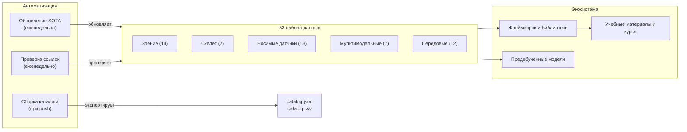

# Awesome Распознавание человеческой активности [](https://awesome.re)

<p align="center">
  <a href="https://github.com/Leo-Cyberautonomy/awesome-human-activity-recognition">
    
  </a>
</p>

> Курируемое исследовательское руководство по **распознаванию человеческой активности** — 53 набора данных, ключевые фреймворки, предобученные модели, учебные материалы и инструменты бенчмаркинга для модальностей компьютерного зрения, носимых датчиков, скелетных данных и мультимодальных подходов.

[](https://creativecommons.org/licenses/by/4.0/)
[](https://github.com/Leo-Cyberautonomy/awesome-human-activity-recognition/pulls)
[](https://github.com/Leo-Cyberautonomy/awesome-human-activity-recognition/commits/main)
[](data/sota-snapshot.json)
[](https://leo-cyberautonomy.github.io/awesome-human-activity-recognition/)

[中文](README.zh.md) | [English](../README.md) | [Deutsch](README.de.md) | [Español](README.es.md) | [Français](README.fr.md) | [日本語](README.ja.md) | [한국어](README.ko.md) | [Português](README.pt.md) | **Русский**

## Содержание

- [Архитектура репозитория](#архитектура-репозитория)
- [Какой набор данных выбрать](#какой-набор-данных-выбрать)
- [Наборы данных](#наборы-данных)
- [Фреймворки и библиотеки](#фреймворки-и-библиотеки)
- [Предобученные модели](#предобученные-модели)
- [Учебные материалы и курсы](#учебные-материалы-и-курсы)
- [Ключевые публикации](#ключевые-публикации)
- [Соревнования и челленджи](#соревнования-и-челленджи)
- [Инструменты и утилиты](#инструменты-и-утилиты)
- [Связанные Awesome-списки](#связанные-awesome-списки)

## Архитектура репозитория



## Какой набор данных выбрать

> Выберите модальность и задачу, затем перейдите по рекомендации к нужному разделу.

**У меня есть видео и я хочу классифицировать действия** — Начните с Kinetics-700 для предобучения, оценивайте на UCF-101 или HMDB-51 для сравнения с предшествующими работами. См. [Зрение](#зрение-rgb--глубина).

**Мне нужна временная детекция действий в необрезанном видео** — ActivityNet для предложений действий, AVA для пространственно-временной детекции, MultiTHUMOS для плотной мультиметочной разметки. Также указаны в разделе «Зрение».

**Я работаю со скелетными данными или данными захвата движений** — NTU RGB+D 120 является стандартом де-факто. Для согласования текста и движения используйте Babel или HumanML3D. См. [Скелет](#скелет-и-захват-движений) и [Передовые](#передовые-и-перспективные).

**У меня данные с IMU или носимых датчиков** — UCI-HAR для базовых экспериментов, PAMAP2 для мультисенсорных данных, CAPTURE-24 для реального масштаба (151 субъект, 3883 часа). См. [Носимые датчики](#носимые-датчики).

**Мне нужны эгоцентрические или мультимодальные данные** — Ego4D для масштаба (3,3 тыс. часов), EPIC-Kitchens-100 для кухонных действий, Ego-Exo4D для перекрёстного обзора (НОВОЕ, CVPR 2024). См. [Мультимодальные](#мультимодальные-и-эгоцентрические).

**Я хочу генерацию движений по тексту** — HumanML3D для одного человека, InterHuman для двух человек, Motion-X++ для всего тела с лицом и руками. Также указаны в разделе «Передовые».

## Наборы данных

### Зрение (RGB / Глубина)

- [Kinetics-700](https://deepmind.com/research/open-source/kinetics) — Крупномасштабный бенчмарк для предобучения: 650 тыс. клипов с YouTube по 700 классам действий.
- [UCF-101](https://www.crcv.ucf.edu/data/UCF101.php) — Классический бенчмарк распознавания действий: 13,3 тыс. клипов по 101 классу.
- [HMDB-51](https://serre-lab.clps.brown.edu/resource/hmdb-a-large-human-motion-database/) — Разнообразный набор данных: 6,8 тыс. клипов из фильмов и веб-видео по 51 классу.
- [ActivityNet](http://activity-net.org/) — Бенчмарк временной детекции действий: 20 тыс. необрезанных видео с YouTube по 200 классам.
- [AVA](https://research.google.com/ava/) — Пространственно-временная детекция действий: 430 фрагментов из фильмов с 80 атомарными метками действий и ограничивающими рамками.
- [NTU RGB+D 120](http://rose1.ntu.edu.sg/datasets/actionrecognition.asp) — Распознавание 3D-действий с нескольких ракурсов: 114 тыс. последовательностей по 120 классам (RGB, глубина, скелет).
- [Something-Something V2](https://developer.qualcomm.com/software/ai-datasets/something-something) — Набор данных для распознавания тонких взаимодействий с объектами: 220 тыс. клипов по 174 меткам, требующий временного рассуждения.
- [FineGym](https://sdolivia.github.io/FineGym/) — Точное распознавание гимнастических действий: 32 тыс. иерархически размеченных сегментов.
- [Moments in Time](http://moments.csail.mit.edu/) — Чрезвычайно разнообразный набор данных для распознавания событий и действий: 1 млн размеченных 3-секундных клипов по 339 классам.
- [Diving48](http://www.svcl.ucsd.edu/projects/resound/dataset.html) — Точное распознавание действий в прыжках в воду: 18 тыс. клипов по 48 классам, требующий временного рассуждения.
- [Toyota Smarthome](https://project.inria.fr/toyotasmarthome/) — Распознавание повседневной активности: 16 тыс. мультиракурсных клипов по 31 классу (RGB, глубина, скелет).
- [MultiSports](https://deeperaction.github.io/multisports/) — Пространственно-временная детекция действий в 4 видах спорта: 3,2 тыс. клипов и 66 классов точных действий.
- [MultiTHUMOS](https://ai.stanford.edu/~syyeung/everymoment.html) — Плотная мультиметочная временная детекция действий: 65 классов и 38 тыс. аннотаций.
- [FineSports](https://github.com/PKU-ICST-MIPL/FineSports_CVPR2024) — Точный анализ командного спорта: 10 тыс. видео NBA и 52 типа действий (CVPR 2024).

### Скелет и захват движений

- [NTU RGB+D 60](https://rose1.ntu.edu.sg/dataset/actionRecognition/) — Основополагающий набор данных для распознавания действий по скелету: 57 тыс. последовательностей по 60 классам.
- [AMASS](https://amass.is.tue.mpg.de/) — Унифицированные параметры SMPL из более чем 40 наборов данных захвата движений: 16 тыс. минут, 344 субъекта.
- [Human3.6M](http://vision.imar.ro/human3.6m/description.php) — Стандарт де-факто для оценки 3D-позы: 3,6 млн кадров от 11 профессиональных актёров.
- [Babel](https://babel.is.tue.mpg.de/) — Набор данных для согласования движения и языка: 43 часа и 3,7 тыс. последовательностей с аннотациями SMPL и текстовыми метками.
- [TotalCapture](http://totalcapture.net/) — Мультимодальный бенчмарк оценки 3D-позы, объединяющий захват движений, мультиракурсное RGB и IMU от 5 субъектов.
- [PKU-MMD](https://www.icst.pku.edu.cn/struct/Projects/PKUMMD.html) — Мультимодальный бенчмарк детекции действий: 20 тыс. экземпляров по 51 классу.
- [Skeletics-152](https://github.com/skelemoa/quater-gcn) — Крупномасштабное распознавание действий по оценённым скелетам: 150 тыс. клипов по 152 классам.

### Носимые датчики

- [UCI-HAR](https://archive.ics.uci.edu/ml/datasets/human+activity+recognition+using+smartphones) — Классический бенчмарк на данных IMU смартфона: 30 субъектов и 6 активностей, практически насыщен.
- [PAMAP2](https://archive.ics.uci.edu/ml/datasets/pamap2+physical+activity+monitoring) — Стандарт носимого HAR с множественными IMU и пульсометром: 9 субъектов, 18 активностей.
- [WISDM](https://www.cis.fordham.edu/wisdm/dataset.php) — Данные сенсоров телефона и умных часов: 51 субъект, более 1 миллиона образцов.
- [OPPORTUNITY](https://archive.ics.uci.edu/ml/datasets/OPPORTUNITY+Activity+Recognition) — Распознавание контекстно-зависимой активности: 72 носимых и амбиентных датчика от 4 субъектов.
- [HAPT](https://archive.ics.uci.edu/ml/datasets/Human+Activity+Recognition+Using+Smartphones) — Набор данных IMU смартфона с детекцией постуральных переходов: 30 субъектов, 12 активностей.
- [RealWorld HAR](https://sensor.informatik.uni-mannheim.de/#dataset_realworld) — Распознавание активности в реальных условиях с несколькими позициями устройств: 60 субъектов, 15 активностей.
- [mHealth](https://archive.ics.uci.edu/ml/datasets/MHEALTH+Dataset) — Нательные датчики с ЭКГ для мониторинга мобильного здоровья: 10 субъектов, 12 активностей.
- [UniMiB-SHAR](http://www.sal.disco.unimib.it/technologies/unimib-shar/) — Набор данных акселерометра смартфона для повседневных активностей и обнаружения падений: 30 субъектов, 17 активностей.
- [Daphnet](https://archive.ics.uci.edu/ml/datasets/Daphnet+Freezing+of+Gait) — Детекция застывания походки у пациентов с болезнью Паркинсона: 3 носимых акселерометра, 10 субъектов.
- [Sussex-Huawei Locomotion](http://www.shl-dataset.org/) — Крупномасштабное распознавание режима передвижения: более 2800 часов от 3 пользователей с датчиками телефона и часов.
- [HARTH](https://archive.ics.uci.edu/dataset/779/harth) — Профессионально аннотированный по видео набор акселерометрических данных свободной жизнедеятельности: 22 субъекта в реальных условиях.
- [CAPTURE-24](https://github.com/OxWearables/capture24) — Крупнейший набор данных наручного акселерометра свободной жизнедеятельности: 151 субъект и 3883 часа (Nature Scientific Data 2024).
- [WEAR](https://github.com/mariusbock/wear) — Набор данных для уличных видов спорта с IMU умных часов и эгоцентрическим видео: 22 субъекта, 18 активностей (IMWUT 2024).

### Мультимодальные и эгоцентрические

- [EPIC-Kitchens-100](https://epic-kitchens.github.io/2021) — Долговременные эгоцентрические кухонные действия с аудио: 700 часов, 90 кухонь.
- [Ego4D](https://ego4d-data.org/docs/data/) — Крупнейший эгоцентрический набор данных с мультизадачными бенчмарками: 3,3 тыс. часов, 74 сценария.
- [Charades](https://allenai.org/plato/charades/) — Мультиметочное распознавание действий в помещении по сценариям: 9,8 тыс. видео, 157 меток.
- [NTU Mutual Actions](https://arxiv.org/abs/1905.04757) — Взаимодействия двух человек из NTU RGB+D со скелетными данными по 26 классам взаимодействий.
- [ActivityNet Captions](https://cs.stanford.edu/people/ranber/densevid/) — Плотное описание видео и временная локализация: 20 тыс. видео, 100 тыс. описаний.
- [How2Sign](https://how2sign.github.io/) — Мультимодальный набор данных американского жестового языка: RGB, глубина и поза, 80 часов.
- [EgoExo-Fitness](https://github.com/iSEE-Laboratory/EgoExo-Fitness) — Оценка качества фитнес-действий с эгоцентрической и экзоцентрической точек зрения: 31 час, более 6 тыс. действий (ECCV 2024).

### Передовые и перспективные

- [BEHAVE](https://virtualhumans.mpi-inf.mpg.de/behave/) — Взаимодействие человека с объектом по RGB-D и 3D-позе: 321 последовательность, 20 субъектов.
- [Motion-X](https://caizhongang.github.io/projects/Motion-X/) — Движения всего тела и кистей рук из мультисенсорного захвата: 2 млн кадров, 10 субъектов.
- [Ego-Exo4D](https://ego-exo4d-data.org/) — Понимание действий с разных ракурсов: синхронизированное эго- и экзо-видео, 1,4 тыс. последовательностей.
- [HumanML3D](https://github.com/EricGuo5513/HumanML3D) — Набор данных для генерации движений по тексту с аннотациями SMPL: более 14 тыс. последовательностей движений.
- [InterHuman](https://github.com/tr3e/InterHuman) — Движения взаимодействия двух человек с SMPL-X и текстовыми описаниями: более 6 тыс. последовательностей.
- [HOI4D](https://hoi4d.github.io/) — Эгоцентрическое взаимодействие руки с объектом: RGB-D и поза руки, более 4 тыс. видеоклипов.
- [FineBio](https://github.com/aistairc/FineBio) — Точное понимание действий в биологической лаборатории с многоэтапными аннотациями процедур.
- [HAA500](https://www.cse.ust.hk/haa/) — Разнообразное распознавание точных атомарных действий: 10 тыс. клипов по 500 классам.
- [Motion-X++](https://motion-x-dataset.github.io/) — Генерация движений всего тела по тексту и аудио: более 120 тыс. последовательностей.
- [FLAG3D](https://andytang15.github.io/FLAG3D/) — Понимание фитнес-активности в 3D: мультиракурсное RGB, скелет и текст, 180 тыс. последовательностей (CVPR 2024).
- [InterX](https://liangxuy.github.io/inter-x/) — Комплексный набор данных взаимодействий между людьми с SMPL-X: более 11 тыс. последовательностей (CVPR 2024).
- [WiMANS](https://arxiv.org/abs/2402.09430) — Первый бенчмарк распознавания активности нескольких пользователей на основе WiFi, представленный на топовой конференции (ECCV 2024).

## Фреймворки и библиотеки

### Распознавание действий по видео

- [MMAction2](https://github.com/open-mmlab/mmaction2) — Инструментарий OpenMMLab для анализа видео, поддерживающий более 20 архитектур моделей, включая SlowFast, TimeSformer и VideoMAE.
- [PySlowFast](https://github.com/facebookresearch/SlowFast) — Библиотека Facebook Research для анализа видео с моделями SlowFast, X3D, MViT и AVA.
- [Video-Swin-Transformer](https://github.com/SwinTransformer/Video-Swin-Transformer) — Чисто трансформерная основа для распознавания видео, достигающая SOTA на Kinetics-400, Kinetics-600 и SSv2.
- [TimeSformer](https://github.com/facebookresearch/TimeSformer) — Разделённое пространственно-временное внимание от Facebook Research для классификации видео (ICML 2021).
- [VideoMAE](https://github.com/MCG-NJU/VideoMAE) — Самообучение на видео с маскированными автоэнкодерами, достигающее SOTA на множестве бенчмарков.
- [InternVideo2](https://github.com/OpenGVLab/InternVideo2) — Базовая модель для понимания видео в масштабе, поддерживающая распознавание действий, поиск и описание.

### Распознавание действий по скелету

- [CTR-GCN](https://github.com/Uason-Chen/CTR-GCN) — Графовая свёртка с поканальным уточнением топологии для распознавания действий по скелету (ICCV 2021).
- [ST-GCN](https://github.com/yysijie/st-gcn) — Основополагающая пространственно-временная графовая свёрточная сеть, определившая подход GCN для скелетного HAR.
- [2s-AGCN](https://github.com/lshiwjx/2s-AGCN) — Двухпотоковая адаптивная графовая свёрточная сеть для распознавания действий по скелету (CVPR 2019).
- [HD-GCN](https://github.com/Jho-Yonsei/HD-GCN) — Иерархически декомпозированная графовая свёрточная сеть для распознавания действий по скелету (AAAI 2024).
- [MotionBERT](https://github.com/Walter0807/MotionBERT) — Унифицированное предобучение для анализа человеческого движения: оценка 3D-позы и распознавание действий.
- [InfoGCN](https://github.com/stnoah1/infogcn) — Графовая свёрточная сеть с информационным узким местом для распознавания действий по скелету (CVPR 2022).

### HAR по носимым датчикам

- [tsai](https://github.com/timeseriesAI/tsai) — Библиотека глубокого обучения для временных рядов и последовательностей на основе fastai и PyTorch, широко используемая для сенсорного HAR.
- [aeon](https://github.com/aeon-toolkit/aeon) — Унифицированный Python-инструментарий для временных рядов: классификация, кластеризация и обнаружение аномалий.
- [NNCLR-HAR](https://github.com/mariusbock/nnclr-har) — Фреймворк самообучения с контрастивным подходом для HAR по носимым датчикам (IMWUT 2022).
- [DeepConvLSTM](https://github.com/sussexwearlab/DeepConvLSTM) — Эталонная реализация архитектуры свёрточной LSTM для распознавания активности по носимым датчикам.
- [Hang-Time HAR](https://github.com/ahoelzemann/hangtime_har) — Распознавание баскетбольной активности по одному наручному инерциальному датчику с помощью глубокого обучения.

### Генерация и оценка движений

- [MDM](https://github.com/GuyTevet/motion-diffusion-model) — Диффузионная модель человеческого движения для генерации движений по тексту, достигающая SOTA на HumanML3D.
- [MLD](https://github.com/ChenFengYe/motion-latent-diffusion) — Латентная диффузионная модель движений для эффективной текстовой генерации человеческого движения (CVPR 2023).
- [T2M-GPT](https://github.com/Mael-zys/T2M-GPT) — Генерация человеческого движения из текстовых описаний с дискретными представлениями.
- [MotionGPT](https://github.com/OpenMotionLab/MotionGPT) — Унифицированная модель генерации движения и языка, рассматривающая движение как иностранный язык.
- [SMPL-X](https://github.com/vchoutas/smplx) — Выразительная модель тела, учитывающая позы тела, лица и рук — стандарт для современных наборов данных движений.

## Предобученные модели

- [VideoMAE V2](https://github.com/OpenGVLab/VideoMAEv2) — Видеомодель с миллиардом параметров, предобученная на миллионах клипов, дообучаемая для распознавания действий.
- [InternVideo2 Model Zoo](https://huggingface.co/OpenGVLab/InternVideo2-Stage2_1B-224p-f4) — Контрольные точки видео-языковой модели с 6 млрд параметров на Hugging Face для распознавания действий и поиска.
- [UniFormerV2](https://github.com/OpenGVLab/UniFormerV2) — Эффективный видеотрансформер с мультимасштабными токенами, достигающий 90,0% top-1 на Kinetics-400.
- [MVD](https://github.com/ruiwang2021/mvd) — Предобученная модель маскированной видеодистилляции, конкурентоспособная с VideoMAE на последующих задачах распознавания действий.
- [MotionBERT Checkpoints](https://huggingface.co/walterzhu/MotionBERT) — Предобученный кодировщик движений, переносимый на оценку 3D-позы, распознавание действий и восстановление меша.

## Учебные материалы и курсы

- [Dive into Deep Learning — Action Recognition](https://d2l.ai/) — Интерактивный учебник с главой об анализе видео и распознавании действий с кодом на PyTorch.
- [MMAction2 Tutorials](https://mmaction2.readthedocs.io/en/latest/get_started/overview.html) — Пошаговое руководство по обучению моделей распознавания действий на пользовательских наборах данных.
- [Sensor HAR Tutorial by Marius Bock](https://github.com/mariusbock/dl-for-har) — Подробное руководство по глубокому обучению для HAR по инерциальным датчикам на PyTorch.
- [Stanford CS231N — Video Understanding](https://cs231n.stanford.edu/) — Лекционные материалы по временному моделированию, двухпотоковым сетям и 3D-свёрткам для распознавания действий.
- [Coursera — Motion Planning](https://www.coursera.org/learn/robotics-motion-planning) — Курс Пенсильванского университета по представлениям движений, релевантным для HAR.
- [Motion Diffusion Tutorial](https://colab.research.google.com/drive/1MvBaAhOrEk8MP_jwNdQKLnvMxXPOG6zU) — Colab-ноутбук для обучения текстово-обусловленных диффузионных моделей человеческого движения на HumanML3D.

## Ключевые публикации

### Основополагающие работы

- [Two-Stream Convolutional Networks](https://arxiv.org/abs/1406.2199) — Simonyan, Zisserman, NeurIPS 2014. Установление двухпотоковой пространственно-временной парадигмы.
- [C3D: Learning Spatiotemporal Features](https://arxiv.org/abs/1412.0767) — Tran et al., ICCV 2015. Пионерское применение 3D-свёрток для обучения видеопризнаков.
- [I3D: Quo Vadis Action Recognition](https://arxiv.org/abs/1705.07750) — Carreira, Zisserman, CVPR 2017. Расширение 2D-архитектур ImageNet до 3D-видео.
- [ST-GCN: Spatial Temporal Graph Convolutional Networks](https://arxiv.org/abs/1801.07455) — Yan et al., AAAI 2018. Определение подхода GCN для распознавания действий по скелету.
- [SlowFast Networks](https://arxiv.org/abs/1812.03982) — Feichtenhofer et al., ICCV 2019. Двухпотоковая архитектура для распознавания видео.

### Эпоха трансформеров (с 2020 года)

- [ViViT: A Video Vision Transformer](https://arxiv.org/abs/2103.15691) — Arnab et al., ICCV 2021. Чисто трансформерные модели для классификации видео.
- [TimeSformer](https://arxiv.org/abs/2102.05095) — Bertasius et al., ICML 2021. Разделённое пространственно-временное внимание для масштабируемых видеотрансформеров.
- [VideoMAE](https://arxiv.org/abs/2203.12602) — Tong et al., NeurIPS 2022. Предобучение с маскированными автоэнкодерами, достигающее SOTA при минимуме размеченных данных.
- [InternVideo2](https://arxiv.org/abs/2403.15377) — Wang et al., ECCV 2024. Масштабирование базовых видеомоделей до 6 млрд параметров на более чем 60 бенчмарках.

### HAR по носимым и сенсорным данным

- [DeepConvLSTM](https://arxiv.org/abs/1611.06759) — Ordonez, Roggen, Sensors 2016. Основание глубокого обучения для распознавания активности по носимым датчикам.
- [Attend and Discriminate](https://arxiv.org/abs/2007.07426) — Abedin et al., IMWUT 2021. Механизмы внимания для мультисенсорного HAR.
- [Self-supervised HAR](https://arxiv.org/abs/2011.11542) — Tang et al., IJCAI 2021. Контрастивное обучение для сенсорного распознавания активности.

### Генерация движений

- [MDM: Human Motion Diffusion Model](https://arxiv.org/abs/2209.14916) — Tevet et al., ICLR 2023. Диффузионная генерация движений по тексту.
- [MotionGPT](https://arxiv.org/abs/2306.14795) — Jiang et al., NeurIPS 2023. Объединение движения и языка через архитектуры LLM.
- [Motion-X](https://arxiv.org/abs/2307.00818) — Lin et al., NeurIPS 2023. Первый крупномасштабный набор данных движений всего тела с выразительными аннотациями.

### Обзорные статьи

- [Deep Learning for HAR: A Survey](https://dl.acm.org/doi/10.1145/3472290) — Li et al., ACM Computing Surveys 2022. Комплексный обзор подходов глубокого обучения для HAR.
- [Skeleton-based Action Recognition Survey](https://arxiv.org/abs/2012.12231) — Liu et al., IEEE TPAMI 2022. Углублённый обзор методов GCN и трансформеров для скелетного HAR.
- [Multimodal HAR with Emphasis on Classification](https://www.sciencedirect.com/science/article/pii/S0950705124000029) — Yadav et al., Knowledge-Based Systems 2024. Новейший обзор стратегий слияния модальностей.

## Соревнования и челленджи

- [Ego-Exo4D Challenge 2025](https://eval.ai/web/challenges/challenge-page/2249/overview) — Многодорожечный бенчмарк CVPR 2025: эго-поза, распознавание действий и понимание языка.
- [ActivityNet Challenge](http://activity-net.org/challenges/2024/) — Ежегодное соревнование по временной детекции действий, предложениям действий и плотному описанию видео.
- [EPIC-Kitchens Challenge](https://epic-kitchens.github.io/2024) — Соревнование по эгоцентрическому распознаванию, детекции и предсказанию действий.
- [SHL Recognition Challenge](http://www.shl-dataset.org/activity-recognition-challenge/) — Ежегодное соревнование по распознаванию режима транспортировки на основе датчиков смартфона.
- [Babel Challenge](https://teach.is.tue.mpg.de/) — Понимание движения и языка, временная сегментация действий на данных захвата движений.
- [UAV-Human Challenge](https://github.com/SUTDCV/UAV-Human) — Понимание поведения человека с ракурса БПЛА с мультимодальными данными.

## Инструменты и утилиты

- [Papers with Code — HAR Leaderboards](https://paperswithcode.com/task/activity-recognition) — Отслеживание SOTA в реальном времени по всем основным бенчмаркам HAR.
- [MMAction2 Model Zoo](https://mmaction2.readthedocs.io/en/latest/model_zoo/modelzoo.html) — Предобученные контрольные точки и конфигурации для более чем 100 моделей распознавания действий.
- [Decord](https://github.com/dmlc/decord) — Эффективный видеочитатель с ускорением GPU для конвейеров обучения глубоких нейросетей.
- [vid2player](https://github.com/jhgan00/vid2player) — Анимация персонажей из видеовхода, полезна для визуализации распознавания активности.
- [OpenPose](https://github.com/CMU-Perceptual-Computing-Lab/openpose) — Детекция ключевых точек нескольких человек в реальном времени для извлечения скелета из видео.
- [MediaPipe](https://developers.google.com/mediapipe) — ML-фреймворк Google для выполнения на устройстве: оценка позы, трекинг рук и распознавание жестов.
- [YOLO-Pose](https://github.com/ultralytics/ultralytics) — Ultralytics YOLOv8 Pose для оценки скелета нескольких человек в реальном времени.

## Связанные Awesome-списки

- [Awesome Action Recognition](https://github.com/jinwchoi/awesome-action-recognition) — Публикации и наборы данных по распознаванию действий.
- [Awesome Skeleton-based Action Recognition](https://github.com/firework8/Awesome-Skeleton-based-Action-Recognition) — Методы GCN и трансформеров для скелетного HAR.
- [Awesome Self-Supervised Learning](https://github.com/jason718/awesome-self-supervised-learning) — Методы самообучения, применимые к видео- и сенсорным модальностям.
- [Awesome Video Understanding](https://github.com/HuaizhengZhang/Awesome-System-for-Machine-Learning) — Системы и архитектуры для понимания видео.
- [Awesome IMU Sensing](https://github.com/rh20624/Awesome-IMU-Sensing) — Сенсорика на основе IMU для распознавания активности и навигации.
- [Awesome Pose Estimation](https://github.com/cbsudux/awesome-human-pose-estimation) — Методы и бенчмарки оценки позы человека.

## Примечания

См. также: [Многомерная таксономия](../docs/taxonomy.md) | [Обзорные статьи](../docs/surveys.md) | [Бенчмарки](../docs/benchmarking.md) | [Генератор каталога](../tools/) | [Дорожная карта](../docs/roadmap.md) | [Как внести вклад](../CONTRIBUTING.md)

### Цитирование

```bibtex
@misc{awesome_har_2025,
  title   = {Awesome Human Activity Recognition: A Curated List},
  author  = {Wenxuan Huang},
  year    = {2025},
  url     = {https://github.com/Leo-Cyberautonomy/awesome-human-activity-recognition},
  note    = {GitHub repository}
}
```

### Благодарности

Спасибо авторам наборов данных, командам аннотирования и сопровождающим бенчмарков, которые делают возможными открытые исследования в области понимания человеческой активности.
