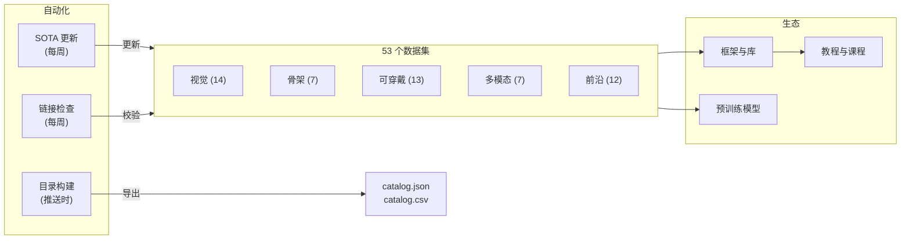

# Awesome 人体活动识别 [](https://awesome.re)

<p align="center">
  <a href="https://github.com/Leooo-Huang/awesome-human-activity-recognition">
    
  </a>
</p>

> 一份由研究者驱动的 **人体活动识别** 精选指南——涵盖 53 个数据集、关键框架、预训练模型、教程和基准工具，覆盖视觉、可穿戴、骨架和多模态等方向。

[](https://creativecommons.org/licenses/by/4.0/)
[](https://github.com/Leooo-Huang/awesome-human-activity-recognition/pulls)
[](https://github.com/Leooo-Huang/awesome-human-activity-recognition/commits/main)
[](data/sota-snapshot.json)
[](https://leooo-huang.github.io/awesome-human-activity-recognition/)

[**中文**](README.zh.md) | [Deutsch](README.de.md) | [English](../README.md) | [Español](README.es.md) | [Français](README.fr.md) | [日本語](README.ja.md) | [한국어](README.ko.md) | [Português](README.pt.md) | [Русский](README.ru.md)

## 目录

- [仓库架构](#仓库架构)
- [该选哪个数据集](#该选哪个数据集)
- [数据集](#数据集)
- [框架与库](#框架与库)
- [预训练模型](#预训练模型)
- [教程与课程](#教程与课程)
- [关键论文](#关键论文)
- [竞赛与挑战](#竞赛与挑战)
- [工具与实用程序](#工具与实用程序)
- [相关精选列表](#相关精选列表)

## 仓库架构



## 该选哪个数据集

> 选择你的模态和任务，然后参照推荐跳转到对应章节。

**我有视频，想做动作分类** — 使用 Kinetics-700 做预训练，在 UCF-101 或 HMDB-51 上评估以便与前人工作对比。参见[视觉](#视觉rgb--深度)。

**我需要在未剪辑视频中做时序动作检测** — ActivityNet 用于提议生成，AVA 用于时空检测，MultiTHUMOS 用于密集多标签检测。同样列在上方视觉部分。

**我使用骨架或动捕数据** — NTU RGB+D 120 是事实标准。文本-动作对齐可使用 Babel 或 HumanML3D。参见[骨架与动捕](#骨架与动捕)和[前沿与新兴](#前沿与新兴)。

**我有 IMU 或可穿戴传感器数据** — UCI-HAR 做基线，PAMAP2 做多传感器实验，CAPTURE-24 做大规模真实场景（151 名受试者，3883 小时）。参见[可穿戴传感器](#可穿戴传感器)。

**我需要第一视角或多模态数据** — Ego4D 追求规模（3300 小时），EPIC-Kitchens-100 针对厨房动作，Ego-Exo4D 用于跨视角（新，CVPR 2024）。参见[多模态与第一视角](#多模态与第一视角)。

**我想做文本到动作生成** — HumanML3D 用于单人，InterHuman 用于双人，Motion-X++ 用于包含面部和手部的全身动作。同样列在上方前沿部分。

## 数据集

### 视觉（RGB / 深度）

- [Kinetics-700](https://deepmind.com/research/open-source/kinetics) - 大规模预训练基准，包含 65 万 YouTube 片段，覆盖 700 个动作类别。
- [UCF-101](https://www.crcv.ucf.edu/data/UCF101.php) - 经典动作识别基准，包含 1.33 万片段，覆盖 101 个类别。
- [HMDB-51](https://serre-lab.clps.brown.edu/resource/hmdb-a-large-human-motion-database/) - 多样化动作识别数据集，包含来自电影和网络视频的 6800 个片段，覆盖 51 个类别。
- [ActivityNet](http://activity-net.org/) - 时序动作检测基准，包含 2 万条未剪辑 YouTube 视频，覆盖 200 个类别。
- [AVA](https://research.google.com/ava/) - 时空动作检测数据集，包含 430 个电影片段和 80 个原子动作标签（含边界框）。
- [NTU RGB+D 120](http://rose1.ntu.edu.sg/datasets/actionrecognition.asp) - 多视角 3D 动作识别数据集，包含 11.4 万序列，覆盖 120 个类别，使用 RGB、深度和骨架数据。
- [Something-Something V2](https://developer.qualcomm.com/software/ai-datasets/something-something) - 精细物体交互数据集，包含 22 万片段，覆盖 174 个标签，需要时序推理。
- [FineGym](https://sdolivia.github.io/FineGym/) - 精细体操动作识别数据集，包含 3.2 万个层级标注的片段。
- [Moments in Time](http://moments.csail.mit.edu/) - 极其多样化的事件与动作识别数据集，包含 100 万个 3 秒标注视频片段，覆盖 339 个类别。
- [Diving48](http://www.svcl.ucsd.edu/projects/resound/dataset.html) - 精细跳水动作识别数据集，包含 1.8 万片段，覆盖 48 个类别，需要时序推理。
- [Toyota Smarthome](https://project.inria.fr/toyotasmarthome/) - 日常生活活动识别数据集，包含 1.6 万个多视角片段，覆盖 31 个类别，使用 RGB、深度和骨架数据。
- [MultiSports](https://deeperaction.github.io/multisports/) - 跨 4 项运动的时空动作检测数据集，包含 3200 个片段和 66 个精细动作类别。
- [MultiTHUMOS](https://ai.stanford.edu/~syyeung/everymoment.html) - 密集多标签时序动作检测数据集，包含 65 个类别和 3.8 万个标注。
- [FineSports](https://github.com/PKU-ICST-MIPL/FineSports_CVPR2024) - 多人精细体育理解数据集，包含 1 万个 NBA 视频和 52 种动作类型，来自 CVPR 2024。

### 骨架与动捕

- [NTU RGB+D 60](https://rose1.ntu.edu.sg/dataset/actionRecognition/) - 骨架动作识别的基础数据集，包含 5.7 万序列，覆盖 60 个类别。
- [AMASS](https://amass.is.tue.mpg.de/) - 统一的 SMPL 动捕参数，来自 40 多个数据集，涵盖 1.6 万分钟和 344 名受试者。
- [Human3.6M](http://vision.imar.ro/human3.6m/description.php) - 3D 姿态估计的事实标准，包含来自 11 名专业演员的 360 万帧数据。
- [Babel](https://babel.is.tue.mpg.de/) - 动作-语言对齐数据集，包含 43 小时和 3700 个序列，标注有 SMPL 和文本标签。
- [TotalCapture](http://totalcapture.net/) - 多模态 3D 姿态估计基准，结合动捕、多视角 RGB 和 IMU 数据，来自 5 名受试者。
- [PKU-MMD](https://www.icst.pku.edu.cn/struct/Projects/PKUMMD.html) - 多模态动作检测基准，包含 2 万个实例，覆盖 51 个类别。
- [Skeletics-152](https://github.com/skelemoa/quater-gcn) - 基于估计姿态的大规模骨架动作识别数据集，包含 15 万片段，覆盖 152 个类别。

### 可穿戴传感器

- [UCI-HAR](https://archive.ics.uci.edu/ml/datasets/human+activity+recognition+using+smartphones) - 经典智能手机 IMU 基准，包含 30 名受试者和 6 种活动，性能已近饱和。
- [PAMAP2](https://archive.ics.uci.edu/ml/datasets/pamap2+physical+activity+monitoring) - 可穿戴 HAR 标准数据集，包含多 IMU 和心率数据，来自 9 名受试者，覆盖 18 种活动。
- [WISDM](https://www.cis.fordham.edu/wisdm/dataset.php) - 手机和智能手表传感器数据挖掘数据集，包含 51 名受试者和超过 100 万个样本。
- [OPPORTUNITY](https://archive.ics.uci.edu/ml/datasets/OPPORTUNITY+Activity+Recognition) - 丰富的情境感知活动识别数据集，包含 72 个可穿戴和环境传感器，来自 4 名受试者。
- [HAPT](https://archive.ics.uci.edu/ml/datasets/Human+Activity+Recognition+Using+Smartphones) - 智能手机 IMU 数据集，支持姿态转换检测，包含 30 名受试者，覆盖 12 种活动。
- [RealWorld HAR](https://sensor.informatik.uni-mannheim.de/#dataset_realworld) - 真实场景活动识别数据集，支持多设备位置，包含 60 名受试者，覆盖 15 种活动。
- [mHealth](https://archive.ics.uci.edu/ml/datasets/MHEALTH+Dataset) - 体表传感器搭配 ECG 的移动健康监测数据集，包含 10 名受试者，覆盖 12 种活动。
- [UniMiB-SHAR](http://www.sal.disco.unimib.it/technologies/unimib-shar/) - 智能手机加速度计数据集，用于日常活动和跌倒检测，包含 30 名受试者，覆盖 17 种活动。
- [Daphnet](https://archive.ics.uci.edu/ml/datasets/Daphnet+Freezing+of+Gait) - 帕金森患者冻结步态检测数据集，使用 3 个可穿戴加速度计，包含 10 名受试者。
- [Sussex-Huawei Locomotion](http://www.shl-dataset.org/) - 大规模运动模式识别数据集，包含 2800 多小时数据，来自 3 名用户，使用手机和手表传感器。
- [HARTH](https://archive.ics.uci.edu/dataset/779/harth) - 专业视频标注的自由生活加速度计 HAR 数据集，包含 22 名受试者，采集于真实场景。
- [CAPTURE-24](https://github.com/OxWearables/capture24) - 最大的自由生活腕部加速度计数据集，包含 151 名受试者和 3883 小时数据，来自 Nature Scientific Data 2024。
- [WEAR](https://github.com/mariusbock/wear) - 户外运动数据集，包含智能手表 IMU 和第一视角视频，来自 22 名受试者，覆盖 18 种活动，发表于 IMWUT 2024。

### 多模态与第一视角

- [EPIC-Kitchens-100](https://epic-kitchens.github.io/2021) - 长时第一视角厨房动作数据集，包含音频，横跨 700 小时和 90 个厨房。
- [Ego4D](https://ego4d-data.org/docs/data/) - 最大的第一视角数据集，包含多任务基准，横跨 3300 小时和 74 个场景。
- [Charades](https://allenai.org/plato/charades/) - 室内多标签动作识别数据集，包含脚本描述，横跨 9800 个视频和 157 个标签。
- [NTU Mutual Actions](https://arxiv.org/abs/1905.04757) - 来自 NTU RGB+D 的双人交互数据，包含骨架数据，覆盖 26 个交互类别。
- [ActivityNet Captions](https://cs.stanford.edu/people/ranber/densevid/) - 密集视频描述和时序定位数据集，包含 2 万视频和 10 万条描述。
- [How2Sign](https://how2sign.github.io/) - 多模态美国手语数据集，包含 RGB、深度和姿态数据，横跨 80 小时。
- [EgoExo-Fitness](https://github.com/iSEE-Laboratory/EgoExo-Fitness) - 第一视角与第三视角健身动作质量评估数据集，包含 31 小时和 6000 多个动作，来自 ECCV 2024。

### 前沿与新兴

- [BEHAVE](https://virtualhumans.mpi-inf.mpg.de/behave/) - RGB-D 人-物交互数据集，包含 3D 姿态，横跨 321 个序列，来自 20 名受试者。
- [Motion-X](https://caizhongang.github.io/projects/Motion-X/) - 全身和手部关节动作数据集，来自多传感器动捕，包含 200 万帧，来自 10 名受试者。
- [Ego-Exo4D](https://ego-exo4d-data.org/) - 跨视角动作理解数据集，包含同步的第一视角和第三视角视频，横跨 1400 个序列。
- [HumanML3D](https://github.com/EricGuo5513/HumanML3D) - 文本到动作生成数据集，包含 SMPL 标注，横跨 1.4 万多个动作序列。
- [InterHuman](https://github.com/tr3e/InterHuman) - 双人交互动作数据集，包含 SMPL-X 和文本描述，横跨 6000 多个序列。
- [HOI4D](https://hoi4d.github.io/) - 第一视角手-物交互数据集，包含 RGB-D 和手部姿态，横跨 4000 多个视频片段。
- [FineBio](https://github.com/aistairc/FineBio) - 精细生物实验室动作理解数据集，包含多步骤实验流程标注。
- [HAA500](https://www.cse.ust.hk/haa/) - 多样化精细原子动作识别数据集，包含 1 万片段，覆盖 500 个类别。
- [Motion-X++](https://motion-x-dataset.github.io/) - 全身动作生成数据集，包含文本和音频，横跨 12 万多个序列。
- [FLAG3D](https://andytang15.github.io/FLAG3D/) - 3D 健身活动理解数据集，包含多视角 RGB、骨架和文本，横跨 18 万序列，来自 CVPR 2024。
- [InterX](https://liangxuy.github.io/inter-x/) - 综合人-人交互数据集，包含 SMPL-X，横跨 1.1 万多个序列，来自 CVPR 2024。
- [WiMANS](https://arxiv.org/abs/2402.09430) - 首个在顶级会议发表的基于 WiFi 的多用户活动感知基准，来自 ECCV 2024。

## 框架与库

### 视频动作识别

- [MMAction2](https://github.com/open-mmlab/mmaction2) - OpenMMLab 视频理解工具箱，支持 20 多种模型架构，包括 SlowFast、TimeSformer 和 VideoMAE。
- [PySlowFast](https://github.com/facebookresearch/SlowFast) - Facebook Research 视频理解库，包含 SlowFast、X3D、MViT 和 AVA 模型。
- [Video-Swin-Transformer](https://github.com/SwinTransformer/Video-Swin-Transformer) - 纯 Transformer 视频识别主干网络，在 Kinetics-400、Kinetics-600 和 SSv2 上达到 SOTA。
- [TimeSformer](https://github.com/facebookresearch/TimeSformer) - Facebook Research 分离式时空注意力视频分类方法，来自 ICML 2021。
- [VideoMAE](https://github.com/MCG-NJU/VideoMAE) - 基于掩码自编码器的自监督视频预训练方法，在多个基准上达到 SOTA。
- [InternVideo2](https://github.com/OpenGVLab/InternVideo2) - 大规模视频理解基础模型，支持动作识别、检索和描述生成。

### 骨架动作识别

- [CTR-GCN](https://github.com/Uason-Chen/CTR-GCN) - 通道拓扑细化图卷积网络，用于骨架动作识别，来自 ICCV 2021。
- [ST-GCN](https://github.com/yysijie/st-gcn) - 开创性的时空图卷积网络，奠定了 GCN 在骨架 HAR 中的方法论。
- [2s-AGCN](https://github.com/lshiwjx/2s-AGCN) - 双流自适应图卷积网络，用于骨架动作识别，来自 CVPR 2019。
- [HD-GCN](https://github.com/Jho-Yonsei/HD-GCN) - 层级分解图卷积网络，用于骨架动作识别，来自 AAAI 2024。
- [MotionBERT](https://github.com/Walter0807/MotionBERT) - 统一的人体动作分析预训练方法，涵盖 3D 姿态估计和动作识别。
- [InfoGCN](https://github.com/stnoah1/infogcn) - 信息瓶颈图卷积网络，用于骨架动作识别，来自 CVPR 2022。

### 可穿戴传感器 HAR

- [tsai](https://github.com/timeseriesAI/tsai) - 基于 fastai 和 PyTorch 构建的时间序列深度学习库，广泛用于传感器 HAR。
- [aeon](https://github.com/aeon-toolkit/aeon) - 统一的 Python 时间序列工具包，包括分类、聚类和异常检测。
- [NNCLR-HAR](https://github.com/mariusbock/nnclr-har) - 用于可穿戴传感器 HAR 的自监督对比学习框架，来自 IMWUT 2022。
- [DeepConvLSTM](https://github.com/sussexwearlab/DeepConvLSTM) - 卷积 LSTM 架构的参考实现，用于可穿戴活动识别。
- [Hang-Time HAR](https://github.com/ahoelzemann/hangtime_har) - 基于单只腕部惯性传感器的篮球活动识别，使用深度学习。

### 动作生成与估计

- [MDM](https://github.com/GuyTevet/motion-diffusion-model) - 人体动作扩散模型，用于文本到动作生成，在 HumanML3D 上达到 SOTA。
- [MLD](https://github.com/ChenFengYe/motion-latent-diffusion) - 动作潜在扩散模型，用于高效的文本驱动人体动作生成，来自 CVPR 2023。
- [T2M-GPT](https://github.com/Mael-zys/T2M-GPT) - 使用离散表示从文本描述生成人体动作。
- [MotionGPT](https://github.com/OpenMotionLab/MotionGPT) - 统一的动作-语言生成模型，将动作视为一种外语。
- [SMPL-X](https://github.com/vchoutas/smplx) - 表达性人体模型，捕捉身体、面部和手部姿态，是现代动作数据集的标准。

## 预训练模型

- [VideoMAE V2](https://github.com/OpenGVLab/VideoMAEv2) - 十亿参数视频基础模型，在数百万片段上预训练，可微调用于动作识别。
- [InternVideo2 Model Zoo](https://huggingface.co/OpenGVLab/InternVideo2-Stage2_1B-224p-f4) - 60 亿参数视频-语言模型检查点，托管于 Hugging Face，用于动作识别和检索。
- [UniFormerV2](https://github.com/OpenGVLab/UniFormerV2) - 高效多尺度 token 视频 Transformer，在 Kinetics-400 上达到 90.0% top-1 准确率。
- [MVD](https://github.com/ruiwang2021/mvd) - 掩码视频蒸馏预训练模型，在下游动作识别任务上与 VideoMAE 性能相当。
- [MotionBERT Checkpoints](https://huggingface.co/walterzhu/MotionBERT) - 预训练动作编码器，可迁移至 3D 姿态估计、动作识别和网格恢复。

## 教程与课程

- [Dive into Deep Learning - 动作识别](https://d2l.ai/) - 交互式教材的视频理解与动作识别章节，包含 PyTorch 代码。
- [MMAction2 Tutorials](https://mmaction2.readthedocs.io/en/latest/get_started/overview.html) - 在自定义数据集上训练动作识别模型的分步指南。
- [Sensor HAR Tutorial by Marius Bock](https://github.com/mariusbock/dl-for-har) - 基于 PyTorch 的惯性传感器 HAR 综合深度学习教程。
- [Stanford CS231N - 视频理解](https://cs231n.stanford.edu/) - 涵盖时序建模、双流网络和 3D 卷积的课程材料。
- [Coursera - Motion Planning](https://www.coursera.org/learn/robotics-motion-planning) - 宾夕法尼亚大学课程，涵盖与 HAR 相关的运动表示。
- [Motion Diffusion Tutorial](https://colab.research.google.com/drive/1MvBaAhOrEk8MP_jwNdQKLnvMxXPOG6zU) - 在 HumanML3D 上训练文本条件人体动作扩散模型的 Colab 笔记本。

## 关键论文

### 奠基性工作

- [Two-Stream Convolutional Networks](https://arxiv.org/abs/1406.2199) - Simonyan 和 Zisserman, NeurIPS 2014，建立了时空双流范式。
- [C3D: Learning Spatiotemporal Features](https://arxiv.org/abs/1412.0767) - Tran 等, ICCV 2015，开创了视频特征学习中的 3D 卷积。
- [I3D: Quo Vadis Action Recognition](https://arxiv.org/abs/1705.07750) - Carreira 和 Zisserman, CVPR 2017，将 2D ImageNet 架构膨胀至 3D 视频。
- [ST-GCN: Spatial Temporal Graph Convolutional Networks](https://arxiv.org/abs/1801.07455) - Yan 等, AAAI 2018，定义了骨架动作识别的 GCN 方法。
- [SlowFast Networks](https://arxiv.org/abs/1812.03982) - Feichtenhofer 等, ICCV 2019，视频识别的双通路架构。

### Transformer 时代（2020 年至今）

- [ViViT: A Video Vision Transformer](https://arxiv.org/abs/2103.15691) - Arnab 等, ICCV 2021，纯 Transformer 视频分类模型。
- [TimeSformer](https://arxiv.org/abs/2102.05095) - Bertasius 等, ICML 2021，可扩展视频 Transformer 的分离式时空注意力。
- [VideoMAE](https://arxiv.org/abs/2203.12602) - Tong 等, NeurIPS 2022，掩码自编码器预训练，以极少标注数据达到 SOTA。
- [InternVideo2](https://arxiv.org/abs/2403.15377) - Wang 等, ECCV 2024，将视频基础模型扩展至 60 亿参数，覆盖 60 多个基准。

### 可穿戴与传感器 HAR

- [DeepConvLSTM](https://arxiv.org/abs/1611.06759) - Ordonez 和 Roggen, Sensors 2016，奠定了可穿戴活动识别的深度学习基础。
- [Attend and Discriminate](https://arxiv.org/abs/2007.07426) - Abedin 等, IMWUT 2021，多传感器 HAR 的注意力机制。
- [Self-supervised HAR](https://arxiv.org/abs/2011.11542) - Tang 等, IJCAI 2021，基于传感器的活动识别对比学习。

### 动作生成

- [MDM: Human Motion Diffusion Model](https://arxiv.org/abs/2209.14916) - Tevet 等, ICLR 2023，基于扩散的文本到动作生成。
- [MotionGPT](https://arxiv.org/abs/2306.14795) - Jiang 等, NeurIPS 2023，通过 LLM 架构统一动作和语言。
- [Motion-X](https://arxiv.org/abs/2307.00818) - Lin 等, NeurIPS 2023，首个大规模全身动作数据集，包含表达性标注。

### 综述

- [Deep Learning for HAR: A Survey](https://dl.acm.org/doi/10.1145/3472290) - Li 等, ACM Computing Surveys 2022，HAR 深度学习方法的全面综述。
- [Skeleton-based Action Recognition Survey](https://arxiv.org/abs/2012.12231) - Liu 等, IEEE TPAMI 2022，骨架 HAR 的 GCN 和 Transformer 方法深度综述。
- [Multimodal HAR with Emphasis on Classification](https://www.sciencedirect.com/science/article/pii/S0950705124000029) - Yadav 等, Knowledge-Based Systems 2024，涵盖融合策略的最新综述。

## 竞赛与挑战

- [Ego-Exo4D Challenge 2025](https://eval.ai/web/challenges/challenge-page/2249/overview) - CVPR 2025 多赛道基准，涵盖第一视角姿态、动作识别和语言理解。
- [ActivityNet Challenge](http://activity-net.org/challenges/2024/) - 时序动作检测、提议生成和密集描述的年度挑战赛。
- [EPIC-Kitchens Challenge](https://epic-kitchens.github.io/2024) - 第一视角动作识别、检测和预测竞赛。
- [SHL Recognition Challenge](http://www.shl-dataset.org/activity-recognition-challenge/) - 基于智能手机传感器的交通模式识别年度挑战赛。
- [Babel Challenge](https://teach.is.tue.mpg.de/) - 动捕数据上的动作-语言理解和时序动作分割挑战。
- [UAV-Human Challenge](https://github.com/SUTDCV/UAV-Human) - 无人机视角下的人体行为理解，包含多模态数据。

## 工具与实用程序

- [Papers with Code - HAR Leaderboards](https://paperswithcode.com/task/activity-recognition) - 所有主要 HAR 基准的实时 SOTA 追踪。
- [MMAction2 Model Zoo](https://mmaction2.readthedocs.io/en/latest/model_zoo/modelzoo.html) - 100 多个动作识别模型的预训练检查点和配置。
- [Decord](https://github.com/dmlc/decord) - 高效 GPU 加速视频读取器，用于深度学习训练流水线。
- [vid2player](https://github.com/jhgan00/vid2player) - 从视频输入生成角色动画，可用于活动识别可视化。
- [OpenPose](https://github.com/CMU-Perceptual-Computing-Lab/openpose) - 实时多人关键点检测，用于从视频中提取骨架。
- [MediaPipe](https://developers.google.com/mediapipe) - Google 的端侧 ML 框架，用于姿态估计、手部追踪和手势识别。
- [YOLO-Pose](https://github.com/ultralytics/ultralytics) - Ultralytics YOLOv8 Pose，用于实时多人骨架估计。

## 相关精选列表

- [Awesome Action Recognition](https://github.com/jinwchoi/awesome-action-recognition) - 动作识别论文与数据集。
- [Awesome Skeleton-based Action Recognition](https://github.com/firework8/Awesome-Skeleton-based-Action-Recognition) - 骨架 HAR 的 GCN 和 Transformer 方法。
- [Awesome Self-Supervised Learning](https://github.com/jason718/awesome-self-supervised-learning) - 适用于视频和传感器模态的自监督学习方法。
- [Awesome Video Understanding](https://github.com/HuaizhengZhang/Awesome-System-for-Machine-Learning) - 视频理解系统与架构。
- [Awesome IMU Sensing](https://github.com/rh20624/Awesome-IMU-Sensing) - 基于 IMU 的活动识别与导航感知。
- [Awesome Pose Estimation](https://github.com/cbsudux/awesome-human-pose-estimation) - 人体姿态估计方法与基准。

## 脚注

另请参阅：[多维分类体系](../docs/taxonomy.md) | [综述](../docs/surveys.md) | [基准](../docs/benchmarking.md) | [目录构建器](../tools/) | [路线图](../docs/roadmap.md) | [如何贡献](../CONTRIBUTING.md)

### 引用

```bibtex
@misc{awesome_har_2025,
  title   = {Awesome Human Activity Recognition: A Curated List},
  author  = {Wenxuan Huang},
  year    = {2025},
  url     = {https://github.com/Leooo-Huang/awesome-human-activity-recognition},
  note    = {GitHub repository}
}
```

### 致谢

感谢数据集作者、标注团队和基准维护者，正是他们让人体活动理解领域的开放研究成为可能。
